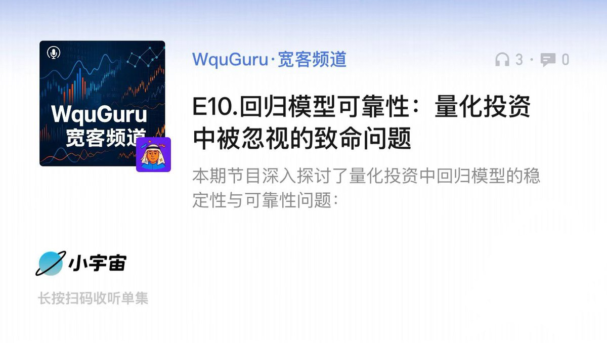

# 回測過擬合診斷：量化策略實盤失效的根本原因

> **來源**: [@wquguru](https://x.com/wquguru/status/1923923953690812491)
>
> **日期**: Sun May 18 02:09:49 +0000 2025
>
> **標籤**: `過擬合` `模型診斷` `實盤驗證`

---

> **來源**: [@wquguru (WquGuru🦀)](https://twitter.com/wquguru)
> **日期**: 2026-02-18
> **標籤**: `回測過擬合` `模型診斷` `量化策略` `實盤表現`

---

## 核心問題

為何超過 70% 的量化交易策略在實盤中表現不如回測？關鍵在於回測過擬合問題以及缺乏標準化的模型診斷流程。

## 解決方案

提高模型在實盤環境中可靠性的三大方法：

1. **增加樣本量**：擴展至 300 天歷史數據
2. **使用 Lasso 回歸**：防止過擬合
3. **採用貝葉斯方法**：結合先驗知識

## 延伸閱讀

完整內容請參考 WquGuru·寬客頻道第 10 期《回歸模型可靠性：量化投資中被忽視的致命問題》。
