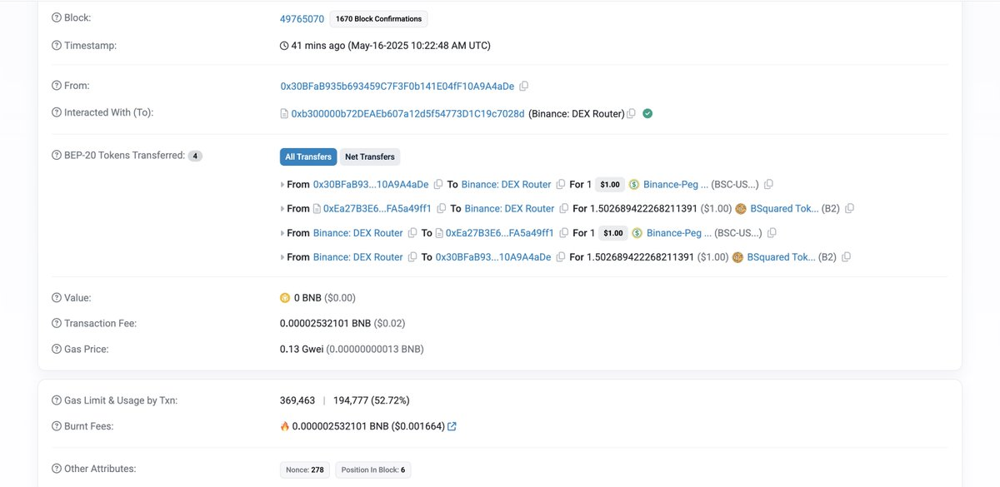
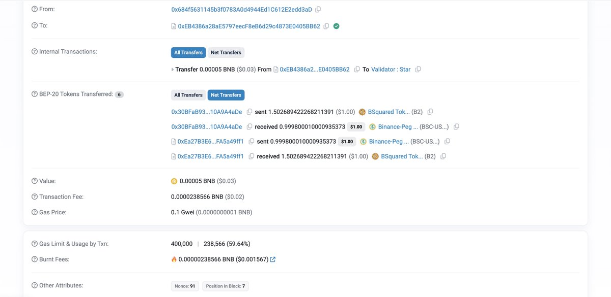

# Binance Alpha 積分刷分：MEV 技術降低 80% 損耗

> **來源**: [@33357xyz](https://x.com/33357xyz/status/1923338184957821105)
>
> **日期**: Fri May 16 11:22:11 +0000 2025
>
> **標籤**: `MEV技術` `Binance Alpha` `滑點優化`

---

> **來源**: [@33357xyz (33357.xyz)](https://twitter.com/33357xyz)
> **日期**: 2026-02-18
> **標籤**: `binance-alpha` `mev` `arbitrage` `slippage-optimization`

---

## 核心技術

降低 80% 的損耗，使用最低損耗刷 Binance Alpha 積分！

目前 Binance Alpha 流動池最低的手續費是 1/10000，理論上做一次買入、賣出的交互最低損耗是萬二。但因為買入賣出的時間不一樣導致會有價格波動，實際刷分損耗常常在千分之一以上。

## MEV 捆綁交易方案

成功地使用 MEV 技術，將買入和賣出交易捆綁在一起發送給節點，可以實現同時在一個流動池上進行買入賣出操作，使價格波動對刷分損耗的影響降為 0。這個技術常被用來做三明治交易，但現在可以用來造福刷分的人。

## 實測數據

在 block 49765070 上同時完成了 Binance Alpha 買入賣出的交易：
- 買入交易位於第 6 交易位
- 賣出交易位於第 7 交易位
- 1 USDT 的買入換回來了 0.9998 USDT
- 不算給 MEV 服務商的小費，損耗僅僅只有萬分之二
