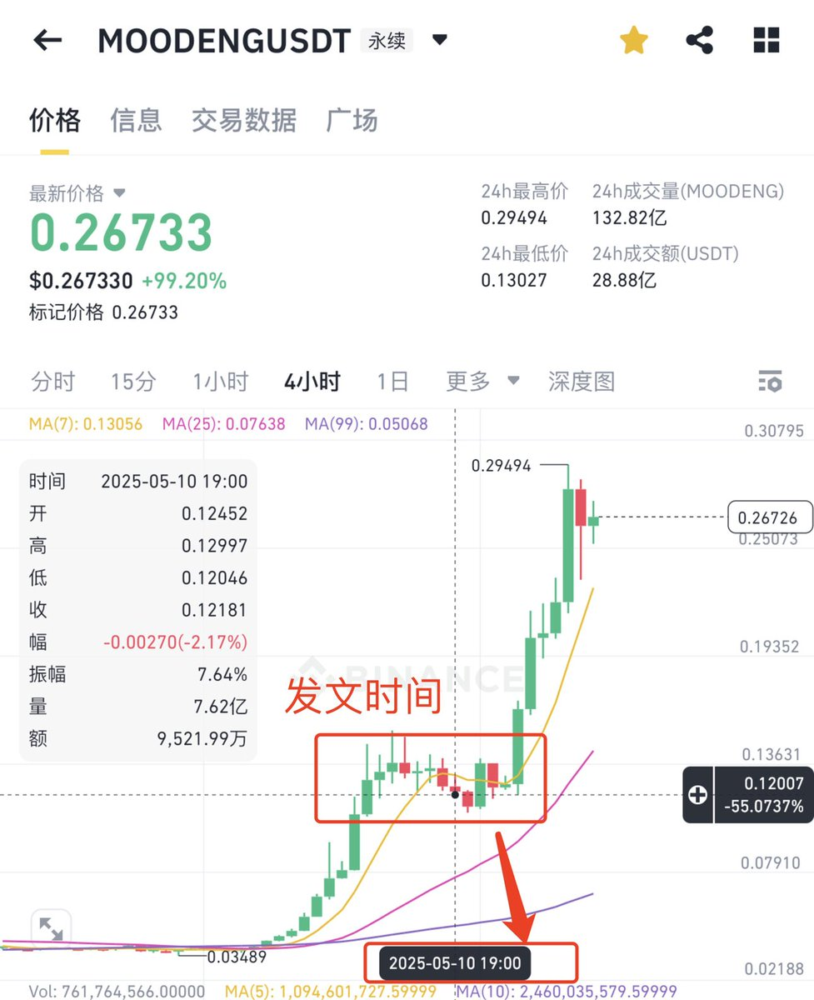
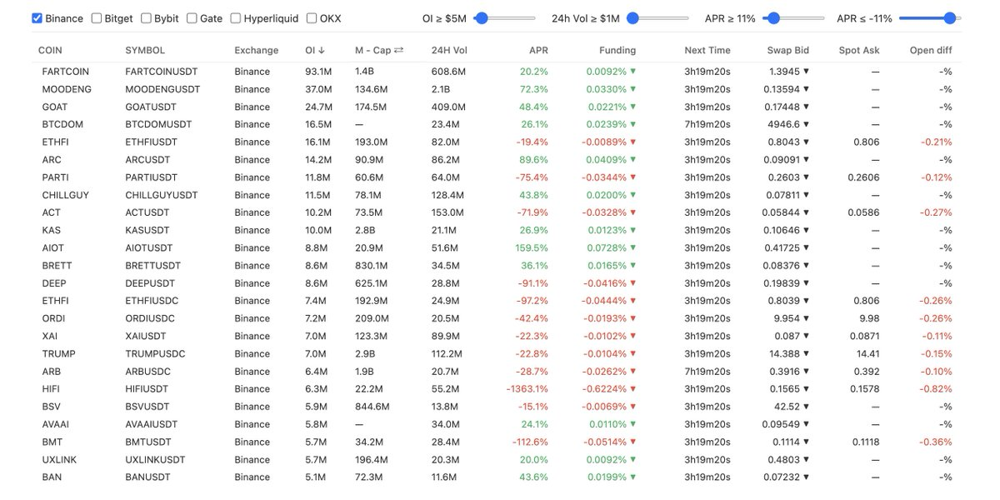

# 永續合約 APR、OI 與成交量信號：小市值代幣異動篩選指南

> **來源**: [@0xKevin00](https://x.com/0xKevin00/status/1921855980926865488)
>
> **日期**: Mon May 12 09:12:26 +0000 2025
>
> **標籤**: `永續合約` `技術指標` `小市值代幣`

---

> **來源**: [@0xKevin00](https://twitter.com/0xKevin00)
> **日期**: 2026-02-18
> **標籤**: `永續合約` `APR` `OI` `小市值代幣` `異動篩選`

---

## 背景說明

我發現很多人不會用這個網站,如果你看我的截圖,可以發現當時篩選出來的 $Moodeng,兩天時間翻倍了,剛好在啟動的當天!

好人做到底一次性講透徹,我用 Moodeng 來舉例!

## 指標含義與用法

### APR (年化資金費率)

**含義**:APR 是永續合約資金費率的年化值,反映多空情緒。表格中以百分比顯示(如 MOODENG 的 72.3%)

**用法**:
- **正值**(如 >0%):多頭支付空頭,市場看漲情緒高
- **高正值**(如 >10%):多頭情緒極強,可能預示價格拉升
- **負值**(如 ETHFI 的 -97.2%):空頭情緒占主導,可能看跌

### OI 合約持倉量 (Open Interest)

**含義**:未平倉合約總量,表格中以百萬美元(M)表示

**用法**:
- **OI 上升**:新資金流入,市場活躍,可能推動價格上漲
- **高 OI**(如 >20M):市場參與度高,波動性可能增加
- **快速增長**(需動態數據,表格為快照):預示大行情

### OI/市值比 (OI/M.Cap)

**含義**:OI 除以市值,反映衍生品市場的槓桿水平。需計算(如 MOODENG:37.0M ÷ 134.6M = 0.275)

**用法**:
- **高比值**(如 >0.2):槓桿高,投機情緒濃厚,波動性大
- **快速上升**:市場槓桿快速堆積,可能預示價格劇烈波動

### 24 小時交易量/市值比 (24H Vol/M.Cap)

**含義**:24 小時交易量除以市值,反映交易活躍度。需計算(如 MOODENG:2.1B ÷ 134.6M = 15.6)

**用法**:
- **高比值**(如 >0.3):交易量異常放大,市場活躍,可能由利好驅動
- **快速上升**:異常放量,通常是價格拉升的前兆

## 篩選 24 小時內異常放量及潛在拉升資產

結合表格數據,利用上述指標篩選可能在 24 小時內異常放量並準備拉升的資產。

### 篩選條件

| 指標 | 閾值 | 說明 |
|------|------|------|
| APR | >10% | 多頭情緒強 |
| OI/M.Cap | >0.2 | 高槓桿 |
| 24H Vol/M.Cap | >0.3 | 異常放量 |
| OI | >20M | 關注絕對值高或快速增長 |

### 篩選結果

#### MOODENG

- **APR**:72.3%(>10%,多頭情緒極強)
- **OI/M.Cap**:37.0M ÷ 134.6M = 0.275(>0.2,高槓桿)
- **24H Vol/M.Cap**:2.1B ÷ 134.6M = 15.6(>0.3,交易量異常放大)
- **OI**:37.0M(高)

**結論**:滿足所有條件,極有可能在 24 小時內拉升

#### GOAT

- **APR**:48.4%(>10%,多頭情緒強)
- **OI/M.Cap**:24.7M ÷ 174.5M = 0.142(<0.2,但較高)
- **24H Vol/M.Cap**:409.0M ÷ 174.5M = 2.34(>0.3,交易量異常放大)
- **OI**:24.7M(高)

**結論**:APR 和 24H Vol/M.Cap 強勢,OI/M.Cap 稍低,具備拉升潛力

## 總結

通過 APR 年化利率、OI 合約持倉量、OI/市值比、24 小時交易量/市值比,可以篩選出 24 小時內異常放量且可能拉升的資產:

**MOODENG**:指標最強(APR 72.3%、OI/M.Cap 0.275、24H Vol/M.Cap 15.6),最有可能拉升

這些指標反映了多頭情緒(APR)、資金流入(OI)、槓桿水平(OI/M.Cap)和交易活躍度(24H Vol/M.Cap),共同指向價格拉升的可能性。建議重點關注 MOODENG 和 GOAT,結合價格突破和技術形態操作。

---

## 引用推文

> 臥槽,我發現個網站可以抓到即將暴漲的代幣!!
> 
> 小市值的代幣 $moodeng $pnut $neiro $mubarak 都在暴漲
> 
> 用這個網站可以直接篩選出小市值代幣異動的,24 小時這些幣成交量都異常,果然今天都拉飛了
> 
> 鏈接放評論區👇👇
> 
> — @0xKevin00
