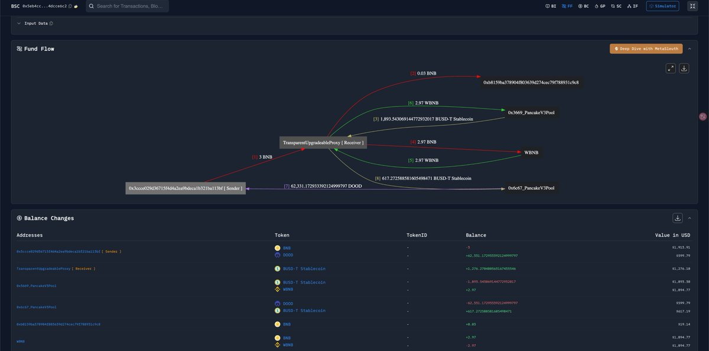

# Uniswap V3 價格限制套利案例分析

> **來源**: [@BoxMrChen](https://x.com/BoxMrChen/status/1921449158826684682)
>
> **日期**: Sun May 11 06:15:52 +0000 2025
>
> **標籤**: `套利` `Uniswap V3` `聚合器`

---

> **來源**: [@BoxMrChen](https://twitter.com/BoxMrChen)
> **日期**: 2026-02-18
> **標籤**: `uniswap-v3` `dex-arbitrage` `sqrtprice-limit` `on-chain-attack` `swap-exploit`

---

## 案例描述

群裡討論了一個很有意思的交易案例：用戶花費 3 BNB 只買到價值 600 U 的資產。

## 原因分析

問題出在第二個交易選擇了一個小池子，然後達到 `sqrtPriceLimitX96` 限制後，就只能買到多少算多少。最後只買了 600 多 U 的資產，而剩下的資金就留在了聚合合約中。

## 資金去向

追蹤後發現，剩下的資金被另一筆交易空手套走了。兩筆交易間隔大概 10 小時。

## 套利原理

當使用 Uniswap V3 進行 swap 時，如果設置了 `sqrtPriceLimitX96` 參數，交易會在達到價格限制時停止執行，未使用的資金會留在呼叫合約中。

如果聚合合約的資金提取邏輯存在漏洞，攻擊者可以在之後透過特定方式將這些「卡住」的資金取出。

## 啟示

這個案例說明區塊鏈上還有很多不為人知的地方存在獲利路徑，值得深入研究交易細節和合約邏輯。
