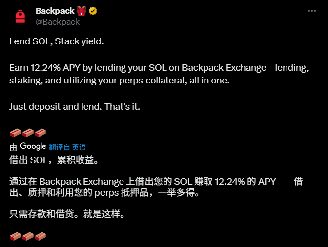
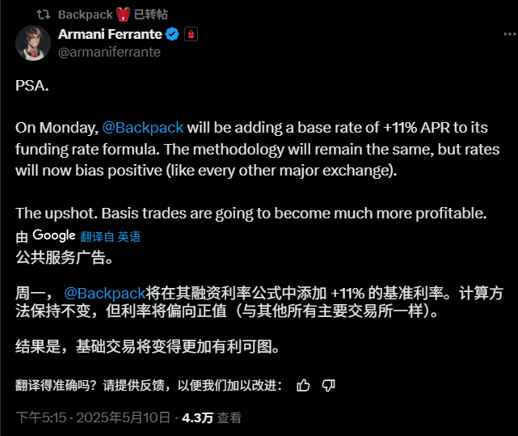
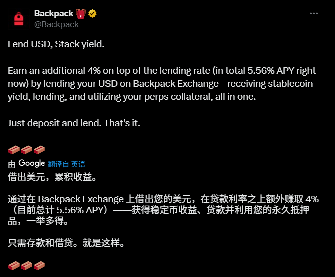

# Backpack SOL 中性套利策略：年化 20% 的無風險組合

> **來源**: [@Cody_DeFi](https://x.com/Cody_DeFi/status/1921628662362948024) | [原文連結](https://backpack.exchange/signup?code=608bnwy0)
>
> **日期**: Sun May 11 18:09:09 +0000 2025
>
> **標籤**: `套利` `Basis Trading` `資金費率`

---





> **來源**: [@Cody_DeFi (Cody)](https://twitter.com/Cody_DeFi)  
> **日期**: 2026-02-18  
> **標籤**: `Backpack` `中性套利` `Basis Trading` `SOL` `資金費率` `穩定收益`

---

## 策略概述

在 Backpack 構建一個年化 20%+ 的 SOL 中性套利策略，同時賺取積分。這是一個基於合約 Funding Fee 的基礎套利操作，適合新手入門。

Backpack 近期更新了三個功能，使得 SOL 的 Basis Trading（中性套利）變得非常簡單且有利可圖。

## Backpack 的三個核心功能更新

### 1. SOL 本位借貸，年化 12%+ 收益

Backpack 將 SOL 在鏈上的 Staking + Lending 收益釋放出來，反饋給用戶，直接將 SOL 在借貸端的收益拉高到 12%。

**操作方式**：將 SOL 存入 Backpack，打開自動借貸功能，即可獲取 12% 的 SOL 本位年化收益。

### 2. PERP Funding Rate 基礎利率調整至 10%+

幣圈永續合約交易的基礎利率，長期看多資產價格每年上漲 10%+。即使沒有任何人交易，默認的 FUNDING FEE 都是正的年化 10%+（多頭付資金費給空頭）。

Backpack 引入了這個做市算法，直接給做空的人起始 11% 的資金費率。如果不由多頭支付，就由 Backpack 自己的做市商來支付，本質上是一個讓利。

### 3. 合約保證金引入美元國債收益

大多數交易所的合約保證金不給任何利息，但 Backpack：
- 按照 1:1 匯率接受所有美元穩定幣
- 以美元 USD 作為基礎交易貨幣
- 提供年化 4% 的國債 + 實時浮動收益（目前 1.5%）返還給用戶

## 套利組合構建方法

### 操作步驟

1. **充值穩定幣**到 Backpack
2. **同時下單**：
   - 現貨 SOL 多頭
   - 期貨 SOL 空頭
3. **打開自動借貸功能**，剩下的 Backpack 會自動處理

### 收益來源

通過做多現貨、做空期貨的方式，構建中性頭寸合約，有三個生息點：

| 收益來源 | 年化收益率 |
|---------|-----------|
| 現貨 SOL 存入 Backpack | 12% |
| 做空 SOL 期貨 | 11%+ |
| 合約保證金頭寸 | 5.6% |

### 收益計算示例

**假設條件**：
- 本金：$40,000
- 用 3 倍槓桿做空 SOL
- 剩下 $30,000 買 SOL 現貨

**收益計算**：
```
30,000 × 0.12 + 30,000 × 0.11 + 10,000 × 0.056
= 3,600 + 3,300 + 560
= 7,460 美元/年
年化收益率 ≈ 18.65%
```

加上 Backpack 的積分獎勵，折算下來年化超過 20%。

## 進階優化策略

### 提高資金效率

- 將買到的 SOL 作為保證金，實際資金效率可以提高一倍，年化收益可以翻倍
- 完全用 SOL 作為保證金，開一倍做空槓桿，構建一個永遠不會爆倉的中性套利組合

### 跨所套保

- 收益會受到參與人數和市場情況的影響，尤其是 FUNDING FEE 的變化
- 可以去其他交易所跨所套保
- 現貨的 STAKING 也可以去其他協議質押，獲取更高收益

### 重要原則

**將交易 TX 留在 Backpack**，這樣可以刷 Backpack 的積分。

## 總結

Backpack 推出的功能都很良心，本質上是把一些利潤讓利給用戶，這點優於太多其他 CEX 交易所。
