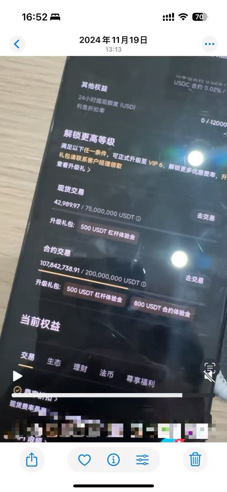

# VOXEL 事件中的高頻印鈔算法：Lead-Lag 套利策略深度解析

> **來源**: [@Boywus](https://x.com/Boywus/status/1918941848728658129)
>
> **日期**: Sun May 04 08:12:43 +0000 2025
>
> **標籤**: `高頻交易` `跨交易所套利` `做市商風險`

---



## 什麼是 Lead-Lag 套利策略

本文以 BITGET 的 VOXEL/USDT 事件為例，說明一個在該事件中獲利上千萬美元的高頻交易算法。這個策略完全屬於市場正常交易，並非系統 BUG。事實上，當天只需要把程式啟動，不需要特別複雜的參數，BITGET 的做市商就主動開啟了印鈔機會，並且撒給了全市場。

本策略屬於高頻交易中實戰策略 LEAD-LAG 的衍生分支，目前仍然有效。

## 策略風險與注意事項

1. **本策略屬於高頻交易**：可能拉高帳戶的撤單率和 taker 率
2. **容易引發交易所風控**：如果產生了大量盈利，不一定能全提走。筆者多次與多個交易所談判，有部分帳號只拿回了充值本金
3. **技術要求高**：需要低延遲伺服器、高性能編程和多帳戶交易。由於多帳戶需要多 IP，涉及一定的分散式部署

## 理論基礎與核心邏輯

以 BITGET 為交易市場，Binance 為指導市場進行講解（實戰中可能有多個指導市場共同決定），只以開多為例子進行講解，其他指標均簡化說明。

### 基本原理

我們一般認為指導市場的價格比交易所市場快幾個 tick，且能量強度高。宏觀上的大漲趨勢、插針，在微觀上仍然是多個波峰波谷組成的，所以我們本質只要做到在微觀交易中跟隨指導市場做最簡單的招數：**低買高賣**。

### 關鍵參數定義

**TTL（訂單生存時間）**：指下單到交易所後，到你下次的撤單之間的間隔，先簡單取值 100ms

**Basis（基差）計算**：

1. 先訂閱兩邊的 orderbook，簡單化理解，不使用最新成交價，取 mid price 為市場價
2. 假設取 60 個 Binance 的 midprice 和 BITGET 的 midprice
3. 算出兩個交易所價格之間的基差，做一定的平滑處理得到常態版本的基差 basis

理論上再對 Binance 價格做其他變化處理，得到一個在 BITGET 市場上的公平價。為了簡化計算，我們直接用：

```
BITGET 市場公平價 = BinancePrice - basis
```

代表我們認為，BITGET 的價格一定跟隨 Binance 的價格。

**下單價格計算**：

```
下單價格 = 公平價 × (1 - delta)
```

delta 一般是一個動態取值，為了解決常態基差過於死板問題。為了理解簡單，直接先固定取值 0.2%。

### 完整流程

**簡化版本的完整流程**：每隔 100ms 運行一次，先撤銷以前的所有掛單，輸入公平價和 delta，得到下單價格，在 BITGET 下單。

## 實際案例分析

假設市場的價格從 105，每個 tick 都下跌 1，跌到 100 又漲回 102；且 Binance 價格比 BITGET 快一個 tick，則遵循下面的表格：

| TICK | BINANCE | BITGET |
|------|---------|--------|
| 00:00:00 | 104 | 105 |
| 00:00:01 | 103 | 104 |
| 00:00:02 | 102 | 103 |
| 00:00:03 | 101 | 102 |
| 00:00:04 | 100 | 101 |
| 00:00:05 | 101 | 100 |
| 00:00:06 | 102 | 101 |

**交易過程**：

- 在第四秒的時候，你在 BITGET 上的下單價格是 100 × (1 - 0.2%) = 99.8，小於市場價格 101，會掛在買盤上，不成交
- 在第五秒的時候，先撤單 99.8 的單子；你在 BITGET 上的新下單價格是 101 × (1 - 0.2%) = 100.798；BITGET 的市場價是 100，所以你會直接按照 100 的價格成交，完成了市價買入；最後在 101 可以獲利出場

## 策略特徵

由於平常時候，交易市場都一直跟隨指導市場進行價格變化，無大波動的時候基差比較穩定，只有在指導市場出現大幅變化的時候才有大量機會，特別是在跌下來又拉上去這種情況，使得兩個市場的價格完全偏離常態基差。

所以本策略一般表現成：
- take 盤口
- 高頻接針
- 吃清算單的特徵

## VOXEL 事件實例

以 2024/4/20 日 VOXEL 為實例，16:10 - 16:25 的時候：

- Binance 價格在 0.1340 - 0.1459，只有短暫高點的 0.14888
- BITGET 的價格被做市商控盤穩定在 0.1263 - 0.1573，且產生了百億美元天量交易額

導致使用 BINANCE 價格作為指導價格，下單立即成交，並且使用指導價格賣出也立即成交。相當於是 BITGET 的做市商不跟隨指導市場，硬是高價買貨，低價賣貨，技術上應該屬於做市商自己的參數設定錯誤。

## 實操要點

作者補充說明：

1. **為什麼選 BITGET**：因為他們官方做市商垃圾
2. **需要什麼技能**：你得會高性能編程 golang/rust
3. **技術細節**：盡量使用 ws 下單，BITGET 的門檻要 VIP4
4. **交易對選擇**：選交易量 TOP 4-10 的交易對，前面的 BTC 之類的太卷
5. **指導市場選擇**：使用 Binance/OKX 的行情作為指導，在 BITGET 交易

作者在 BITGET 上一個月一億 U 的交易額就是這個策略。
