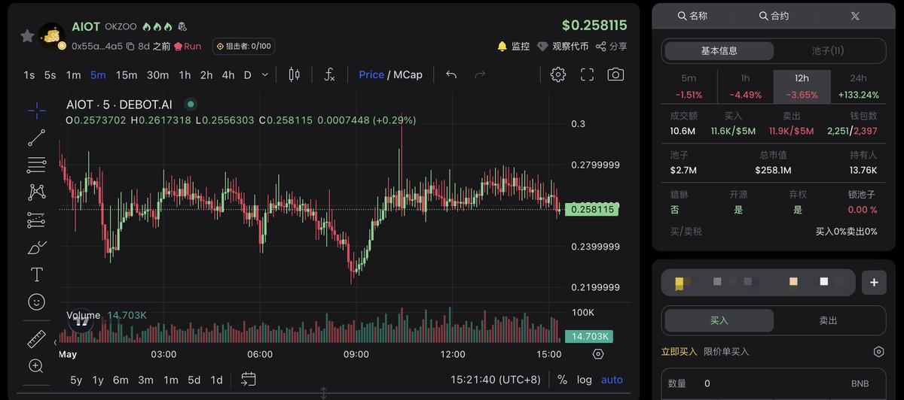
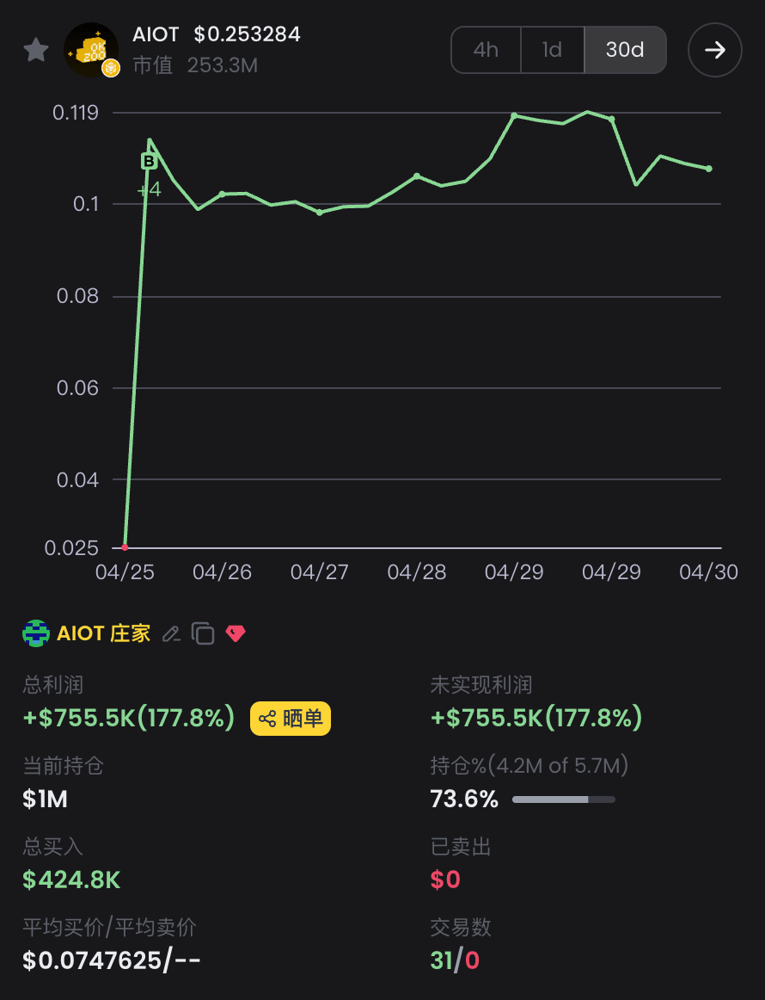

# AIOT 莊家地址籌碼分析：Meteora 流動性查看方法

> **來源**: [@ai_9684xtpa](https://x.com/ai_9684xtpa/status/1917842062139089136)
>
> **日期**: 
>
> **標籤**: `莊家行為` `鏈上分析` `籌碼追蹤`

---

> **來源**: [@ai_9684xtpa (Ai 姨)](https://x.com/ai_9684xtpa)  
> **標籤**: `鏈上分析` `莊家追蹤` `Meteora` `DLMM` `BSC` `流動性分析`

---

## 核心發現

疑似 $AIOT 莊家地址已持有流通總量 23.7% 的籌碼。

該地址的操作策略顯示明確的價格區間規劃：
- **買入區間**：[$0.01204, $0.07285]
- **賣出區間**：[$0.3381, $0.8086]

## Meteora 流動性查看方法

此前 Ai 姨分享過 Solana 網路 Meteora 流動性分佈的查看教程，用於追蹤陰謀集團、開發者、聰明錢在水面下的心理價位。**這個方法在 BSC 網路同樣適用**。

透過查看 Meteora DLMM (Dynamic Liquidity Market Maker) 池的流動性分佈，可以看出大戶的限價單分佈，從而判斷其心理價位區間。

## 案例驗證

此前追蹤的聰明錢地址：
- **建倉時間**：2025-04-25
- **買入成本**：花費 1001 BNB 重倉 $AIOT，成本價 $0.07476
- **現價**：$0.2424
- **浮盈**：75.5 萬美元
- **回報率**：178%

幣安宣布上線 $AIOT 合約後，幣價短時上漲近 120%。現價 $0.2424 剛好卡在該地址限價買單區間邊緣 ($0.07285)，驗證了流動性分析的準確性。

錢包地址：[查看鏈上記錄](https://t.co/gPoEuKTJiG)

## 應用價值

透過 Meteora DLMM 流動性分佈分析，可以：
1. 識別大戶的心理價位區間
2. 判斷買入/賣出壓力位
3. 追蹤聰明錢的操作策略
4. 跨鏈適用（Solana、BSC 等支援 Meteora 的網路）
