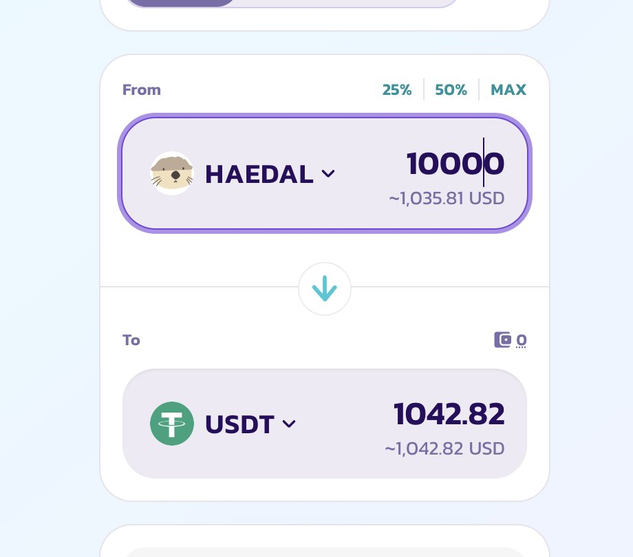
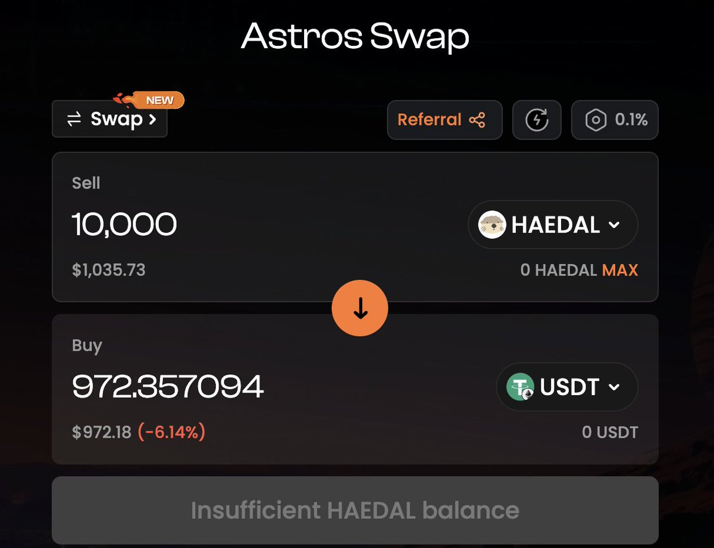

# 跨鏈套利機會：TGE 首小時的價差套利實例分析

> **來源**: [@block_dam](https://x.com/block_dam/status/1917236332545655013)
>
> **日期**: 
>
> **標籤**: `跨鏈套利` `TGE 交易` `價格不對稱`

---

> **來源**: [@block_dam (D_Block)](https://twitter.com/block_dam)
> **日期**: 2026-02-18
> **標籤**: `跨鏈套利` `TGE` `價差套利` `Haedal` `Milk` `Binance`

---

跨鏈套利麻了。最近幣安新上的 $Haedal 和 $Milk 都是跨鏈幣,又接入了最大流動性場所 Binance。我想說的是,TGE 頭一個小時,是搬磚黨的狂歡,價差巨大。

## 實例分析：$Haedal 價差

我以 $Haedal 為例,在 BSC 鏈裡走 Pancake @PancakeSwap 是 1042 刀,在 Sui 鏈裡走 Astros 聚合器 @astros_ag 是 953 刀。在剛開池的時候會價差更誇張一些。

★ Insight ─────────────────────────────────────
- **TGE 首小時的跨鏈套利窗口**：當項目代幣在多條鏈和 CEX 同時上線時，流動性分散導致價差巨大，BSC 和 Sui 之間出現近 10% 的價差
- **跨鏈橋接成本考量**：$Haedal 案例中 89 美元的價差需要扣除跨鏈橋手續費、Gas 費、滑點等成本，實際套利空間取決於執行速度和資金規模
─────────────────────────────────────────────────
