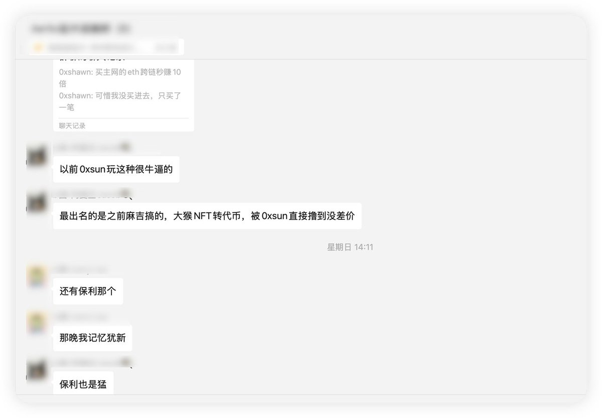

# Exodus 雙鏈套利獲利操作復盤

> **來源**: [@dami16z](https://x.com/dami16z/status/1917390264311898449) | [原文連結](https://x.com/0xSunNFT/status/1818666552461570284)
>
> **日期**: Wed Apr 30 01:27:17 +0000 2025
>
> **標籤**: `跨鏈套利` `雙鏈發行` `代幣價差`

---

> **來源**: [@dami16z (dami.eth)](https://x.com/dami16z)
> **日期**: 2025-01-27
> **標籤**: `跨鏈套利` `Exodus` `雙鏈發行` `案例分析` `SOL` `ETH`

---

## 背景介紹

27 號的時候，兩位朋友在討論 Exodus 代幣的異動情況，其中分享了一個 Solana 上的項目 Exodus。

而項目的雙鏈發行，往往會出現意想不到的套利機會。

比如之前鏈上皇 Sun 哥，曾經最出名的操作復盤（保利的代幣），有以下幾篇：

**猴地 NFT → 代幣的套利操作：**
- https://t.co/EsX3Kv4Hnk
- https://t.co/acrZNI0NDx

**保利代幣的套利操作：**
- https://t.co/TKbJlMaZsE
- https://t.co/BBir3g7HKn

## 套利案例復盤

Solana 上的項目方 @EthereumExodus，做了一個跨鏈工具，可以把 ETH 的 token 跨到 Solana 做交易，目的是為了讓以太坊的用戶可以流動到 Solana 上去。

**官網：** https://t.co/SqwZxuaWjJ

可以看到，官網左下角分別貼了兩個不同鏈的官方代幣。既然有跨鏈的操作，雙鏈的 token 就有可能發生價差的情況。

## 獲利機會分析

追溯下來，當時第一個通過 ETH 進行跨鏈代幣的玩家，透過這個價差機會賺到了數萬 U。

**套利完整路徑：**

1. 發現雙鏈發行的 Exodus 代幣在 ETH 和 SOL 兩條鏈上存在價差
2. 使用官方跨鏈工具，將 ETH 鏈上的代幣跨到 SOL 鏈
3. 在價差存在期間快速完成跨鏈套利操作
4. 獲利離場

## 關鍵要點

- **雙鏈發行項目**常常會出現短期價差套利機會
- **跨鏈工具**的存在為套利提供了技術可行性
- **速度是關鍵**：第一個發現並執行的玩家往往能獲得最大利潤
- 需要同時監控兩條鏈上的代幣價格差異
