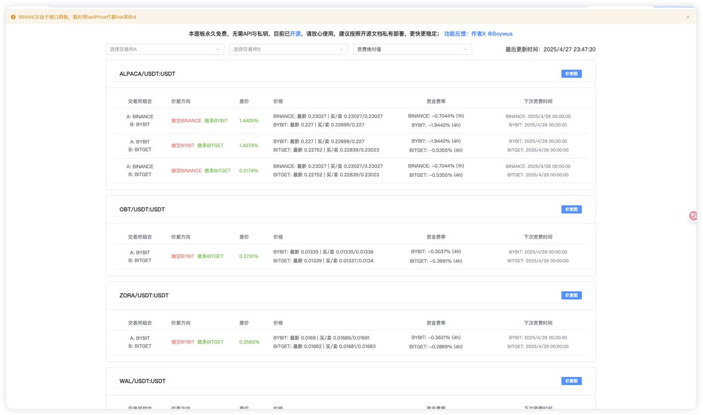

# Taoli 跨所套利工具 - 開源價差發現面板

> **來源**: [@Boywus](https://x.com/Boywus/status/1916526082280599799) | [原文連結](https://taoli.tools/)
>
> **日期**: Sun Apr 27 16:13:20 +0000 2025
>
> **標籤**: `套利工具` `跨所套利` `開源軟體`

---

> **來源**: [@Boywus](https://twitter.com/Boywus)
> **日期**: 2026-02-18
> **標籤**: `跨所套利` `工具` `開源` `價差發現`

---

## 工具更新內容

開源的資費面板進行了以下更新：

### 主要功能更新

1. **跨所價差套利機會發現**
   - 現在支援跨交易所之間的價差套利機會發現功能

2. **客戶端效能優化**
   - 加載時間優化至 1 秒

3. **服務端效能提升**
   - 數據統一訂閱機制
   - 採用記憶體讀取，速度更快

## 使用說明

- **資費面板定位**：僅用於發現交易機會
- **實際交易**：請使用 [@aliez_ren](https://twitter.com/aliez_ren) 的 Taoli Tools 進行交易操作

## 開源資訊

- **授權**：永久免費
- **開源專案**：[Taoli Tools](https://t.co/crwKlaXkqf)
