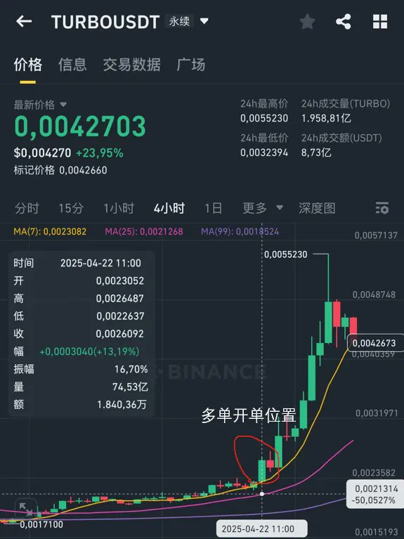
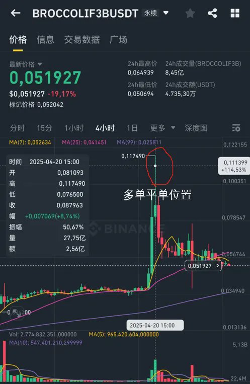
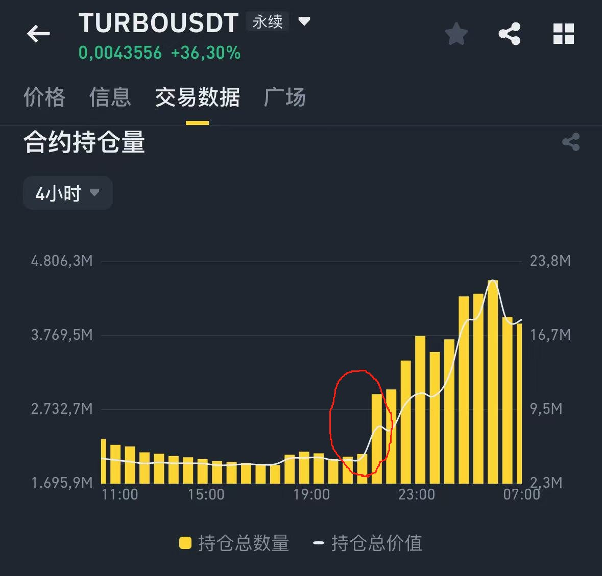
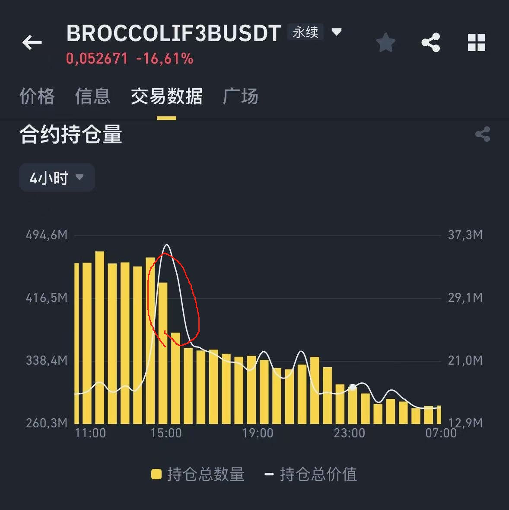
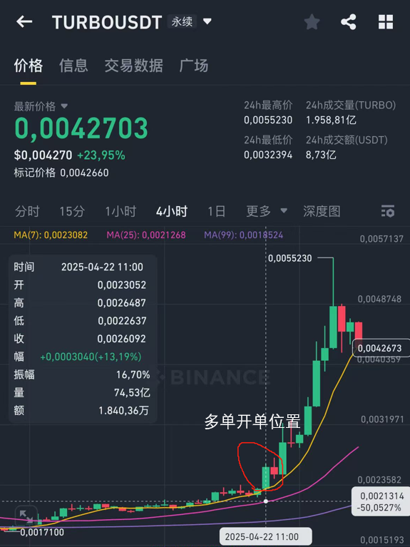
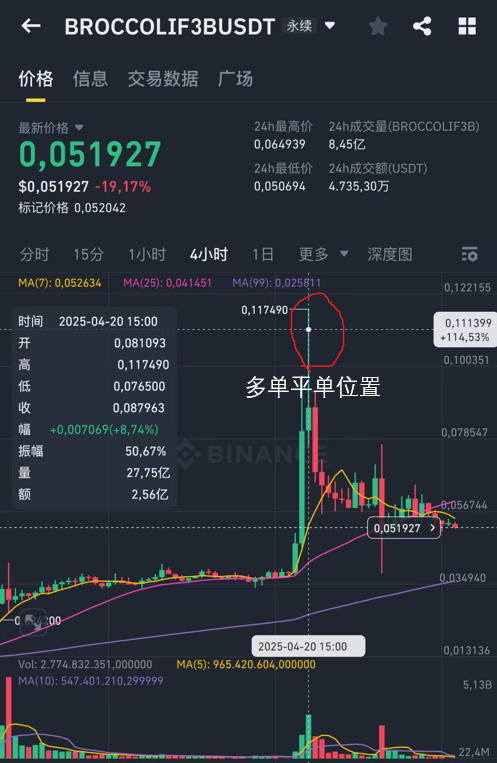

# 永續合約持倉量與資金費率：捕捉莊家動作的實戰指南

> **來源**: [@0xTZ_DeFi](https://x.com/0xTZ_DeFi/status/1916176833269387478)
>
> **日期**: Sat Apr 26 17:05:32 +0000 2025
>
> **標籤**: `持倉量分析` `資金費率` `莊家識別` `合約交易`

---

> **來源**: [@0xTZ_DeFi (0xTZ 💢)](https://x.com/0xTZ_DeFi/status/1783100951782256902)
> **日期**: 2024-04-24
> **標籤**: `永續合約` `持倉量` `資金費率` `莊家分析` `市場微觀結構`

---

麥總 @Michael_Liu93 這篇寫得真的很好,看完讓我想起了很多次被莊支配的恐懼😇。借這個機會說說我的一些思路,大家可以參考一下。

## 如何透過持倉量(OI)變化捕捉莊家動作?

我們先來看持倉量的含義:持倉量(Open Interest, OI)就是尚未結算的合約總數。OI 變化反映了市場資金流向:

- **OI 上升**意味著資金持續流入
- **OI 下降**表示有頭寸平倉撤出

換句話說,當 OI 放量拉高時,經常意味著新單進場(可能是莊家在加倉);反之,OI 下降可能說明莊家在高位出貨或散戶平倉逃跑。

### 實戰案例:結合價格走勢理解 OI

**案例一:Turbo 幣拉升(莊家建倉)**

Turbo 幣在 4 月 22 日有一波大幅拉升(4 小時圖中可見 11:00 的長陽)。從圖中可以看到,這個位置價格大漲,而緊接著 OI 大幅增加,這正說明莊家在此之前不斷加倉多單。

關鍵規律:
- **價格上行 + OI 同時增長** → 很可能是莊家推動上漲
- **價格上行 + OI 反而下降** → 可能是多頭被動縮量(短線多單回補)或假突破

在 Turbo 4 小時 K 線上,4 月 22 日 11:00 出現了一個明顯的拉升點位。結合持倉量數據,我們發現 4 月 22 日晚合約持倉量猛增,表明當時有大量新的多單被建立。持倉量上漲表示資金湧入市場,這些跡象共同暗示莊家正在佈局做多。

**案例二:BROCCOLIF3B 出貨(莊家平倉)**

以 BROCCOLIF3B 為例,4 月 20 日 15:00 同樣出現了劇烈的波動。當時價格上漲到 0.11749,之後迅速回落。與此同時,合約持倉量圖在 15:00 後出現斷崖式下跌,持倉量從接近 490M 瞬間掉到 400M 以下。

這充分說明:**OI 大幅下降時,意味著多頭大量平倉離場,對應著莊家在高位發貨獲利**。利用這種方式,莊家能在高點吸走散戶的籌碼,然後利用平倉帶來的拋壓推低價格。麥總在圖中標的「多單平倉位置」就是典型的莊家鎖定利潤後清倉的例子。

**綜上所述**:如果某一個幣在高位出現長陽 K 線伴隨持倉量下跌,通常意味著莊家已經出場,散戶多單被套。**OI 減少時通常意味著資金流出市場**。

## 如何用資金費率和盤口行為進一步印證?

### 資金費率(Funding Rate)的含義

資金費率是永續合約特有的週期性費用,正負值反映了多空力量對比:

- **資金費率為正**:合約價格高於現貨,市場上多頭需要支付資金費給空頭
- **資金費率為負**:空頭占優,空頭需要支付資金費給多頭

當我們看到某一個幣的資金費率異常走高,就代表大量多單存在,可能是莊家拉盤時逼散多頭或積累籌碼的信號;如果資金費率突然轉負,則表示多頭情緒消退,空頭力量上升。

簡單來說,**費率的急速變化可以佐證 OI 與價格的線索**。

### 盤口行為分析

透過盤口(買賣掛單)也能看出端倪:

莊家常透過假掛單製造假象:
- 在重要支撐位掛大量買單吸引跟風買入,隨後悄然撤單,導致散戶被套——這就是假突破
- 在壓制行情時,可能在天花板掛大量賣單給人錯覺

由此可見,**緊盯盤口的大單排布和突發撤單,配合資金費率動向**,是確認莊家意圖的好方法。例如 K 線上突然放量但多頭合約並未實際增加,就要警惕可能是假突破。

## 常見的陷阱策略

莊家誘多誘空的手段很多:

1. **假裝開多誘導散戶入場後猛然殺跌**
2. **假跌破後快速拉起反手做空**

在傳播上,這些套路經常伴隨突如其來的消息或情緒放大。

### 舉例

- 幣價突然突破前期阻力線,多頭蜂擁而上,但很快暴跌,那是莊家打穿支撐再拉升的表演;反之亦然
- 有時價格在高位做出一個假頂,快速向下,又吸引空頭追入,然後又馬上傳出利好反向拉起(讓做空的人跳水)

這些都是莊家常見的收割手法。所以,當看到市場突然放出大額訂單且伴隨尖銳的反向波動時,**一定要保持冷靜,不要盲目跟單**,很可能就是莊家在割韭菜。

## 總結和小 Tips

我主要遵循以下思路:

1. **關注 OI 和資金費率的極端變化**:多頭拉升時 OI 不漲反跌就比較危險
2. **結合盤口和 K 線情緒**:盡量識別是否有「假突破/假跌破」的跡象
3. **橫盤整理階段觀察**:可留意是否有不對稱的掛單或資金流入,一般來說這是莊家吸籌的表現
4. **控制風險、分批進出**:不要輕易抄底或追高,看到自己不熟悉的高槓桿暴漲暴跌場景時,要多警惕一些

最後說一句:**不盲目追漲跌、靈活設置止損、分散持倉,才能在牛市和熊市生存下來**。

---

## 附:麥總原文重點整理

### 為什麼莊要用合約收割?

1. **收割需要找對手盤**:現在散戶不願意接盤山寨幣現貨,但很多合約交易者樂意做空,莊爆掉做空的,讓他們平倉這個動作就是「買」,相當於把空軍高位轉化為買盤
2. **合約的流動性是現貨的數倍**
3. **有槓桿,莊的資金使用效率極高**
4. **流通的現貨只要控的住,合約隨便操盤**

### OM 案例

比如之前瘋漲的 OM,怎麼能一直漲這麼多?操作就是控住現貨,然後莊開合約多單,透過拉現貨去爆合約的空單,然後合約多單賺的錢繼續買成現貨,然後一路滾雪球,市值越來越大。

### 如何發現莊在搞事情?

主要關注 Open Interest(OI 合約持倉量):

**用法一:看絕對值**
- 如果一個市值很低的標的,合約持倉量巨大,甚至超過了他的市值,這種情況絕對有遊資或莊在埋伏搞事情

**用法二:觀察瞬間變化**
- 觀察合約持倉量的瞬間變化來去抓莊在開多單和空單的瞬間,然後你去蹭莊的車
- 當你看到 Turbo 莊多單瞬間開進去了,現貨也開始拉了,這個時候不該去想怎麼開空單,而是去嘗試蹭莊多單的車
- 當你看到 F3B 莊多單瞬間都把 OI 平斷崖了,這個時候不說去做空,至少有多單的話也該跑了
