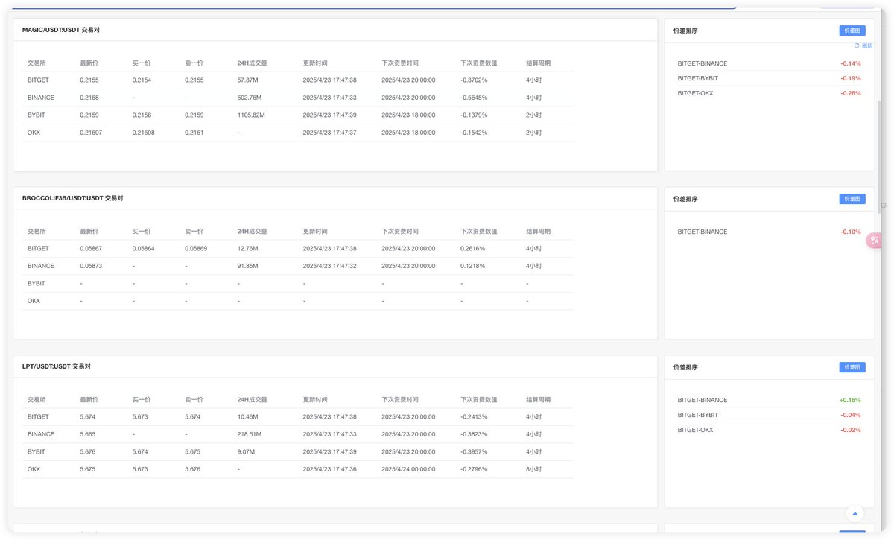
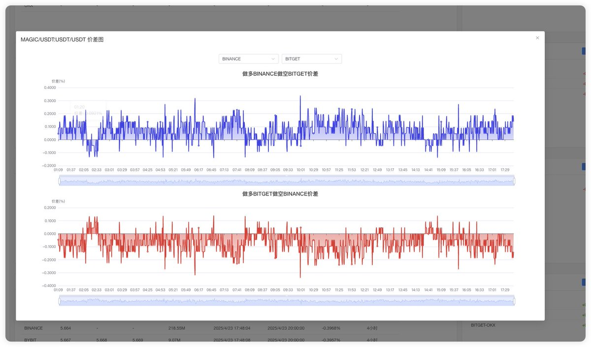

# Taoli 跨所套利面板 — 資費套利全網對比工具

> **來源**: [@Boywus](https://x.com/Boywus/status/1914979678399721864) | [原文連結](https://taoli.tools/)
>
> **日期**: Wed Apr 23 09:48:28 +0000 2025
>
> **標籤**: `套利工具` `跨所對比` `資費套利`

---

> **來源**: [@Boywus](https://twitter.com/Boywus)
> **日期**: 2026-02-18
> **標籤**: `跨所套利` `資費套利` `交易工具` `CCXT`

---

## 工具介紹

Taoli Tools 推出新版本的資費套利全網面板，提供跨交易所套利機會的全面監控與對比功能。

## 核心功能

### 1. 資費全面展示
- **資費時間**：顯示各交易所的資費計算時間點
- **資費週期**：展示資費結算週期
- **資費比例**：完整呈現各平台的資費率

### 2. 跨所價差對比
支援多個交易所之間的即時價差比對，方便發現套利機會。

### 3. 網路優化
- **無需梯子**：完全支援無 VPN 環境下訪問
- **CCXT 橋接**：透過 CCXT 整合多交易所 API
- **流量優化**：降低了數據流量占用

## 技術參考

本工具參考了以下專案：
- @aliez_ren 的工作
- @rnmumu3 的工作

## 使用方式

目前正在招募內測夥伴進行測試，有興趣者可私訊 @Boywus 報名參加內測。
