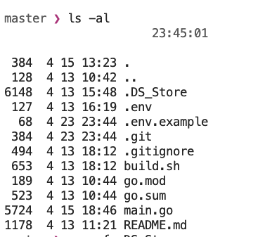
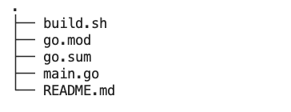

# Gate 交易機器人撤離分享

> **來源**: [@dan326714](https://x.com/dan326714/status/1915069863019913613) | [原文連結](https://twitter.com/rnmumu3/status/1915069863019913613/photo/1)
>
> **日期**: Wed Apr 23 15:46:50 +0000 2025
>
> **標籤**: `交易機器人` `自動化交易` `代碼分享`

---

> **來源**: [@dan326714 (十年一夢)](https://x.com/dan326714)  
> **日期**: 2026-02-18  
> **標籤**: `Gate.io` `交易機器人` `量化交易` `程式碼分享`

---

## 撤離 Gate 交易機器人經驗分享

作者分享了從 Gate.io 交易所撤離的交易機器人代碼和架構。由於程式採用半自動化設計,程式碼不會上傳至 Git (作者的 Git 帳號已被標記)。

### 專案結構

程式採用模組化設計,主要包含以下組件:

- 交易邏輯模組
- API 連接層  
- 風險控制系統
- 半自動執行框架

---

**注意事項**: 此為作者個人使用的半自動化交易系統,使用前需要理解程式邏輯並根據自己的需求進行調整。
