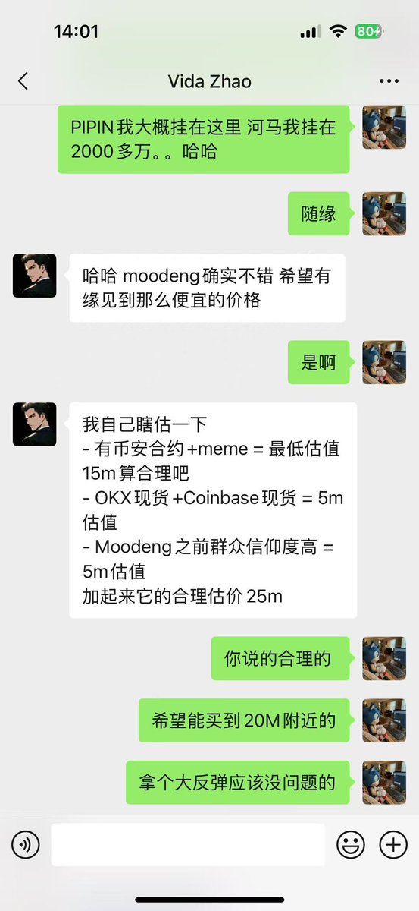
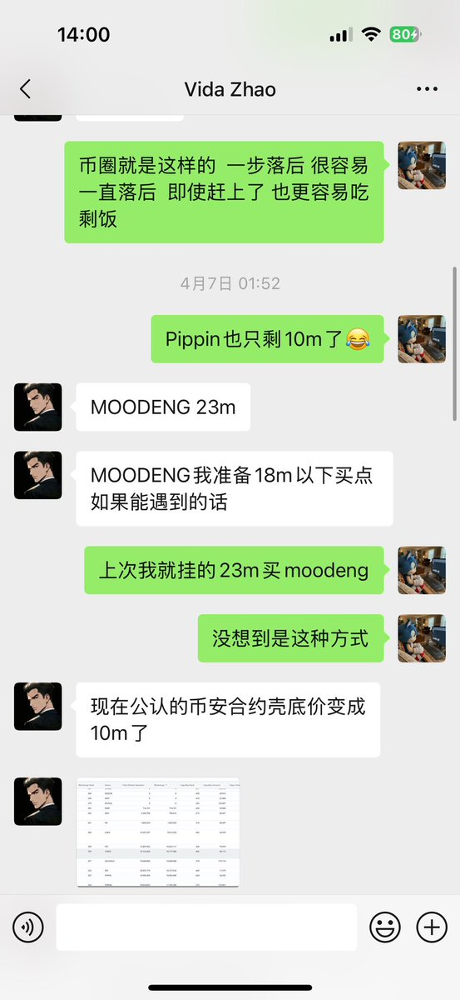
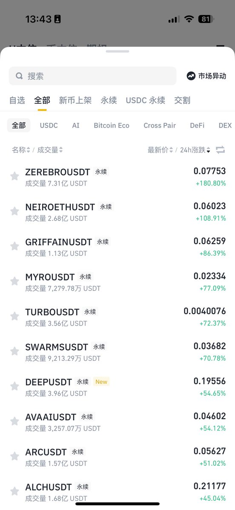
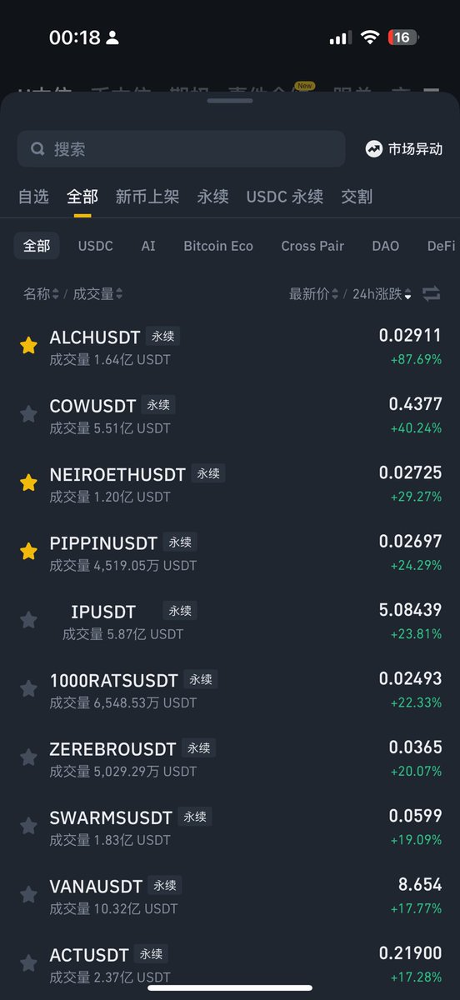
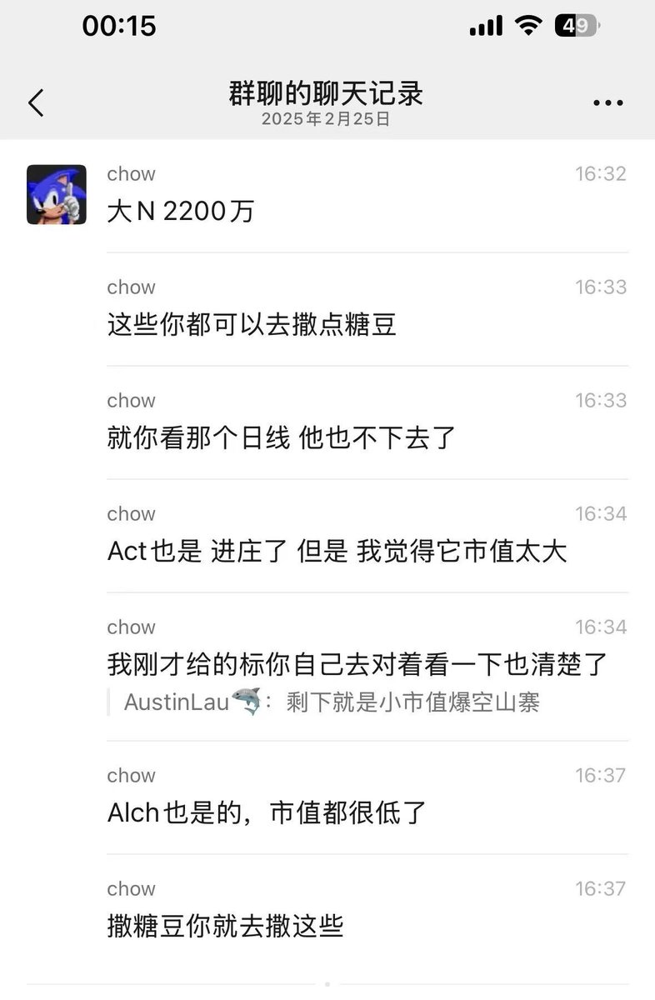

# 小市值代幣交易策略與市場觀察

> **來源**: [@daidaibtc](https://x.com/daidaibtc/status/1914925370174022015)
>
> **日期**: Wed Apr 23 06:12:40 +0000 2025
>
> **標籤**: `小市值` `交易策略` `市場微觀結構`

---

> **來源**: [@daidaibtc (带带带比特)](https://x.com/daidaibtc)
> **日期**: 2026-02-18
> **標籤**: `小市值代幣` `交易策略` `市場觀察` `幣安合約` `Solana` `BSC`

---

## 核心思路

玩小市值的思路一直沒問題。只是陰跌震盪和暴跌買入的難度，不可同日而語。

舉個例子，當初我和方程式討論的時候，moodeng 20M 你去看 K 線，估的很精準的，我們玩的多的會有自己的估計方式。但對於參與經驗少的玩家來說，買什麼、哪裡買、買多少、要被洗多久、能不能拿到大反彈都是問題。只能靠個人總結觀察了。

## 市場觀察

引發我的思考有：

1. **小市值標的依舊有價值**：即使現在數量多了，天花板也低了一些
2. **部分標一直有莊在裡面**
3. **Sol 小市值殼子明顯有陰謀盤**（甚至可能是 sol 基金會？這個瞎逼猜的了），BSC 的則更像散戶集中營
4. **BSC 的同樣有價值**：那幾個小市值現貨都是 OI 極高的
5. **對於套住 or 有獲利的個人來說**：止盈或許更好些？我對這個賽道的整體看法是反彈而不是反轉

## 選幣邏輯

全是小市值，可以印證下午撒糖豆這個思路沒啥問題。行情很差的時候，這些非常便宜的東西是可以吸引到市場注意力的。

說的很明白了，**幣安合約本身就是有價值的**，這個之前聊過，雖然現在小市值挺多了，但是一千多萬是值的，然後就是選新 List 的，沒有下架風險，活躍度也高。

這種東西，我本來就沒辦法告訴你具體的標，市值太小，很容易 PVP。但其實根本不難找。
