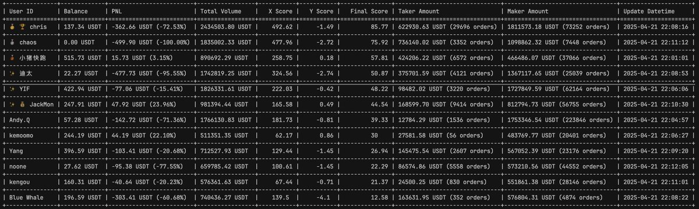

# Hummingbot 量化交易競賽新手實戰復盤記錄

> **來源**: [@yangle666](https://x.com/yangle666/status/1914998501899141208) | [原文連結](https://thoughtful-chamomile-c72.notion.site/1dd422f8039880418d53e052c494e66c)
>
> **日期**: Wed Apr 23 11:03:16 +0000 2025
>
> **標籤**: `量化交易` `新手學習` `實戰復盤`

---

以下是整理好的文章內容：

---

> **來源**: [@yangle666 (yang)](https://twitter.com/yangle666)
> **日期**: 2024
> **標籤**: `Hummingbot` `量化交易` `做市策略` `新手實戰`

---

量化交易，對交易小白一直都是個神秘的領域，一直想深入學習又各種緣由沒深入（主要不是自己擅長賺錢的領域），也是在多次研究後了解到 Hummingbot，又找尋到由 dolm 組建的中文社群，跟過一期培訓（純湊數，幾乎沒聽課），也算接觸了量化交易，始終是含苞待放的新手而已。

此次也是社群第四次比賽，也是我最後快結束前決定報名，初衷也很簡單「實戰中學習」。

作為一個真正的純純新手，一次量化交易沒做過，一次 Hummingbot 沒用過，一點量化知識也沒有，就這麼毅然決然的上車了，我對這個認知的很簡單，我賺不到錢，我透過一次實戰學到很多，我現在沒有量化交易相關的業務，但未來一定會涉及到。

當然，最終成績拿了倒數第四，而且虧錢，也挺好，短短 1 週多能力得到巨大提升。我也想透過總結給自己一個交代，給後面純純的量化新手一些學習的經驗。

此次比賽對一個純新手說核心武器還是 ChatGPT，不懂你就問，有想法就和它聊。

實話實講，比賽的規則其實都沒搞明白我就直接衝了，只清晰的明白交易額完成 50 萬才合格。起初第一天拿到比賽帳號我就思考幾個問題：

> Hummingbot 是怎麼部署的來？

> 選什麼交易對？

> 用什麼策略？怎麼啟動？

其實 Hummingbot 怎麼用，只需要細讀官方文件幾乎就全部能搞定，前提是你真的讀了。

其他的全部交給 ChatGPT，從詳細的市場分析，到策略定製，細節調整，數據分析與建議，都是和 Chat 共同完成的。

我是直接把 Chat 定義成了教練來使用。

---

## 比賽過程

### 第 1 天（先起飛，在調整姿勢）

開局是懵逼的新手，在配置系統、伺服器、調試就花了好多時間，反而選幣真的是隨便選的（PEPE，考慮交易量還可以）。起初的想法就是先跑起來，跑起來我才能有想法啊。這個過程還算曲折吧（主要當時 dolm 老師講課我沒認真聽），透過官方的文件和 dolm 總結的一些課就學會了，當晚順利執行（使用了 V1 PMM 策略），這也是我第一次量化實操的起點，意義非凡。第二天一看還略有盈利，那心情當時覺得賺錢就這樣簡單？

### 第 2 天（深入學習，換策略）

量化雖然跑起來了，但就到這個時候對 Hummingbot 各項功能和策略都不是很了解，這一天下來處於亢奮學習狀態，把社群所有的影片、往期競賽選手的賽後總結都翻閱了個遍，雖然之前也看過，但不如實操的時候看的有效果，也有一些新的感悟和想法，尤其針對 AS 策略，學習完立刻決定換策略。

這時候選擇了最熟悉的 SUI 交易對，快速透過 GPT 溝通確定了第一版策略。「AS 策略 V1」

### 第 3 天-第 7 天（優化策略，從欣喜到平靜）

這個過程就是每天和 AI 發送運行狀態的報告，溝通策略，🎯 AS 策略 v1 ➜ v2.3 ➜ v3：極限刷量之路。這個過程挺順利，每天都會有盈利，高峰期盈利 5.4%（雖然不多，但是賺錢啊，就這樣保持下去，拿不拿獎我都有錢賺），中途 dolm 老師開了個直播講理兩個策略，其中「AS+hedge 策略對沖」非常適合我現在的運行調整，不過最終我是在沒搞定 hedge 這個對沖策略就放棄了。

這個過程其實挺有意思的，一開始覺得要瘋狂學這學那，途中也發現自己好像也沒那麼忙，就是微調策略，觀察對手分析對手，看著盈利慢慢上升。

### 第 7-10 天（看似有序，實則雜亂）

到第 7 天的時候，多少是有點著急了，盈利略有下降，主要是照這個速度下去，根本完不成 50w 的交易量，下午經過思考和分析，決定開啟第三次大調整，改策略、換交易對。

這天下午很晚的時候啟用了 SOL 合約（交易量夠大、波動頻繁），generic_xgrid 策略，和 V1 不一樣，又花了些時間研究如何使 V2 的策略，還算順利，成功啟動：SOL 網格 v1.0 ➜ v1.6 ➜ v2.0：趨勢掛單、槓桿切換。

當天晚上的交易量數據就非常明顯突升，第 8 天的時候交易量更是猛升，只是利潤幾乎快沒了，先不管繼續刷吧。隨著交易量的大大提升，到第 10 天的時候，刷到 70 萬的時候已經虧損 127 刀了。又陷入了思考，回顧下這幾天的路程，哪裡出錯了？行情跌宕起伏了？策略激進了？

這個階段我自己總結就是，新手的盲目選擇吧，對前面的成績小有自信，到後面橫衝直撞並無策略可講（比如資金的分配、幣種的配比、利潤的保存、回撤的控制等等），只是會用工具而已，也在反思，這如果不是比賽，是十、百倍真金白銀我該怎麼辦，能力充足的前提，要敬畏市場，幾次波動就如此慘烈，何況使用的帳號還有手續費的優勢。

### 第 11 天以後（綠水長流）

比賽到這個階段，我果斷的選擇了放棄競賽，拿不到獎金，那我就不能損失更多的本金，我的目的其實已經達到了，損失一點本金，參與一場真切的實戰，快速學習了量化、Hummingbot，非常值。

青山不老，綠水長流。

---

## 競爭對手分析

比賽中我認為比較有意思的就是每天盯著榜單分析對手，因為是競賽，沒人分享策略，榜單排行差異都挺大，有刷量的，有賺錢的，有以小博大的，我就盯著榜單分析，琢磨，他為什麼賺錢，他什麼策略，訂單怎麼跑的等等，這也是一個學習非常好的方法，拆解。

---

## 寫在最後

給自己一個總結「非常有價值的一場競賽」

從一個純新手，使用 AI 配合參加比賽，做到沒墊底，學習了大量的知識，很開心、充實。

一些反思：工具只是工具，工具以外欠缺的能力實在太多了，路還遠，虛心學、不預學。

做自己擅長的事情，把能賺到的錢先賺到手，在去錦上添花。

最後感謝 dolm 提供的 Hummingbot 中文社群、社群內的學習資料、私下指導等，也希望量化競賽能持續進行，能有更多的選手參與進來。

推薦兩本書《征服市場的人》、《寬客人生》

作者：Yang
