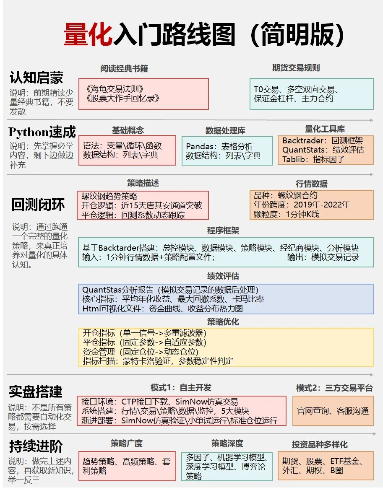

# 量化交易學習路線圖

> **來源**: [@Crypto_QianXun](https://x.com/Crypto_QianXun/status/1913425236122538424) | [原文連結](https://twitter.com/Crypto_QianXun/status/1913425236122538424/photo/1)
>
> **日期**: Sat Apr 19 02:51:40 +0000 2025
>
> **標籤**: `量化交易` `入門教學` `學習規劃`

---

> **來源**: [@Crypto_QianXun (千寻 🌸)](https://twitter.com/Crypto_QianXun)
> **日期**: 2026-02-18
> **標籤**: `量化交易` `學習路線` `入門指南`

---

## 量化交易入門學習路線圖

適合小白入門的量化學習路線圖：

