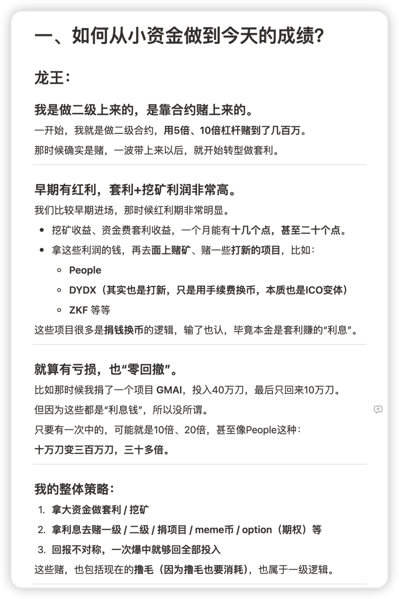

# 龍王交易策略深度分析：從德州到套利的智商碾壓

> **來源**: [@poyincom](https://x.com/poyincom/status/1913896140975874464) | [原文連結](https://poyincom.notion.site/space-1da5c5a8b0978038893ad42f64d973bb?pvs=4)
>
> **日期**: Sun Apr 20 10:02:53 +0000 2025
>
> **標籤**: `交易策略` `套利` `事件交易`

---

> **來源**: [@poyincom](https://twitter.com/poyincom)
> **日期**: 2026-02-18
> **標籤**: `交易策略` `套利` `德州撲克` `合約交易` `DeFi`

---

## 龍王交易經歷概述

認真聽了這個 space，含金量很高，關鍵是老師們都很真誠。

龍王是真神，純粹是「天賦」型選手做到 A9（資產達到億級）。

## 初識龍王

第一次見到他是在小俠的微博，他是頭號黑粉，當時就覺得他時間很多，每天有精力寫段子，沒想到那時候他也在做合約。

後面他開個微博叫「電子廠小侠」。又過了很久到 DeFi 發現他巨有錢，隨便搞個套利都是上千萬。

## 交易演進路徑

從德州撲克 → 合約交易 → 套利 → 事件交易

幹的都是 PVP 的活，智商純粹的碾壓。在學校肯定是學霸，數學肯定是前幾名。

## $TRUMP 事件

從 $trump 看得出他比較難受。1-2 月那一波推文強大的輸出，思維上也給了我很多啟發。

Space 選了他發言的重點，整理成了文檔（原文提供了 Notion 連結，但需要 JavaScript 才能訪問）。
