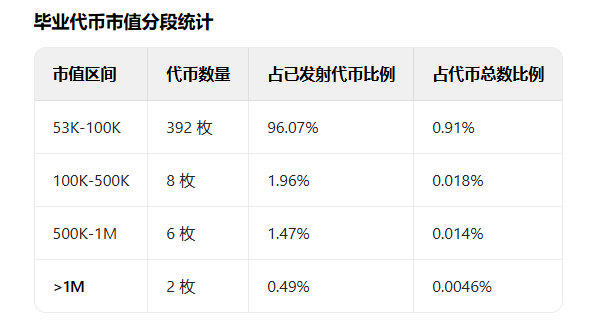
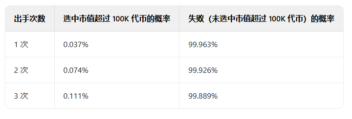
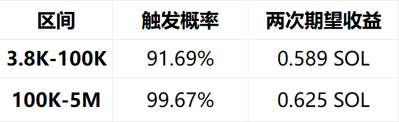
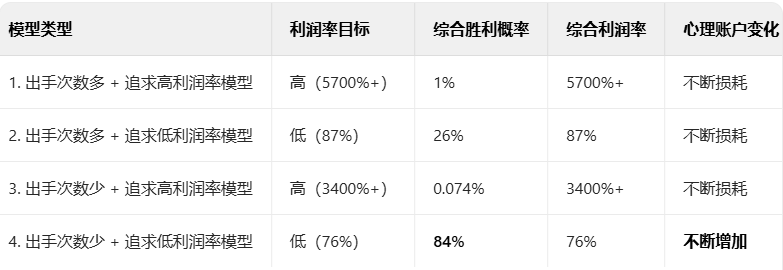

# MEME 市場掠金術：小資金 300U～100萬 U 的飛升策略

> **來源**: [@Shanks_A9z](https://x.com/Shanks_A9z/status/1913161508290269456)
>
> **日期**: Fri Apr 18 09:23:43 +0000 2025
>
> **標籤**: `MEME 交易` `資金管理` `策略量化`

---

## 前言

還是得交流，才能意識到一些問題是痛點。

其實很多人苦惱於，小資金想做大太難了，這個難度似乎堪比登天。

但其實不是，小資金想要做大，或者說來到一級市場，重中之重就是建立自己的交易體系。（我打出這句話的時候有點煩我自己了）這破大道理誰都會講，但沒有什麼人講真實的情況，沒有人會去說到底該如何建立，如何透徹的明晰這個交易體系。

沒關係，我講，我寫。我的文風向來是草莽氣息嚴重，可能很多地方的措辭不得當，太過於直白，不講什麼扯淡的車轱轆面面俱到的話。但沒什麼不好，這個市場需要有人寫點這些玩意。

另外本篇文章的文字居多，可能看著有點麻煩。熟悉我的朋友應該知道，我寫東西，實用並且是真的能夠實踐操作，是第一位的。所以我覺得本篇還是異常有價值的。如果感到迷茫，稍微耐心點，認真讀完，你會有所收穫。

我結合我自己的經歷和經驗，寫寫到底該如何具體的由幾百U到跨過100萬U的策略及路徑。

到現在為止，我是還沒有徹底摸到A8的，其實很菜，比不上其他的一些很厲害的大哥。所以到A8.5，A9的路徑，我沒有切實的經驗，所以就沒法寫。

然後對於我的歷程，我認為我自己現在並不是很成功，所以就先不寫了。等哪天跨越500萬U後，再吹我的牛逼吧。

閒言少敘。散戶朋友們的小資金，有多小呢，一部分幾百U，一部分多點，1K~1萬U。在這裡就按照300U起步算吧。所以本篇也就算是在一級MEME市場，300U-100萬U的真實路徑策略，應該能讓大家少走一些彎路。

（另外本文的所有計算數據及處理都肯定是有偏差的，數據的計算僅作為評判優劣時的其中一個標準）

## 一、數據整理（以PUMP為例）

先來一些數據的分析。

4月15日，pump誕生了43,271個MEME幣。然而畢業（打滿發射）的代幣數量僅為408枚。

畢業率僅為0.94%，不到1%，99%的代幣死在內盤。

打滿發射的408枚代幣數據如下：（原文附有數據圖表）

## 二、策略的透徹明晰

策略分類無非是：出手次數的多/少+追求高/低利潤

進行結合的話就會出現以下四個策略模型：

1. 出手次數多+追求高利潤率模型
2. 出手次數多+追求低利潤率模型
3. 出手次數少+追求高利潤率模型
4. 出手次數少+追求低利潤率模型

接下來我們從數學上來徹底清晰的量化這四種策略的情況及優劣。

由於本篇是講小資金起步的策略，所以下文對於自己方面都以300U為基準（我跟你們一樣，最開始的啟動資金就是這個數）來分析。至於更多資金，即1萬U~20萬U、20萬U~100萬U的策略，會在後文講到。

如果是300U，目前也就是2.4SOL，就按照2.5SOL來計算吧。

在這裡多嘴再明晰一下盈利百分比的問題。因為GAS和賄賂費的問題，如果你每次0.1SOL的賣，每筆交易的損耗（按照標準速度計算）約為0.005SOL，如果在只保本的情況下，你也得再有一筆賣出的交易，損耗同樣為0.005SOL。兩次交易的損耗總的0.01SOL。也就是你買入後，起碼得有10%的利潤，再全部賣出，才能回本。帳面利潤低於10%，就是虧損的。

### 1、出手次數多+追求高利潤率模型

為了方便計算，現在就先不考慮交易的損耗了。既然是出手次數多+追求高利潤，那麼就按照在一天的時間之內，你有2.5SOL，每次0.1，出手了25次。不進行止損的操作，為了追求高暴擊。

如果帶上翻倍出本的策略。你出手了25次，想吃到回本的利潤，至少需要踩中一次高暴擊。那麼這次需要的漲幅是4800%也就是48倍。

如果想吃到這種的倍數，需要的路徑只有一個，那就是在內盤（在43271枚幣中）買入，吃到市值超過100K的代幣（16枚）。你有25次機會，那麼經過計算，你只踩中一次，至少能回本的概率為0.92%，對應你的虧損概率為99.08%。

如果不帶翻倍出本的策略的話，那麼這次需要的漲幅是2500%，也就是25倍。

按照平均市值來計算（53K-100K的平均市值為76.5K，對應25倍就需要你在3.06K上車，但是PUMP的初始市值為3.8K了），所以你還是只有一個路徑，也就是從內盤到超過100K的盤子，經過計算，你至少能回本的概率仍然為0.92%，如果將95K的盤子納入進來，你至少能回本的概率約 0.92%-2.06%。對應虧損的概率仍在98%附近。

**總結**：為什麼會出現這樣的情況？為何你的虧損概率居然能如此的高？原因很簡單，你的本金不夠。這個不夠，是指你沒有至少500SOL的不夠。

每天經常參與PVP的車頭們，他們不會告訴你的是他們的兜裡擁有超過2000個SOL的打狗資金，但他們每次卻只塞2~10SOL。他們有足夠的本金，足夠的耐心去吃到屬於自己的一次暴擊，從而Cover掉所有的虧損，甚至能大賺一筆。從數學上來講，他們這樣的資金體量採取這個策略，才是最合適的。

而小資金採取這個策略，除非你的運氣和天賦異常逆天，在僅僅十來次的出手中，作為一個新手，就能從四萬多個代幣中買到超級高倍漲幅的代幣且一直拿到最後，否則就是逐漸虧光所有本金。

### 2、出手次數多+追求低利潤率模型

在PUMP上玩的話，平均漲幅約為663%，我們將止盈點位在15%~100%作為低利潤率的設置。

那麼其實在任何一個空間內都能容納我們100%的利潤。那就分的情況比較多了。

**（3.8K~53K）即內盤**。你買入，最可行的策略就是喊別人也進來接你的盤。低利潤率止盈的話，需要的就是幾十個點後就跑。

這是比較容易做到的，因為內盤的市值低，帶起漲幅需要的買盤要求很低。當前情況下，如果想在內盤吃翻倍，你喊來大約4000U的買盤即可。大約也就是40個人左右就行。這不難做到，上車後，在各個群都發CA，尤其是質量高的群，最好帶上能FOMO別人的敘事。這個策略也是一些人徹底量化想清楚後一直在做的。

**（53K-100K）**就需要比較大的買盤，那就需要你去喊來更多的人來接你的盤，條件較為苛刻了已經，需要喊來的人數只靠個人發群是辦不到的，那只能靠著自己的理解去選擇了。但是我們這裡只討論數學上的概率，所以排除經驗因素，那麼在這一段玩這個模型，是很難的，加之PUMP大家都清楚，不發射還好，發射後秒澆給的是絕大多數，這一段的含金量幾乎沒有。

**（100K-500K）**這一段的漲幅一般是由什麼構成的呢。1、小車頭。2、敘事的真實性（稍微有點梗和傳播度即可）。我們不能說是去依賴別人小車頭的買盤和跟單，那麼只剩下需要我們對於敘事的經驗及判斷力了。還是一樣，排除這個因素，我們來看看數學上的數據是如何的。

根據數據我們可以得知，超過100K的盤子有16個，其中，50%未超過500K，其餘都超過500K，和去到了超過1M。這個數據是極為可觀的，如果我們每一次都出手，勝率約在43%，盈利的總和相加後的粗略數字為 125%~675%。這個結論是否很出乎你的意料？

**（500K-1m）+（>1M）**。這倆都是同一類。到這個區間，需要漲幅的條件，就有三條，1、大車頭進場。2、莊盤。3、T2級別及以上的敘事。同樣，大車頭來與否，這個因素不可控，除非你是他的親爹。那就剩下兩個了，判斷是否有莊、判斷敘事及傳播度如何。

這兩條也是極富經驗主義的因素。從數學上來講，我們不去考慮這個經驗因素的影響，每個都上。那麼你的綜合利潤率的粗略數字為223%~1250%~上不封頂。這個數字的波動如此巨大的原因與你的止盈點位有關。

### 3、出手次數少+追求高利潤率模型

這一個類別，看起來似乎是異常相悖的。這對你的能力和經驗是有著極高的要求。同時你的經驗因素對這一策略的影響是佔絕大部分的。這一個策略不進行細講，站在新手散戶的角度來進行考量並無任何的指導意義。

但是似乎兩個字我加粗了，如果所處的位置不是小資金散戶，那麼這一個模型在有些時候，他其實並不相悖。經驗足夠豐富，能力足夠強的情況下，花時間去追求此模型是沒什麼問題的。

### 4、出手次數少+追求低利潤率模型

條件如下：出手次數少（控制在1~3次，低利潤率，設置為100%為止盈上限，止盈點位從25%~100%不等。每次出手的金額為0.5 SOL）。

在這個模型中，因為數量的原因，100K是個重要的分水嶺。我們進行區間合併，並將大於100K的區間上限設置為5M。

了解此情況的條件下。我們開始計算我們出手次數少（平均為2次，每次0.5SOL）+追求低利潤率模型（平均為62.5%止盈）在這兩個區間內的期望收益是如何的。（原文附有計算圖表）

不知道你是否意識到了，這個數據是很醍醐灌頂的。為什麼？因為在100K-5M的區間內，你的盈利觸發概率居然來到了99.67%。你可能感覺不強烈，那麼，反過來，你在這個區間進入交易，單從數學上來講，你的失敗概率居然只有0.33%。

**沒錯，少出手+追求低利潤率模型，這才是這所有策略中的，最優解。**

## 總結

在小資金起步時，排除經驗及能力因素的影響，四種策略模型的優劣對比如下：（原文附有總結對比圖表）

---

**★ 關鍵數據要點**：
- PUMP平台日產43,271個MEME幣，畢業率僅0.94%
- 小資金（300U ≈ 2.5SOL）最優策略：少出手+低利潤率
- 在100K-5M市值區間，盈利觸發概率高達99.67%
- 避免高頻追高倍策略，那需要至少500SOL以上的資金體量
