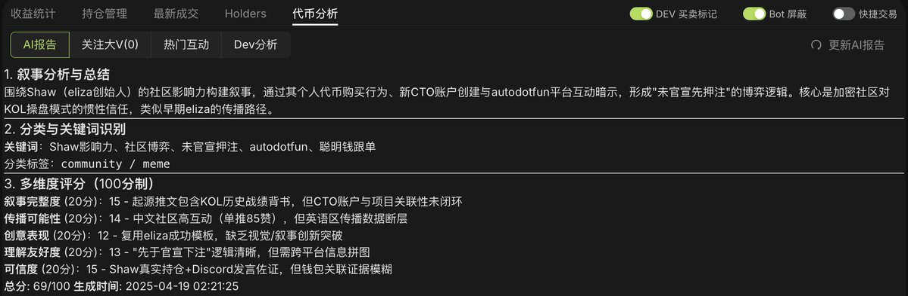
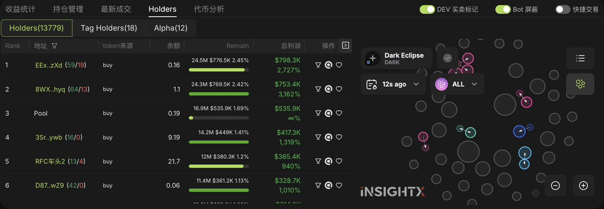
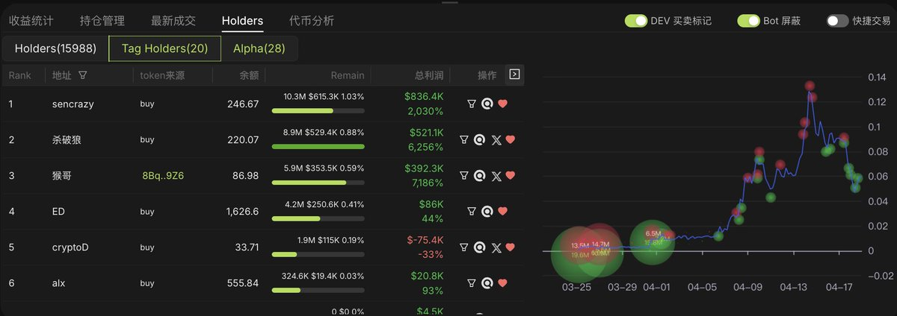

# 6551Dex：SOL 和 BSC 鏈上交易平台功能解析

> **來源**: [@cryptoxiao](https://x.com/cryptoxiao/status/1913524666268041602)
>
> **日期**: Sat Apr 19 09:26:46 +0000 2025
>
> **標籤**: `DEX平台` `鏈上交易` `錢包監控`

---

> **來源**: [@cryptoxiao (Cryptoxiao)](https://twitter.com/cryptoxiao)
> **日期**: 2026-02-18
> **標籤**: `交易工具` `DEX` `SOL` `BSC` `AI分析`

---

## 平台概述

6551Dex (@6551Dex) 是一個支援 SOL 和 BSC 鏈的去中心化交易平台，專注於提供快速交易、AI 分析和智能監控功能。

## 核心功能

### 一、錢包託管（用戶安全第一）

採用用戶本地自託管模式，並增加解鎖密碼進行加密（參考 MetaMask 錢包的解鎖密碼），防止瀏覽器插件的作惡讀取。用戶不需要為託管錢包的安全性而擔心。

### 二、SOL 的交易（快）

針對用戶可能性發生的交易都提前做了優化，保證用戶在需要交易的時候，點擊即上鏈，即使是防夾模式也做到了 1s 以內。短短的 1s 背後是工程師無數天的努力，交易的模組全部都是自己重寫的，保證最快構建。

**節點優勢**：
- 全自建魔改優化集群
- 延遲是目前 SOL 上第一梯隊（也得到了 SOL 基金會 @SolanaFndn 的認可）
- 自有高質押節點，為交易提供更快的速度

### 三、BSC 的交易（找不到比我們更像 SOL Dex 的 BSC Dex）

針對目前 @BNBCHAINZH 的 MEV 亂象，提供了覆蓋率更高的上鏈服務，保證用戶可以做到 90+% 的機率上鏈，同時也針對交易做了優化，保證用戶點擊即上鏈。

### 四、掃鏈面板（快就是第一）

提供第一梯隊的掃鏈速度和交易速度，後面會針對掃鏈單獨做一個 RPC 的集群，只做最快的，快就是好。

### 五、錢包監控（無限地址多策略）

通過集群的消息隊列保證了用戶無限地址高速監控的基礎保障，還提供了一些策略來讓用戶可以自定義自己的監控配置。

### 六、推特監控（Top0）

通過自研的推特引擎，為用戶提供高可定制化的推特專業面板，解決很久以來用戶投研和盯推特的難題。你看到的 0 延遲監控（面向如此多的用戶）其實是背後很多工程師的努力。

### 七、代幣分析（沒有之一）

創新性的結合鏈上與鏈下生成了一份完整的 AI 報告。AI 報告會聚合：
- 推特
- 官網
- 推文評論
- 發盤記錄
- KOL 關注等

在你看到 CA 想了解的整個人工投研流程，AI 引擎已經提前幫你全部了解過並且告訴你。沒錯，這就是 AI，這就是未來。

**叙事分析**：
整個 AI 團隊會為你不斷的優化，保證叙事角度清晰的瞬間，你看到的就是答案，並且隨著輿論的發酵，叙事會同步跟隨變化。

### 八、Holder 分析（專注於用戶的聚焦）

提供了全局的氣泡圖和前排地址的利潤展示，還提供了用戶監控錢包的全局視角。你可以點擊 Tag 查看所有你監控聰明錢的整體倉位點陣圖，你可以看到大家主要的成本區域，也可以看到出貨區域，讓你持倉心中更有底氣。

如果你剛接觸打狗，還沒有自己的聰明錢地址，那也沒關係，提供了 Alpha 團隊動態維護的聰明錢地址，在 Holder-Alpha 分組即可看到。

這些創新的點子都是 Alpha 團隊長期在一線打狗的反饋，不會打狗的團隊是做不出來好的 Dex 的。

## 平台願景

我們清楚的知道每家 Dex 的開發水平，包括我也給了很多 dex 解決了很多產品的問題，我們發現市場上並沒有像 Web2 成熟的券商產品，留給我們的舞台還很大。

我們想做的就是通過 AI 把輿論和鏈上一站式的為用戶提供，解決用戶的需求，讓大家哪裡賺錢去哪裡，目前 Dex 的內容只有我們規劃的 20%。
