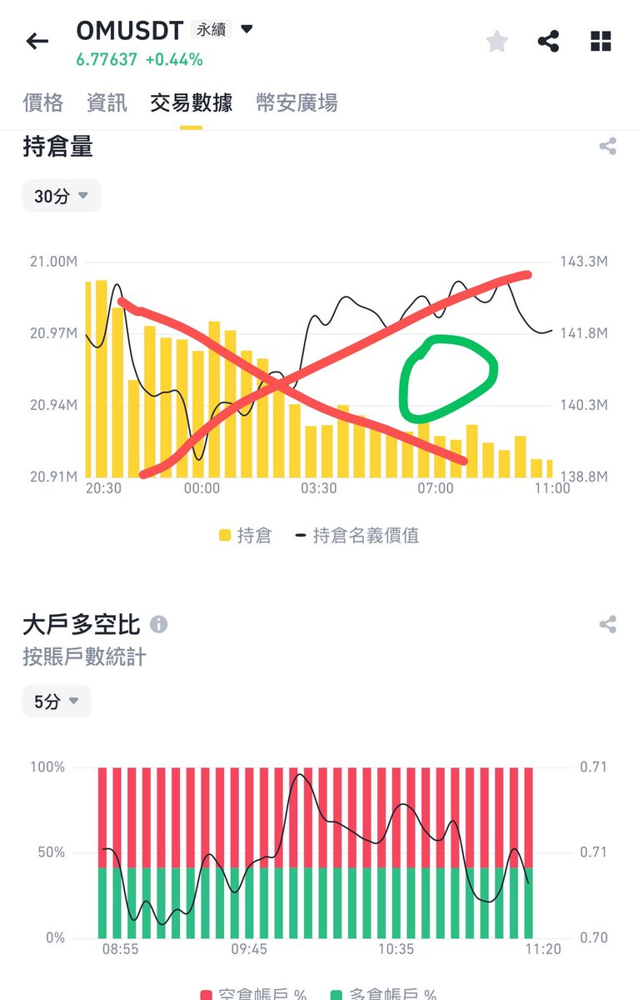
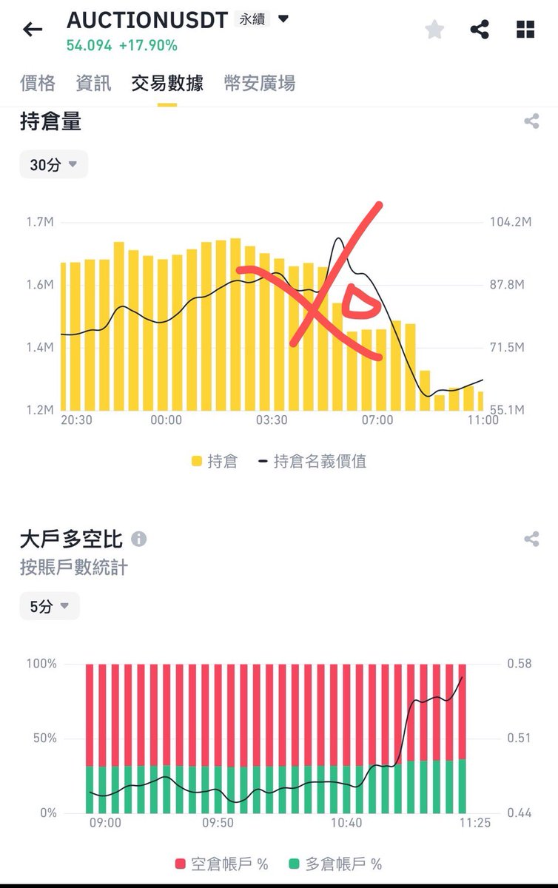

# 山寨幣做空指標：莊家持倉轉換識別法

> **來源**: [@xiaomucrypto](https://x.com/xiaomucrypto/status/1912906793719832746)
>
> **日期**: 
>
> **標籤**: `技術分析` `合約持仓` `莊家行為`

---

> **來源**: [@xiaomucrypto (川沐｜Trumoo🐮)](https://twitter.com/xiaomucrypto)
> **日期**: 2026-02-18
> **標籤**: `山寨幣` `做空指標` `莊家持倉` `合約交易` `交易策略`

---

## 莊家持倉轉換識別法

寫持續爆拉的山寨的做空指標，在爆拉之前，莊家的持倉方向肯定是多單。

### 核心識別指標

**指標 1：正常拉盤階段**
- 跟隨價格的上漲，合約持倉的名義價值跟持倉量保持一致持續貼合增長

**指標 2：莊家轉換持倉訊號**
拋開最早寫過的費率指標，當莊家準備結束操盤的時候，它會先走掉自己建立的多頭倉位轉換成空頭倉位。在這個過程中合約持倉的圖上會出現一個非常顯眼的特徵：

- 跟隨價格的上漲，**合約持倉的名義價值突然與持倉量分離！出現開口空洞**

這時候就是莊家透過拉盤或者托盤平多賣出多頭倉位，然後建立空單。因為這個節點莊家的操作會明顯的大額影響到持倉量的多少，但價格的上升或者托盤會顯示為名義價值可能一直在增長或者脫離貼合的曲線。

---

## 構建交易體系核心要素

### 1. 找到擅長的細分領域

首先是需要找到自己擅長的細分領域，比如：
- 現貨？
- ETF？
- 槓桿？
- 期貨？
- 期現套利？
- 理財產品借貸和現貨搭配套利
- 鏈上工具做夾子賺錢？
- 費率套利？

五花八門，但只要你在某一個細分領域一直可以賺到錢或者賺錢的機率大於 50%，都值得總結成策略反覆使用。

就拿現貨來說，又分長週期、中週期、短週期情緒。每種玩法對應的策略肯定也大相徑庭。我只會短週期四五天那種賺情緒的錢，因為自身性格缺陷，易衝動沒耐心，短週期的情緒操作更適合我。

### 2. 具像化策略條件

確定好最適合自己的細分領域之後，就需要開始具像化自己的：
- 買入條件
- 賣出條件
- 止損條件
- 每次操作的資金配比

在確定使用策略之前最好能透過編寫 Python 量化工具，爬歷史數據來回測一遍自己策略的收益率，看看能不能真正保證自己的策略是可執行的、盈利的，然後再去根據行情的變化修正。

### 3. 安全的交易場所

CEX 幣安、OK 或鏈上錢包相對靠譜的 DEX 比如 Uni、1inch。如果策略執行在非常冷門的交易所那就很可能要做好損失全部資金的準備，收益必須要和自己面臨的損失成正比。別錢是賺了交易所跑路了，或者鏈上 DeFi 跑路了😂。

### 4. 監測工具

針對策略的需求編寫相應的監測工具，或者用現成通用的監測工具給自己提供即時的監測服務，對幣安 OK 或者鏈上數據實時監測，最好可以即時發到微信上的那種。

### 5. 資訊接收管道

充分全面及時的資訊接收：
- 對有價值的推特進行監測，比如 @wublockchain12、@EmberCN
- 加入相對有價值的社群，尤其是可以給你提供非常多即時事件的群，層次和活躍度越高越好
- 他們更容易發現最新的事物，發現行業最新的動態或者創新
- 沒人說話和做交易的社群建議直接退掉
- 一些財經軟體比如金色財經有些數據資訊和經濟數據預告也相對有價值

比如 BRC20，如果資訊比較廣的人可能在三月 10 號左右知道有比特幣銘文這個事情。

### 6. 持續學習

**書籍**：可以作為借鑑，但真正賺錢的東西不會寫在裡面。投資類的書肯定不是寫出來的，而是在金融市場中用錢堆出來的。

**實戰經驗**：
- 自己或者自己認為身邊透過交易起家的幣圈牛人（非常多，每個人發財的門道其實都不太一樣，我一個朋友七分他靠幣安的 ETF 打針擼了小一千萬。現在沒這個漏洞了）
- 甚至可以是很多老表的虧錢經驗，也非常值得學習

如果你能把幣圈五花八門的虧錢方式都避開，那賺錢機率肯定在 50% 以上，活到下一個牛市的機率在 99% 以上。

### 7. 交易原則

要知道在這市場裡什麼事情不能做，跟上一條有點類似：
- 多看看身邊的人是怎麼虧完的
- 多聽聽他們的故事
- 分析總結他們虧損的原因
- 形成自己的交易原則，時刻保持敬畏，不越界

### 8. 心態管理

**心態高於技術高於策略，看淡盈虧。**

- 虧損及時止損時要有壯士斷腕的勇氣
- 符合條件追高時也要有一擊命中的信心
- 不要去追求每次交易都盈利才走，很容易在判斷失誤的時候造成非常巨大的虧損

尤其在合約裡面，能不玩盡量不要去玩合約。合約最恐怖的風險就是不認錯扛單加保證金梭哈扛單最終灰飛煙滅一無所有，這樣的例子在幣圈數不勝數。

### 核心總結

**交易的核心是人，取決於盈利的不是市場，而是人。**

所以要了解自己，尤其是對自己的性格弱點和優勢全面分析了解，你才明白你到底適合什麼樣的策略，以怎麼樣的心態面對交易。
