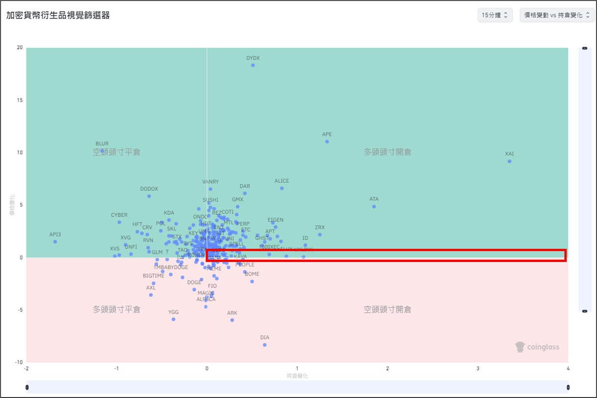

# Coinglass 視覺篩選器：短線操作的持倉分析工具

> **來源**: [@b66ny](https://x.com/b66ny/status/1848030553129570742)
>
> **日期**: Sun Oct 20 15:56:33 +0000 2024
>
> **標籤**: `持倉數據` `短線交易` `期貨分析`

---

> **來源**: [@b66ny (b12ny)](https://x.com/b66ny)
> **日期**: 2026-02-18
> **標籤**: `Coinglass` `短線交易` `持倉分析` `合約交易`

---

## 工具介紹

繼上一篇短線操作的基本核心與觀察，有人詢問關於更細部的實際操作方式。這邊推薦 Coinglass 上面的**視覺篩選器**，可以很直觀看出目前各種幣種的合約狀況。

## 四象限分析

視覺篩選器主要分為四個象限：

- **空頭平倉**（左上）
- **多頭開倉**（右上）
- **多頭平倉**（右下）
- **空頭開倉**（左下）

藉由此數據可以快速了解目前盤面與期貨數據狀況。依照現在大盤與山寨行情，主要觀察的是**多頭開倉**象限。

## 實戰操作重點

### 時區選擇
- 短線操作選擇 **15 分鐘至 1 小時**時區
- 關注**持倉變化 > 價格變化**的幣種
- 也就是最貼近 **x 軸**的幣種

### 選幣邏輯
- 此區域的幣種持倉堆疊但是價格未跟上
- 透過其他數據來輔助判斷
- 很有機會開在起漲位置

### 實戰案例
在之前操作以下幣種時都有機會從這個數據觀察到：
- $ID
- $STORJ
- $BIGTIME
- $PUFFER
- $APE（近期）
- $TIA（近期）

## 使用方式

**手機版**：
主畫面上方 → 指標 → 視覺篩選器

**網頁版**：
K 線 → 技術指標 → 視覺篩選器
