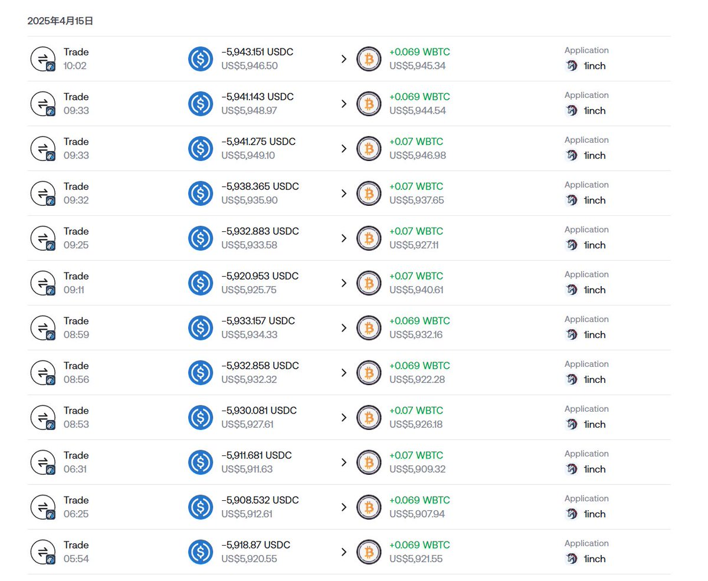
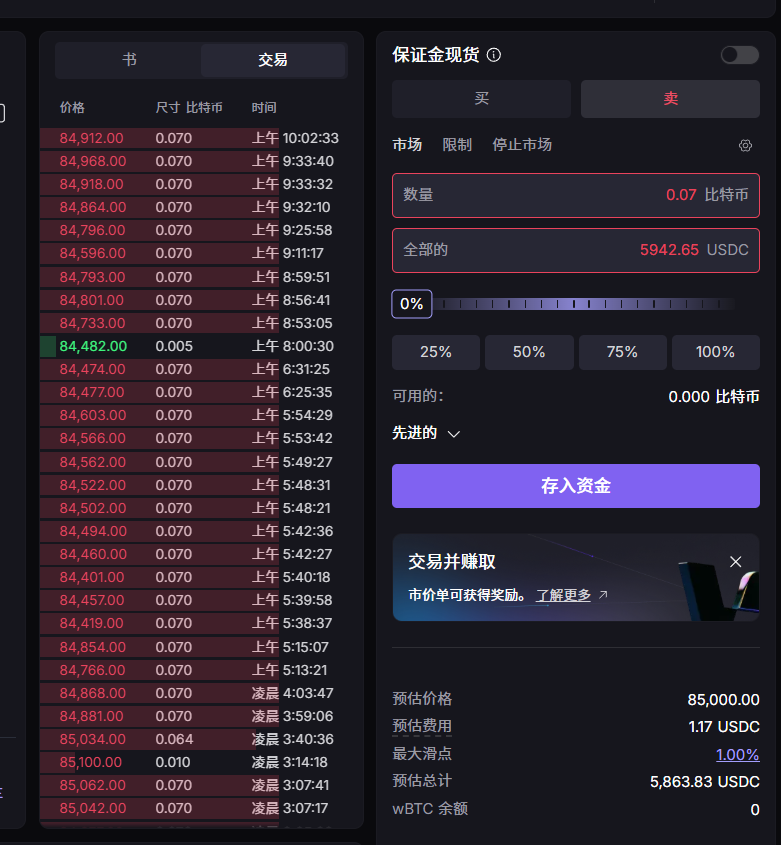
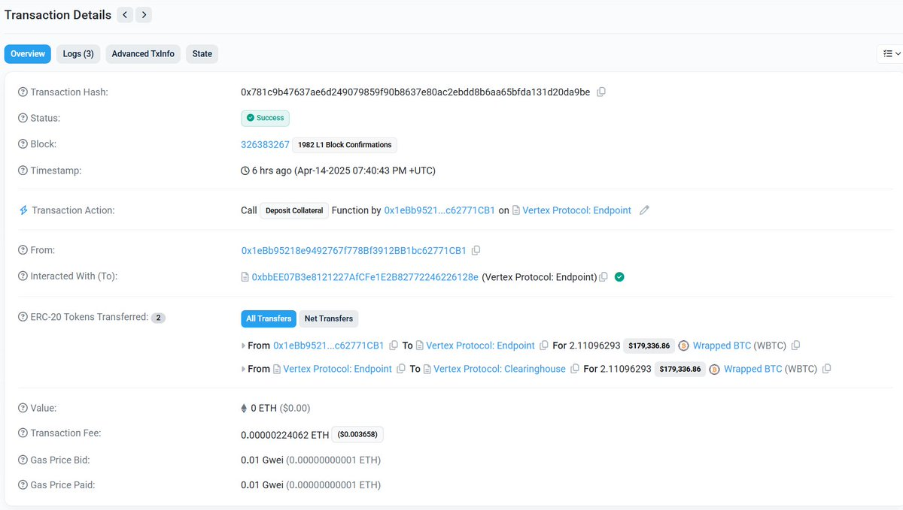
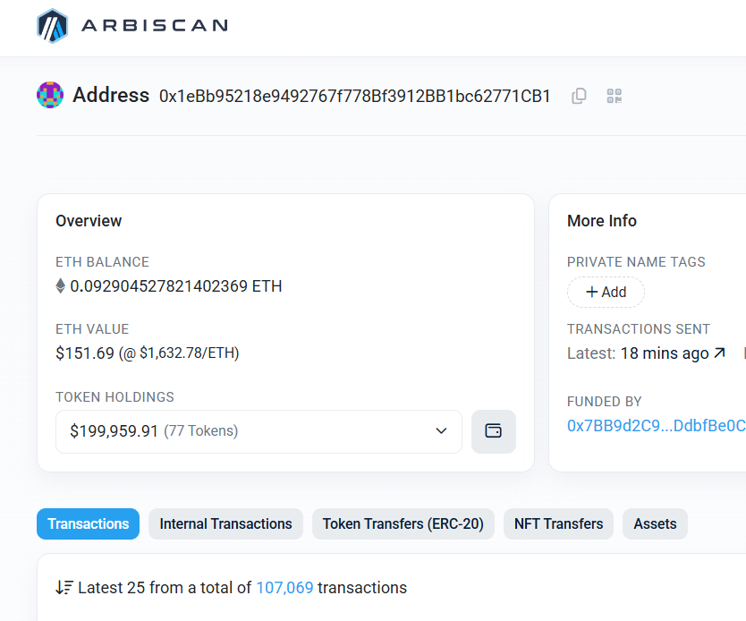

# ARB 鏈聚合器對沖套利策略分析

> **來源**: [@zhamomo666](https://x.com/zhamomo666/status/1911969430072111487) | [原文連結](https://twitter.com/zhamomo666/status/1911969430072111487/photo/1)
>
> **日期**: 
>
> **標籤**: `套利` `鏈上交易所` `風險對沖`

---

## 策略概述

ARB 鏈上使用聚合器與鏈上交易所 VRTX 進行對沖套利。

## 核心思路

在 ARB 鏈上利用聚合器和 VRTX 交易所之間的價差進行對沖套利操作。

## 實戰數據

**觀摩地址**: `0x1ebb95218e9492767f778bf3912bb1bc62771cb1`

- 總交易筆數：10 萬+
- 最低獲利：40 萬 U
- 預估年化收益率：接近 100%

## 策略特點

走暗路、耕瘦田、進窄門 —— 尋找小眾套利機會，避開競爭激烈的主流路線。
