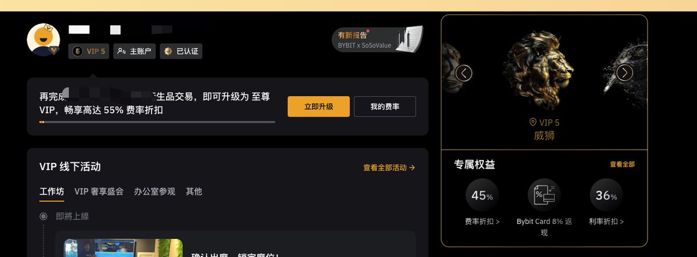

# Bybit ZEC 合約參數操控事件——交易所誠信危機分析

> **來源**: [@sunlc_crypto](https://x.com/sunlc_crypto/status/1911724055461519679)
>
> **日期**: Mon Apr 14 10:11:47 +0000 2025
>
> **標籤**: `交易所風險` `合約參數操控` `市場操縱`

---

> **來源**: [@sunlc_crypto (sunlc.eth)](https://twitter.com/sunlc_crypto)
> **日期**: 2026-02-18
> **標籤**: `Bybit` `ZEC` `合約操控` `交易所誠信` `參數修改`

---

## 事件背景

作為一個長期在 Bybit 上交易的 V5 忠實客戶，我個人長期在 Bybit 帳戶裡有 200-300 萬 U 的資金做交易，加上團隊小夥伴的資金總量超過 800 萬 U。

哪怕是 Bybit 被盜最困難的時刻，我們都堅定的選擇相信 Bybit 可以度過難關。Ben 在面對突發事件冷靜的處置讓我刮目相看，也堅定的選擇把所有資金轉回來繼續交易。

## 問題揭露

但這個週末發生的事情，讓我們不得不懷疑 Bybit 還是不是原來的 Bybit。是不是因為這次被盜損失巨大，而不顧交易所最重要的誠信，選擇肆意修改參數收割用戶？

Ben 作為一個專業交易員出身的 CEO，我仍然願意相信這種行為不是你的本意。Bybit 作為一個老牌專業的交易所，不應該學 Bitget 那樣搞這種噁心的小動作（關於 Bitget 的事情，文章最後再說）。

## 訴求

希望 Ben 可以內部徹查一下，是不是內部有老鼠倉和莊家勾結操縱市場。
