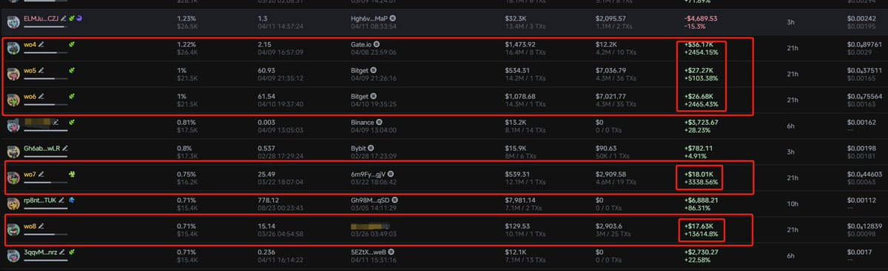
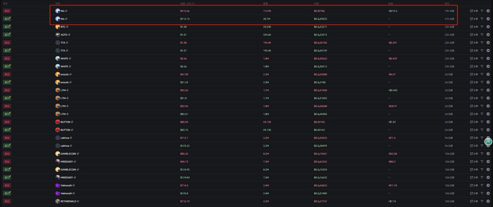
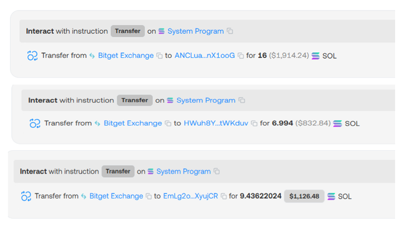

# 鏈上高手薯條哥：透明看穿莊家動作

> **來源**: [@QuantVela](https://x.com/QuantVela/status/1910893981116121313) | [原文連結](https://twitter.com/QuantVela/status/1910893981116121313/photo/1)
>
> **日期**: Sat Apr 12 03:13:22 +0000 2025
>
> **標籤**: `鏈上分析` `莊家動作` `案例教學`

---

> **來源**: [@QuantVela (Vela)](https://twitter.com/QuantVela)
> **日期**: 2026-02-18
> **標籤**: `鏈上分析` `加密貨幣` `交易策略`

---

## 推薦關注

推薦關注隱藏的鏈上高手薯條哥 @0xCryptoFries，莊家的鏈上動作在他面前就是透明的，還經常出案例教學手把手教你。唯一的小問題是頭像有點幼稚。
