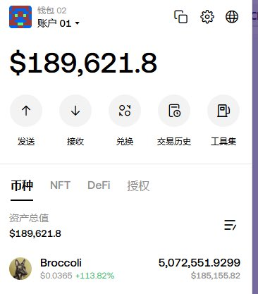

# 小市值幣種莊家操盤策略分析：F3B 案例拆解

> **來源**: [@daidaibtc](https://x.com/daidaibtc/status/1911164324858700156)
>
> **日期**: Sat Apr 12 21:07:37 +0000 2025
>
> **標籤**: `小市值交易` `莊家心理` `期現套利`

---

## 小市值幣種的莊家邏輯

小市值幣種如果沒有莊家，就會淪為散戶陷阱。莊家的經典操盤流程：買入現貨、開倉、做 OI（持倉量）、拉盤、累積對手盤、負費率、負溢價、出貨。

以 F3B 為例，莊家在底部控制了大量現貨，同時在期貨開了大量多單持倉且一直未平倉。當時這個 6M 的盤子原本有機會接手，但最終被外國團隊接下。

## 莊家拉盤策略

莊家瘋狂拉盤的目的是尋求市場注意力和流動性來準備退出。即使拉了很多，期貨盤口深度依然一般。

如果是莊家的角度思考，最怕的是沒人進來玩，其他都不怕：

**當流動性做空時：**
- 硬不動，繼續拉到散戶瘋狂做空（已經開始轉負費率）
- 幣安現在 8H 資金費率，極端時會調整為 4H
- 用收到的資金費繼續買入，繼續拉盤
- 很多人會錨定 F3B 現貨只有 20 多 M 市值來做空
- 把空頭炸出天針後再退出

**當流動性做多時：**
- 平掉自己的多頭倉位
- 如果流動性足夠，再做空期貨，砸現貨
- 把散戶砸成傻逼後再買回來

盲猜如果插天針，那幾分鐘的漲幅可能達到 50%+。但有個疑問：如果沒有交易所有現貨，指數價格只能錨定鏈上的話就很難做到。現在期貨出現負費率，但鏈上價格並沒有像所內現貨一樣出現溢價。

## 小市值交易的核心邏輯

做多小市值最大的確定性邏輯：

1. **便宜**：價格低
2. **稀缺性**：籌碼集中
3. **莊家**：最重要的因素

這三點足夠在散戶那邊建立一定的買入共識。莊家有成熟的買入和撤退打法，可以跟車。但現在小市值（尤其是 meme）很少進莊了，即使進場也分兩種：
- 格局很小（如 NEIROETH）
- 比較惡劣（如 ALCH）

## 散戶盤的困境

全是散戶的籌碼結構，一定是 PVP，一定拉不出高度。而且，全是在交易所裡的合約進行博弈，鏈上的現貨反而沒什麼買盤。這種情況下隨便玩，很容易成為出貨者的流動性。

## 預期交易的時機

預期交易要買得早（回踩支撐），也要賣得早（臨近落地）。以上 Mubark 為例，很多人在上架前一直 FOMO 累積倉位，但經驗告訴我不會在那個位置做預期交易（即使很確定 Mubarak 一定會上現貨）。

行情越差，本金越值錢。可以賣飛很多次，但最好一次都別錯過。

## 市場迭代與擇時

現在做多小市值，更多時候需要擇時而非只看價格。你覺得便宜、市場定價錯誤，有沒有可能是市場的定價方式已經變了？又或者它的便宜需要情緒和行情的慢慢修復，才會開始被價值發現？要考慮中間的持倉過程。

市場在迭代，交易的玩家也要跟著迭代。

## 喊單詐騙的警惕

未來一定會出現喊單小市值來吃流動性作惡的情況。舉例來說，幣安最便宜的 F3B 已經只有幾 M 的市值，很多聰明的朋友都發現了，但都只是私下交流，並不會在外面喊單吃流動性。

一起喊的話，翻倍並不難，只是不會這樣做。只會在情緒修復或事件驅動時介入，或者在底部震蕩區間按照時間線買入（也就是擇時）。但假設買了之後就有人喊單，去接他粉絲的流動性，這也是天經地義。

前陣子在群裡喊過 PIPPIN，喊完當天就有 15% 左右的漲幅，群友有的跑了有的沒跑，最後是 -20% 止損。一個群都能如此 PVP，何況公開喊單。

## 跟單原則

除非有明確的做多邏輯、指標、事件驅動、情緒修復，否則跟小市值的單（尤其是交易所沒現貨的）需要謹慎警惕。

獨立思考，保持迭代。
