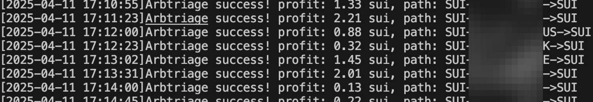

# Solana BF 改良算法在 Sui 區鏈的應用實踐

> **來源**: [@SteinAmour](https://x.com/SteinAmour/status/1910632882638643654) | [原文連結](https://twitter.com/SteinAmour/status/1910632882638643654/photo/1)
>
> **日期**: Fri Apr 11 09:55:51 +0000 2025
>
> **標籤**: `交易算法` `Sui 生態` `跨鏈遷移`

---

> **來源**: [@SteinAmour (朝凪 | 晚风 wanfeng)](https://x.com/SteinAmour)  
> **日期**: 2026-02-18  
> **標籤**: `Solana` `Sui` `BF算法` `量化交易` `DeFi`

---

## 核心觀點

作者將原本為 Solana 開發的 BF（Bundle Flashbot）改良算法移植到 Sui 區塊鏈上使用，發現在 Sui 上表現更佳。主要原因是 Sui 生態缺乏像 Jupiter 這樣的通用型聚合交易工具，降低了競爭壓力。

## 技術背景

- **BF 改良算法**：原本針對 Solana 鏈開發的交易策略優化算法
- **Sui 生態優勢**：相較於 Solana，Sui 缺少像 Jupiter 這種讓所有人都能使用的強大聚合器工具，使得自研算法更具競爭優勢
- **開發時間**：過年期間在家研發的成果

## 實踐成果

作者表示當天行情表現不錯，暗示該算法在 Sui 鏈上的實際應用取得了正面效果。
