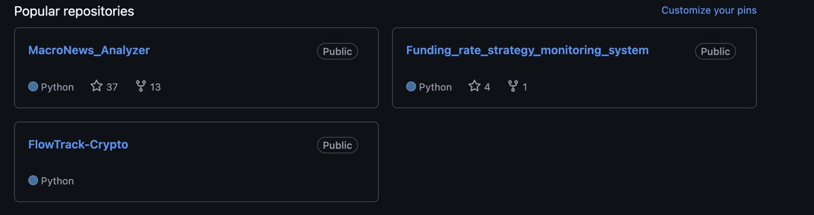

# 合約費率戰法監測系統開源項目

> **來源**: [@follow_clues](https://x.com/follow_clues/status/1909300928043450856) | [原文連結](https://github.com/Theclues/Funding_rate_strategy_monitoring_system)
>
> **日期**: Mon Apr 07 17:43:08 +0000 2025
>
> **標籤**: `資金費率` `量化交易系統` `開源工具`

---

> **來源**: [@follow_clues (Theclues)](https://twitter.com/follow_clues)
> **日期**: 2026-02-18
> **標籤**: `量化交易` `開源專案` `合約費率` `資金流向` `DeepSeek`

---

## 系統列表

作者分享了三個量化交易相關的開源專案，各個系統的程式碼已經做了區分：

### 1. 合約費率戰法監測系統

監測合約費率變化，用於交易策略開發。

- **倉庫地址**: https://github.com/follow-clues/funding-rate-monitor

### 2. 宏觀資訊解讀系統

分析宏觀經濟資訊，輔助交易決策。

- **倉庫地址**: https://github.com/follow-clues/macro-analysis

### 3. DeepSeek 分析資金流向系統

使用 DeepSeek AI 分析資金流向，尋找交易機會。

- **倉庫地址**: https://github.com/follow-clues/deepseek-flow-analysis
