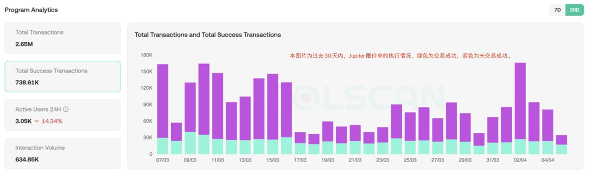
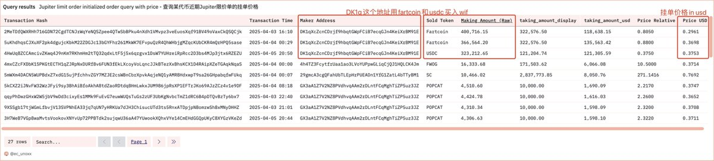
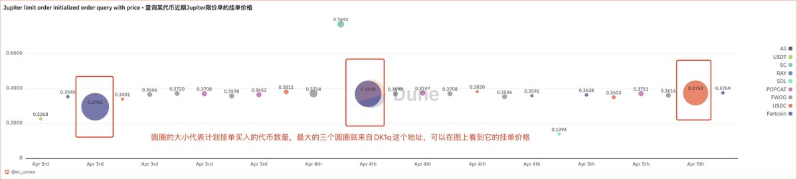

# 用 Dune 追蹤 Jupiter 限價單找庄家與買賣點位

> **來源**: [@ec_unoxx](https://x.com/ec_unoxx/status/1908873316158620039)
>
> **日期**: Sun Apr 06 13:23:58 +0000 2025
>
> **標籤**: `Jupiter限價單` `Solana交易` `鏈上分析`

---

> **來源**: [@ec_unoxx (Viki_Nan.mp3)](https://twitter.com/ec_unoxx)
> **日期**: 2025-01-12
> **標籤**: `Dune` `Jupiter` `限價單` `鏈上分析` `Solana`

---

## 概述

本文介紹如何使用 Dune 追蹤 Jupiter 限價單，透過分析鏈上數據找出莊家吸籌動向、判斷支撐位與阻力位。作者製作了專門的 Dune Dashboard，可以快速查找過去一段時間內透過 Jupiter 限價單功能買入某個代幣的地址、持幣百分比，以及該代幣的限價單掛單價格分佈。

## 第一部分：背景知識

### Jupiter 限價單簡介

Jupiter 限價單（Limit order；最近 Jupiter 將其更名為 triggering）是 Solana 現貨中的一種交易工具，允許用戶以指定價格買賣代幣。它支援 Solana 上幾乎所有代幣對的流動性，平台費用為 0.1%，為用戶提供按目標價格進行交易的選項。訂單執行無需用戶在線，由系統自動處理。

### 鏈上分析價值

限價單能夠反映市場參與者的價格預期：買入單集中區域可能為支撐位，賣出單集中區域可能為阻力位。

### 莊家行為學

大戶或莊家通常會在底部區域設置買入單，逐步建倉，在高位設置賣單，分批清倉以減少市場衝擊。限價單可避免市場訂單因價格波動導致的滑點,適合大額交易,為觀察大戶操作提供了一個窗口。

## 第二部分：限價單流程與 DCA 的異同

### DCA 和限價單的相似之處

1. **機制**：都依賴智能合約和特殊機制實現自動化，無須用戶手動操作

2. **流程**：都需要經歷幾個主要步驟：創建訂單、啟動、兌換、扣費、轉移代幣

3. **帳戶**：都涉及到這三類賬戶地址：
   - **A**：用戶實際下單的地址，也是最後收到代幣的地址，在限價單中是 Maker account，在 DCA 中是 DCA maker
   - **B**：訂單資金託管賬戶，負責存儲用戶的資金，在限價單中是 Order Reserve，在 DCA 中是 DCA order vault
   - **C**：三個自動化帳戶，負責進行代幣的兌換，在限價單中是 j1oA、j1op、j1oe 開頭的 Taker account，在 DCA 中是 JD1d、JD25、JD38 開頭的 DCA keeper

4. **費用**：通常情況下，二者的平台費用都是 0.1%

### 限價單具體流程

以 `DK1qXcZcnCDrjf9hbqtGWpFCiB7ecqGJn4KeiXrBM91E` 這個地址使用 fartcoin 限價單買入 wif 的交易為例，一筆限價單交易主要包含以下階段：

1. **創建限價單訂單**：account maker 創建 Order Reserve 賬戶，將 fartcoin 轉移到 order reserve，正式託管資金
2. **啟動**：從 Order Reserve 提取 fartcoin，交給 Taker account 準備交易
3. **兌換**：Taker account 在 Orca 市場進行 Fartcoin→WSOL→wif 的兌換，兌換後的 wif 返回到 taker account
4. **扣費**：從 wif 中扣除一小部分作為費用，支付給 Jupiter Limit Order Fee Vault
5. **轉移**：將剩餘的 wif 轉移給 Maker account，完成交易

### DCA 與限價單的最大不同

- **DCA 的執行條件**：【時間】，時間到了就會自動執行買賣操作
- **限價單的執行條件**：【價格】，只有到達了這個價格才會進行買賣

因此，**價格**在限價單裡扮演著至關重要的角色。透過觀察限價單的「掛單價格」，我們可以看到莊或者大戶對於一個代幣的預期買入/賣出價，從而輔助我們判斷支撐位和阻力位。這也是這次的 dashboard 相比之前 DCA 的版本有增加的內容。

## 第三部分：Dune Dashboard 功能詳解

本 dashboard 用來查找 Jupiter 限價單相關的數據，主要包括過去一段時間使用 Jupiter 限價單功能買入某個代幣的地址、以及該代幣的限價單掛單價格合集。

### Dashboard 四部分內容

#### 1. 查看使用限價單買入的用戶地址

- **數據來源**：來自 jupiter limit order flashfillorder，為訂單執行及完成交易階段
- **適用場景**：「找莊」：如果是透過限價單大額買入，且持有一定籌碼的，大概率是莊/大戶的地址

#### 2. 查看限價單買入的詳細 tx

- **數據來源**：來自 jupiter limit order flashfillorder，為訂單執行及完成交易階段
- **適用場景**：根據交易 hash 進一步挖掘地址

#### 3 & 4. 限價單的掛單價格合集

包括 tx 交易詳情表及示意圖。

- **數據來源**：來自 jupiter limit order initialize order，此為創建訂單階段，不代表訂單實際執行
- **適用場景**：透過觀察限價單的「創建價格」，我們可以在某種程度上看到，莊或者大戶對於一個代幣的預期買入價，從而輔助我們判斷支撐位

### 關於掛單價格數據的重要說明

限價單訂單的掛單情況及價格，但掛單存在無法成交的可能。事實上，被成功執行的限價單是少數（可以去看最近一個月 solscan 上顯示的限價單成交情況）。

但是訂單「掛單價格」仍然包含了很多關鍵信息，可以作為一個判斷支撐位的依據。

### 實例分析：$wif 限價單

以查詢 $wif 的限價單的掛單價格合集為例（查詢時間為 4 月 6 日北京時間晚上 6 點，查詢參數為過去 72 小時）：

可以根據數據看到，計劃大金額買入 wif 的地址是同一個：`DK1qXcZcnCDrjf9hbqtGWpFCiB7ecqGJn4KeiXrBM91E`

結合圖片（是對圖表數據的可視化），更直觀地理解數據的含義：

- **圓圈的大小**：代表限價單試圖買入的代幣數量
- **圓圈的價格**：代表限價單的創建價格（均已折算為 usd 價格）
- **圓圈的顏色**：代表是使用哪種代幣進行買入

例如，最大的兩個紫色的圓圈，就是使用限價單功能賣出 fartcoin、買入 wif，最大的橘黃色圓圈，是使用 usdc 買入 wif。也就是在 0.29-0.37 這個價格位置，有大量的掛單買入 wif。

## 第四部分：對限價單數據的思考與市場洞察

限價單數據不僅是交易記錄，更是鏈上博弈的縮影。以下是一些分析思路：

### 1. 追踪「莊家」意圖

透過限價單數據，可以觀察莊/大戶/做市商的動向。例如，某個地址在某個代幣上透過限價單大量買入，持倉佔比較高，可能暗示吸籌行為。反之，若高位出現大量賣單，可能是出貨信號。大家可以結合 Arkham 或 Cielo 工具查看地址標籤，存入 gmgn 地址庫，持續跟蹤其操作。

### 2. 判斷買賣點

結合 K 線，限價單價格分佈可作為支撐位和阻力位的參考，短期數據（1-3 天）適合捕捉快速波動，長期數據更能反映趨勢性支撐。

### 3. 解讀市場情緒

限價單數據在一定程度上反映了市場參與者的預期：大量大戶買入單但價格未漲，可能預示拉盤；大量大戶賣單集中於高位，可能暗示頂部。不同市場階段的解讀也有差異，比如牛市中買入單激增往往伴隨上漲，熊市中則可能只是試探性建倉。

### 4. 市場環境與未來趨勢

當前 Solana 生態的低流動性環境下，限價單執行難度增加。並且，由於 Meteora DLMM 也提供了類似限價單買賣的功能，Jupiter 限價單的使用場景進一步被壓縮，但如果流動性回歸，相信限價單的使用率還會有所回升。
