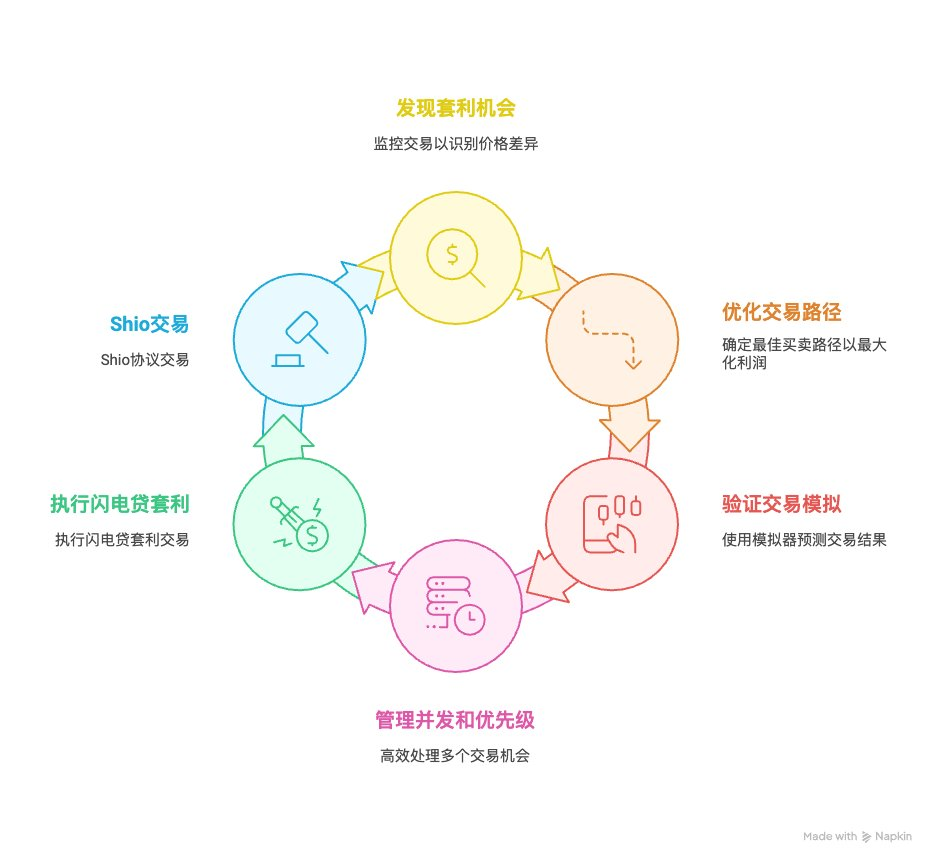

# Sui 套利機器人開源實現：跨 DEX 套利與鏈模擬

> **來源**: [@JasonZhao404](https://x.com/JasonZhao404/status/1907640990032343519)
>
> **日期**: 
>
> **標籤**: `套利` `Sui` `去中心化交易所`

---

> **來源**: [@JasonZhao404 (Jason Zhao | 𝟎𝐱𝐔)](https://twitter.com/JasonZhao404)
> **日期**: 2026-02-18
> **標籤**: `sui` `arbitrage-bot` `dex` `open-source` `movevm` `relay` `shio`

---

## 專案概述

這是一個開源的 Sui 套利機器人實現，曾經獲利超過 20 萬美元。該機器人支援在多個 DEX 之間進行套利，包括 Cetus Protocol、Navi Protocol、Aftermath、DeepBook、Turbos Finance 和 Kriya DEX。

專案核心特色：
- 用 Rust 建構的 MoveVM 模擬器，可以 fork 鏈並快速模擬交易
- 由於缺乏工程師維護和鏈上競爭加劇，目前已停止維護
- 需要實現 Bellman-Ford 演算法才能再次獲利

專案連結：https://github.com/Fried-Rice-Lab/sui-arb-bot

## 套利機會發現策略

### 1. 公共交易監控
分析已確認交易的日誌記錄，識別交換事件（swap events），從中提取相關幣種和流動性池資訊。

### 2. 私有交易監控
透過 Relay 節點獲取記憶體池（mempool）中尚未確認的交易，提前發現可能造成的價格影響。可以連接到自己運行的 relay 節點上。

### 3. Shio 競價交易
監控 Shio 協議的特殊套利機會，支援競價搶跑（frontrunning）功能。
