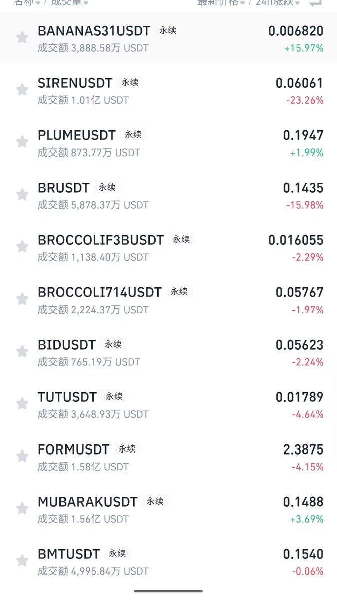

# 小市值合約交易陷阱：庄家出貨與散戶流動性分析

> **來源**: [@daidaibtc](https://x.com/daidaibtc/status/1905761013489897553)
>
> **日期**: Fri Mar 28 23:16:47 +0000 2025
>
> **標籤**: `小市值交易` `合約風險` `莊家博弈`

---

## 小市值合約交易的核心邏輯

做多小市值最大的確定性邏輯有幾個：一個是便宜，一個是稀缺性，這兩個足夠在散戶那邊搭建一定的買入共識。但還有個最重要的是莊家。以前的小市值會進莊，你可以蹭車。莊家有一套成熟的買入和撤退打法：買現貨 → 開持倉 → 做 OI → 拉盤 → 積累對手盤 → 負費率 → 負溢價 → 出貨。

但現在小市值（尤其是 meme）很少進莊了，就算進莊，一種是格局很小（NEIROETH），一種是比較惡劣（ALCH）。這都是前陣子第一次跌的時候出現的情況。

## 全散戶籌碼結構的問題

你要知道，全是散戶的籌碼結構，一定是 PVP，一定拉不出高度。況且，全是在交易所裡的合約進行博弈，鏈上的現貨反而沒什麼買盤。那你瞎玩，就很容易成為出貨者的流動性。

昨晚做多 $TUT 的時候，我就猜到了他會止損。順帶再聊一句預期交易：上 Mubark 之前，很多人很 FOMO，一直在積累倉位。但我的經驗就是不會在那個位置去做預期交易的（即使全群都知道我好幾次肯定地判斷 Mubark 一定會上現貨）。**預期交易買的要早（回踩支撐），賣的也要早（臨近落地）**。行情越差，本金越值錢，可以賣飛很多次，但最好一次都別錯。

## 擇時比價格更重要

回到小市值，現在做多小市值更多時候需要擇時，而非只看價格。你覺得便宜、市場定價錯誤，有沒可能市場的定價方式已經變了？又或者它的便宜需要情緒和行情的慢慢修復才會開始被價值發現？你要考慮這中間的持倉過程。

我是小市值的資深玩家，市場在迭代，那交易的玩家也要跟著迭代。

## 警惕喊單吃流動性

值得一提的是，未來一定會出現喊單小市值來吃流動性作惡的。舉個例子，現在幣安最便宜的 $F3B 已經就幾 M 的市值了，身邊聰明朋友今天都發現了，但我們都是私下交流，並不會來外面喊單吃流動性。

難道一起喊，它翻倍很難嗎？只是我們不會這樣做。我們自己只會在情緒修復 / 或者事件驅動的時候去介入，又或者在一個底部的震盪區間去按照時間線買入（也就是擇時）。那假設我買了，買完就有人喊單了，我去澆他粉絲。這天經地義吧？

前陣子，我還在自己的群裡喊過 $PIPPIN，喊完當天就有 15% 左右？群友有的跑了有的沒跑，我是沒跑，最後 -20% 止損的。**一個群都能如此 PVP，何況公開喊單**。所以除非有明確的做多邏輯 / 指標 / 事件驅動 / 情緒修復，否則跟小市值的單（尤其是交易所沒現貨的）需要謹慎警惕。

## 合約做多小市值 = 送菜給大戶

> 以下引用 @yuyue_chris 的分析

用合約做多大主流沒什麼毛病，但**用合約去多小市值的話基本上是給合約開空套保出貨的大戶送菜**。

### 案例分析：$SIREN

以 $SIREN 為例：

- 3/22 上合約之後，觀察合約持倉量和鏈上成交量情況，基本可以斷定已經有大戶（或者莊）開始合約出貨。因為以他們刷票的思路來說沒有遮掩，可以看出他們的目標本就不是上現貨。

- **合約出貨意味著可以在幾 M、十幾 M 的盤子套現十幾 M**，這在鏈上池是做不到的，這也和 Hyperliquid 事件異曲同工，本質上類似於現貨驅動的預言機攻擊。

- 從 3/26 的數據可以看出：Siren 是其中成交量最大的合約。**拉高只是為了吸引更多人抄底，做多提供對手盤就是大戶的退出流動性**。

### 核心邏輯

現貨驅動的鏈上小市值，如果你要拉盤，應該做的事是去**鏈上拉盤**，而不是合約開多。

合約開多本質上來說是帶單老師和二級玩家的路徑依賴，但在這輪裡是行不通的。

---

**獨立思考，保持迭代。**
