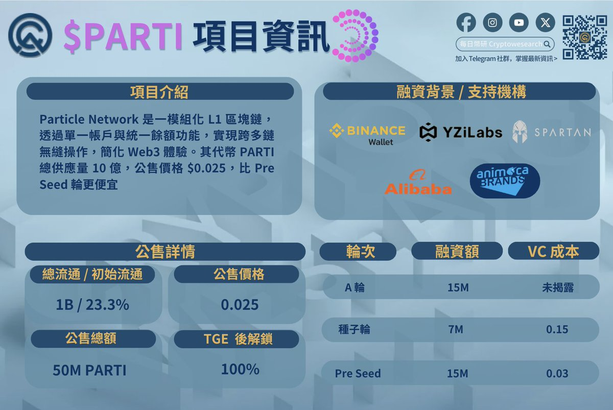

# Particle $PARTI 代幣估值分析：VC 成本、基本面與套利機會

> **來源**: [@cryptogator1121](https://x.com/cryptogator1121/status/1904480490473812336)
>
> **日期**: 
>
> **標籤**: `代幣估值` `新幣分析` `套利機會`

---

> **來源**: [@cryptogator1121 (CryptoGator 小鱷魚🐊)](https://x.com/cryptogator1121)
> **標籤**: `代幣估值` `VC成本分析` `基本面分析` `套利機會` `Particle` `PARTI`

---

每天至少做一個新幣估值，今晚的 Particle PARTI 大概是我最近一個月最 bullish 的新幣項目，目標價在哪？套利機會在哪？alpha 在哪？我們一起來看吧 ✨

## 分析框架

本次估值分析包含以下六個維度：

1. @ParticleNtwrk $PARTI VC 融資成本
2. 基本面估值：Particle 一年賺多少？PARTI 值多少錢?
3. 基本面估值：全鏈賽道競品對標
4. 籌碼面分析 - 代幣經濟學
5. 雙鏈模型與潛在套利機會
6. 結論：開盤價與目標價在哪？

## 項目背景

@ParticleNtwrk 先前推出了全鏈交易工具 UniversalX，引入鏈抽象技術支援跨鏈絲滑交易，讓用戶在不同鏈也能自由打土狗衝鏈上新機會。累積的高機率可以換取 $PARTI 空投。

在熊市就已經認真建設的 @ParticleNtwrk $PARTI，對標 @LayerZero_Core 估值會有幾倍的成長空間。

## 上線資訊

- @BinanceWallet 於 3 月 25 日 18:00 - 19:00（UTC +8）上線 @ParticleNtwrk $PARTI 獨家 TGE 🔥🔥
- 當晚 21:00 上線 @binance @MEXC_Official @bitgetglobal @HashKey_Global @Gate_io

---

**免責聲明**: NFA DYOR（Not Financial Advice, Do Your Own Research）
