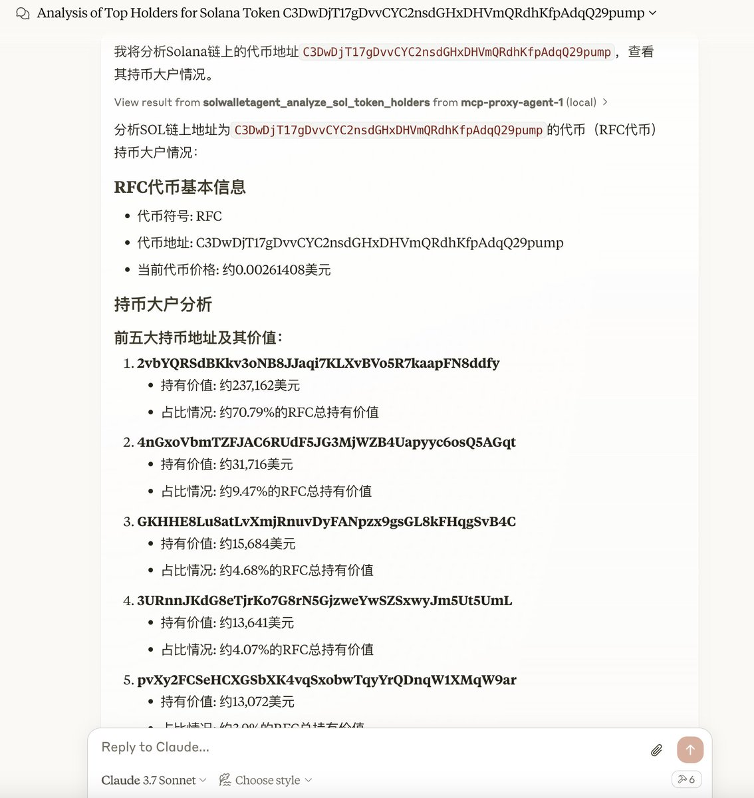

# Solana 鏈巨鯨交易分析：基於 Heurist MCP 工具的深度挖掘

> **來源**: [@gpt3_eth](https://x.com/gpt3_eth/status/1904425761911738405) | [原文連結](https://twitter.com/gpt3_eth/status/1904425761911738405/photo/1)
>
> **日期**: 
>
> **標籤**: `Solana交易` `巨鯨持倉` `鏈上分析`

---

> **來源**: [@gpt3_eth (Frank ✈️)](https://twitter.com/gpt3_eth)
> **日期**: 2026-02-18
> **標籤**: `solana` `鏈上分析` `巨鯨追蹤` `MCP` `Heurist`

---

## 工具與方法

使用 @QuantVela 大佬基於 @heurist_ai 的 MCP 開發的 Solana 鏈交易分析工具，針對 RFC 項目的幾個巨鯨地址進行交易記錄挖掘。

## 發現

通過分析這些巨鯨地址的交易記錄，發現了一個驚人的秘密。

---

**註**: 原推文未詳細說明具體發現內容，完整資訊請參考原推文的後續討論串。
