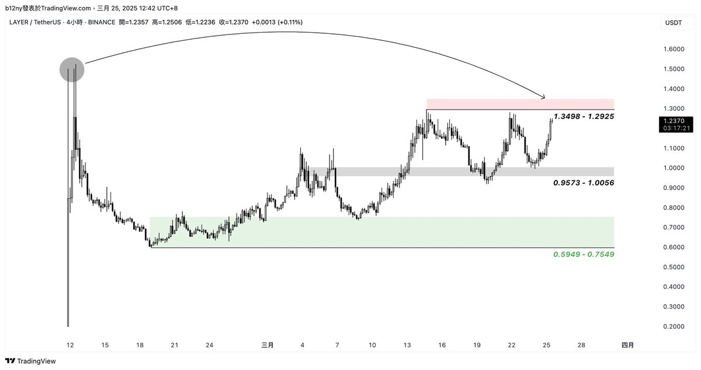

# 價格 vs 走勢：交易決策的本質區別

> **來源**: [@b66ny](https://x.com/b66ny/status/1904400039960883296)
>
> **日期**: 
>
> **標籤**: `交易心態` `市場行為` `資金管理`

---

## 交易決策的核心矛盾

到底價格重要，還是走勢重要？這是一個經常出現在市場裡的交易問題。

許多人會因為「價格便宜」而進場，但當走勢轉弱時又選擇出場，這種看似矛盾衝突的行為，背後其實代表著一個深層邏輯問題——我們到底在依靠什麼做決策？價格，還是走勢？

## 價格：靜態參考觀察而非直接依據

價格是一個靜態結果，是市場在某個時刻的共識，便宜或昂貴，只是相對於過去或心理預期而言。

很多人喜歡在價格便宜時進場，因為人性會傾向於「撿便宜」，但這種行為背後存在一個假設：價格會回到你認為應有的價值。

問題在於，市場並不會因為你的成本高低就漲回去，便宜的東西可以變得更便宜，價值的回歸需要資金、情緒與時間共同作用。

因此，價格只是靜態參考，如同經常說的「在某個價格位置去觀察」，因為沒有資金認同，它只不過是一串數字。

## 走勢：動態反應市場共識與未來方向

而走勢是市場行為的結果，不管是趨勢、盤整或反轉，本質上都是市場參與者集體行動後留下的痕跡。

走勢強代表資金正在進場，走勢弱代表市場沒有信心。

走勢之所以重要，在於它提供更多資訊，反應市場結合過去與當下的狀況，而非過去的某一個數字。

在實際交易中，價格可以是一個進場觸發條件，但是否持有、是否加倉、是否離場，最終還是要看走勢（趨勢）。

## 為什麼交易容易陷入「低買低賣」？

原因在於思維層次沒有分清楚，「便宜所以買」是靜態判斷，「走勢弱所以賣」是動態反應。

當你用靜態判斷去下單，卻用動態反應去止損，就可能形成低買低賣的結果。

答案很清楚：**價格，是觀察；走勢，是決定。**

- 價格決定你「在哪個區域」開始觀察
- 走勢決定你「要不要參與」和「參與多久」

## 如何結合價格與走勢進行交易

1. **價格篩選區域**：決定在哪裡開始觀察
2. **走勢決定行動**：市場確認訊號才參與
3. **資金控制風險**：接受市場跑出預期外

## 結論

價格重要，但只是起點；走勢重要，因為它決定方向。

當你能清楚分辨「價格是參考、走勢是判斷」，不再糾結便宜或昂貴，而是專注於資金態度與市場行為，才有機會變成長期的交易決策。

最終會明白，市場從來不關心你的成本，它只在意下一步誰願意出更高（或更低）的價錢。理解適應市場價格與走勢，才有機會持續活在市場裡。
