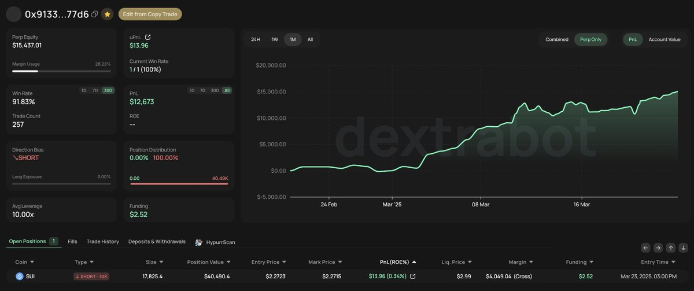

# Hyperliquid 複製交易跟單：91% 勝率聰明錢地址分享

> **來源**: [@timtung_eth](https://x.com/timtung_eth/status/1903828614212399552) | [原文連結](https://hyperdash.com/zh-CN/trader/0x913333c5d982290d58b6ce025d84e3b268c177d6)
>
> **日期**: Sun Mar 23 15:18:07 +0000 2025
>
> **標籤**: `複製交易` `合約跟單` `地址篩選`

---

> **來源**: [@timtung_eth (提姆⚡️Tim Tung 🎒)](https://twitter.com/timtung_eth)
> **日期**: 2025-02-18
> **標籤**: `Hyperliquid` `複製交易` `跟單策略` `SUI合約` `Dextrabot`

---

## 跟單實驗概況

在 Hyperliquid 進行複製交易跟單第 11 天，分享一個勝率 91% 的聰明錢地址。

## 地址績效數據

**913哥地址**：[查看詳情](https://t.co/imUTznJY6m)

- **勝率**：91%
- **主要操作標的**：$SUI 合約
- **近 30 天總收益**：1.2 萬美元
- **特點**：適合嘗試進行合約跟單

該地址已加入跟單組別，將持續追蹤並分享實際績效表現。

## 地址篩選條件

選擇跟單地址時滿足以下三個關鍵條件：

1. **穩定勝率**
2. **PNL 穩定成長**
3. **持倉健康**

## 跟單設置資訊

- **交易平台**：@Dextrabot
- **初始資金**：1258 → 1295 美元
- **跟單地址數**：24+ → 25+

## 操作建議

目前新的鏡像跟單功能剛上線，建議搭配 Telegram 通知監控開單情況，避免漏單問題。
