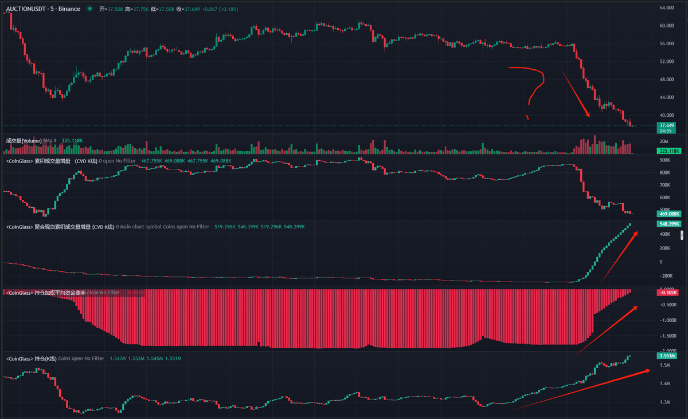

# AUC 代幣莊家出貨操盤手法分析 — 訂單流洞察

> **來源**: [@biupa](https://x.com/biupa/status/1903570827712581677)
>
> **日期**: Sat Mar 22 22:13:46 +0000 2025
>
> **標籤**: `訂單流分析` `莊家操盤` `CVD指標`

---



> **來源**: [@biupa (Biupa)](https://twitter.com/biupa)
> **日期**: 2026-02-18
> **標籤**: `訂單流分析` `莊家操盤` `市場微觀結構` `AUC代幣`

---

## 核心觀察

今天 $AUCTION 出現了有趣的下跌現象：

- **CVD（累計成交量增量）一直上漲**：主動買單 > 主動賣單
- **費率持續向上**：多頭相對於空頭數量增加
- **持倉量增加**：總合約數量增加

可以得出結論：多頭主動開倉居多，現貨主動買盤居多。

但價格愣是一直下跌，原因是什麼？

## CVD 指標解讀

首先理解 CVD，累計成交量增量（Cumulative Volume Delta）的計算方法：

```
CVD = Taker Buy Volume - Taker Sell Volume
主動買單成交量 - 主動賣單成交量
```

### 市場機制

- 掛單和掛單之間是不能成交的
- 掛單必須和主動單成交
- 因此我們會認為是主動單驅動價格，而非掛單驅動價格

通常當 BTC 的 CVD 上漲，價格也會同步上漲（而且是「真漲」，合約驅動的上漲被打回原形的可能性很高）。

## AUCTION 的特殊情況

### 籌碼集中度

這個幣的現貨幾乎全在莊家手裡。

因此如果莊家不進行主動賣出，就幾乎沒有主動賣單。那麼只剩了主動買單（無論是莊家假動作還是散戶抄底）。

### 訂單流失衡

雖然主動買單並不是特別多，但主動賣單特別少。

**對比差異：**
- 如果比特幣是 +500, -500
- AUC 可能是 +10, -1

所以可以看到 CVD 是一直上漲的。

## 莊家操盤手法拆解

### 為什麼 CVD 上漲、價格卻下跌？

**核心手法：** 莊家一直在盤口靠近市價位置掛超大的賣單。

### 操作流程

1. 當主動買單衝擊被動買單，被被動賣單吸收
2. 出現短時間的流動性真空後，被動賣單會向下繼續逼近
3. 因此沒有任何主動賣出，價格卻一直下跌

### 關鍵邏輯

這裡主動買單成交量越多，意味著越多的被動賣單成交。

莊家手裡的貨源源不斷，所以一直在盤口掛新的賣單。

因為成交量也很高，判斷這裡的賣單不僅是為了向下壓價，**確實有成交意圖**。

## 結論

因此莊家在這裡是**真出貨的概率很高**。

無論是散戶抄底現貨，還是合約接多，都成為了莊家出貨的退出流動性。

## 未來走勢判斷

出完貨接下來怎麼走，目前判斷不了：
- 或許就此棄盤
- 或許底部橫盤吸籌做二段

**我們只能對正在發生和已經發生的事情進行判斷。**

### 影響因素

未來莊家怎麼做取決於：
1. 貨倒沒倒完
2. 散戶做空情緒濃不濃厚
3. 錢賺沒賺夠

## 啟示

AUC 今天給我們上了一課。

和 TRB 插針後直接暴跌不同，**AUC 的操盤方式更隱蔽，更具有欺騙性**，利用正 CVD 和上漲持倉量掩護現貨的賣出。

體現出了加密騙局日益精湛的騙術。

**通過訂單流，我們才窺伺到莊家採取了如何的操盤手法，並做出對應解釋。**
