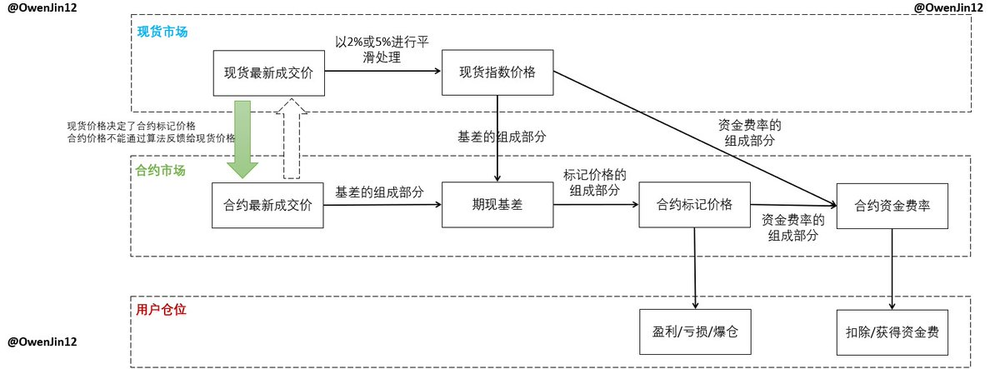

# 解密交易所永續合約算法：資金費率、軋空與幌騙手法

> **來源**: [@OwenJin12](https://x.com/OwenJin12/status/1825464963777064994) | [原文連結](https://rsci.app.link/QIqyoDzxbMb?_p=c31229c09a047af1e61d90f9ef)
>
> **日期**: Mon Aug 19 09:28:57 +0000 2024
>
> **標籤**: `合約交易` `資金費率` `市場操縱`

---

> **來源**: [Owen.btc 🟧 (@OwenJin12)](https://twitter.com/OwenJin12)  
> **日期**: 2024 年（時隔 2023 年第 1 期 1 年後更新）  
> **標籤**: `合約算法` `資金費率` `轋空` `幌騙` `Binance` `OKX`

---

時隔 1 年的合約系列第 2 期：以 $RARE 為例拆解 Binance、OKX 合約計算方案——資金費率≠借貸利率，現貨成交價、指數價格、標記價格又是什麼關係？如何識別轋空 Short Squeeze 和幌騙 Spoofing？

## 背景說明

大多數用戶都對合約嗤之以鼻但又忍不住手去開合約，每次發合約的推文大家評論總是很積極。第 1 篇文章獲得了很多媒體和 KOL 的轉發好評（也養活了不少洗稿博主），所以 2024 年打算時隔 1 年後更新第 2 篇。

研究並預測永續合約的資金費率是每個做市商、交易員的必備技能，但其實很多業內從業人員、專業做市商也對合約算法並不熟悉。所以第 2 篇從主流交易所（Binance & OKX）合約算法的角度介紹 2 種巨鯨主動干預市場的手法——轋空 Short Squeeze & 幌騙 Spoofing。

2023 年的第 1 篇大概寫完了合約算法設計的 20%，2024 年這篇會逐漸開始硬核起來，大概寫完了合約算法設計的 50%。下次什麼時候填坑寫第 3 篇（保險基金機制 & ADL & 風險限額 Risk Limit & 維持保證金率）就看大家的呼聲了。

## 本文涵蓋內容

本文大概解釋了如下問題：

1. **合約訂單簿的基礎知識**
2. **時隔 1 年的負費率合約行情**
3. **現貨價格 & 合約價格 & 指數價格 & 標記價格的關係**（以 Binance 和 OKX 為例）
4. **合約資金費率算法方案**（以 Binance 和 OKX 為例）
5. **合約價格精度的設計**
6. **負資金費率轋空 Short Squeeze 的條件**
7. **幣圈金融交易無監管下的巨鯨優勢**——轋空 Short Squeeze 和幌騙 Spoofing

## 核心觀點

### 價格體系與資金費率

- **資金費率 ≠ 借貸利率**：永續合約的資金費率機制是用來讓合約價格錨定現貨價格，而非單純的借貸成本
- **多重價格系統**：現貨成交價、合約成交價、指數價格（Index Price）、標記價格（Mark Price）各司其職，交易所透過這些價格計算資金費率並防止惡意操縱
- **價格精度設計**：交易所會根據幣種流動性調整合約價格精度，小市值幣種價格精度較粗，容易被操縱

### 市場操控手法

**轋空 Short Squeeze**：

- 在負資金費率（空方支付多方）的情況下，巨鯨可以透過控制現貨價格拉高合約標記價格，迫使空頭平倉
- 條件：需要同時控制現貨市場（影響指數價格）和合約市場（影響標記價格）

**幌騙 Spoofing**：

- 巨鯨在訂單簿掛大量虛假訂單（通常遠離市價），製造市場深度假象
- 誘導散戶做出錯誤判斷後，在成交前撤單，再反向操作收割

### 散戶劣勢

在幣圈無監管的金融交易環境下，巨鯨可以透過以下優勢操控市場：

- **資金優勢**：可以同時在現貨和合約市場大量建倉
- **信息優勢**：可以看到交易所訂單簿深度和清算價格分佈
- **技術優勢**：利用演算法交易和高頻交易搶佔先機
- **規則優勢**：深諳交易所合約算法和資金費率計算規則

散戶在這種不公平的市場中極難獲利，應特別警惕小市值高槓桿合約項目。

## 相關資源

- 完整文章：[揭秘：莊家是如何操縱現貨合約價格最終收割散戶](https://twitter.com/wublockchain12)（作者：@OwenJin12）
- 第 1 期合約系列文章（2023 年發布）

---

**註**：作者在海外相關機構從事交易風險管理，與大型做市商、項目方和機構用戶有豐富的接觸經驗。本文結合具體案例（如 $RARE），揭示項目方、做市商及機構大戶如何在現貨和合約市場聯動操控價格。
