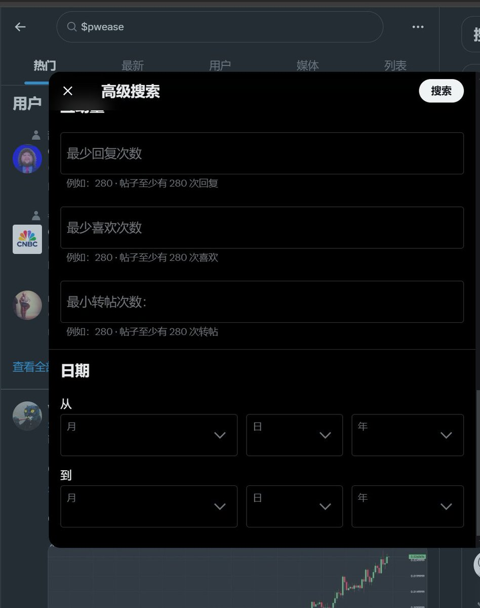
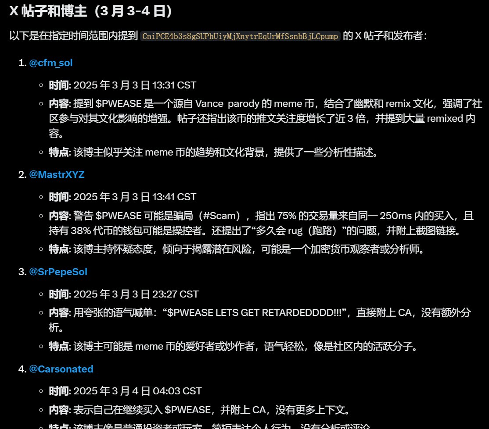
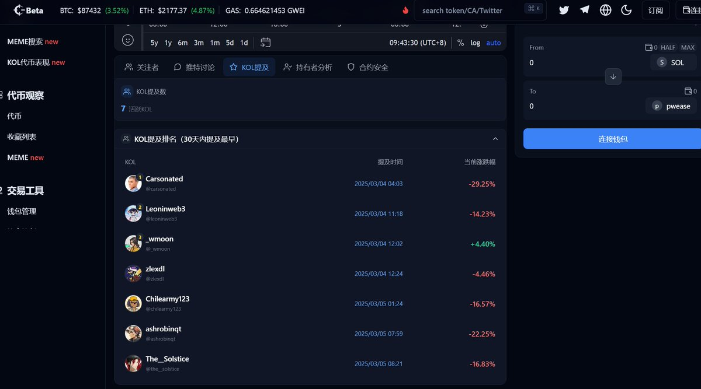

# 如何快速找到優質英文 Caller 脫離信息繭房

> **來源**: [@0xJingleMingle](https://x.com/0xJingleMingle/status/1897109092721942692) | [原文連結](https://lunarcrush.com/home)
>
> **日期**: Wed Mar 05 02:17:08 +0000 2025
>
> **標籤**: `資訊來源` `Caller 篩選` `交易研究`

---

以下是整理好的文章正文：

---

> **來源**: [@0xJingleMingle](https://x.com/0xJingleMingle)
> **作者**: Jingle
> **標籤**: `英文 Caller` `信息源` `工具` `推特` `Meme`

---

## 核心思路

反向思維：不是等 Caller 推薦幣種，而是從已經成功的幣種反推——看誰在早期就發現並有理有據地分析它。

## 1. 搜索標的選擇

最佳目標特徵：
- **英文社群火熱**，中文區討論度不高
- 符合英文區 Meme 文化和情緒點
- 範例：`$PWEASE`

其他標的也可以，但上述類型搜索效率最高。

## 2. 尋找方法

### (1) 推特直接搜索

- 直接搜索該 CA（合約地址）
- 善用**高級搜索**，限制發帖時間
- 選擇**大漲與敘事發酵前**的時間段

### (2) 借助 AI 與工具

**GROK**
- 直接詢問你想要的 CA，限定時間範圍
- 自動推薦博主、討論內容和發帖時間
- 可自定義搜索限制

**LunarCrush (@LunarCrush)**  
網址：https://lunarcrush.com
- 搜索 CA 可看到提及它的熱度高帖子和發帖時間
- 顯示代幣對應 K 線
- 缺點：收費（可免費點擊 50 次）

**CryptoHunter (@cryptohunt_ai)**  
網址：https://cryptohunt.ai
- 可看到提及該代幣的 KOL
- 社媒討論情緒內容總結

## 3. 篩選 & 觀察

篩選原則：
- 找**內容言之有物**的 Caller
- **拒絕永賺博主、矩陣博主**
- 拒絕類似「我在私人群裡 call 了現在多少倍」這種內容

持續觀察：
- 建立一個**推特列表**
- 找到**持續輸出**、有自己交易與分析模式的博主
- 持續迭代更新列表

## 4. 關於找 Telegram 頻道

同樣原理：
1. 搜索 CA
2. 篩選頻道
3. 關注 call 聚合頻道觀察

範例：作者關注的英文 Caller 消息聚合頻道：https://t.me/callers_aggregator

## 題外話

### 脫離信息繭房

如果推特列表已經關注很多中文博主，推薦算法已經把你限制在信息繭房裡，建議：
- **新起一個號**專門關注英文區
- 中文區已有非常多有能力的寶藏 Alpha Caller
- 但如果想從另一個角度觀察，可試試這個方法

### 核心理念

**任何 Caller 都應該只是你的信息源，請堅信：你自己本身是最好的 Alpha。**
