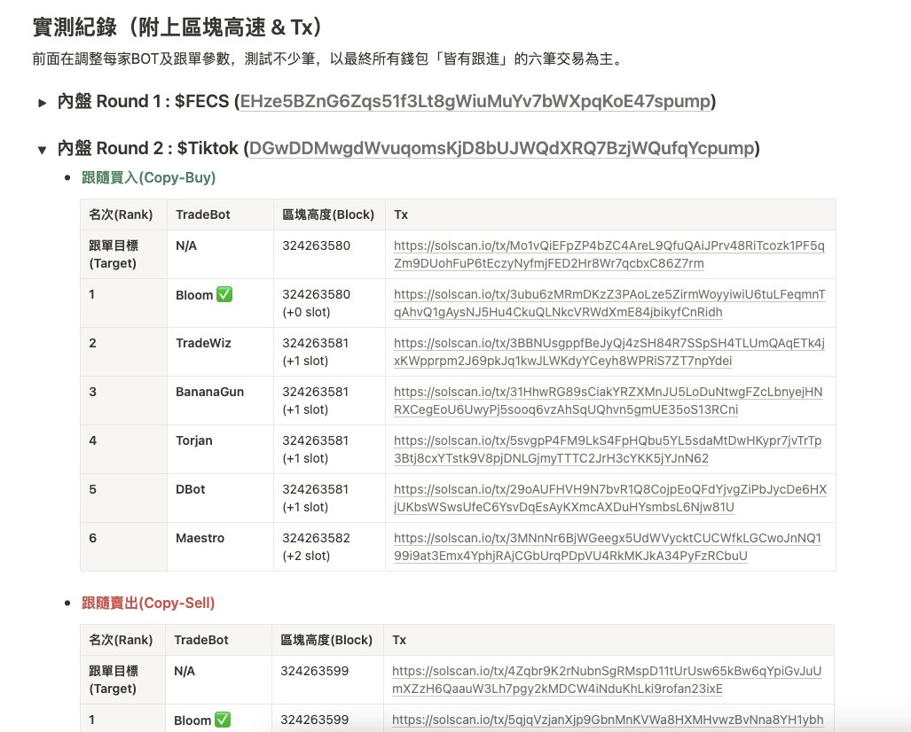
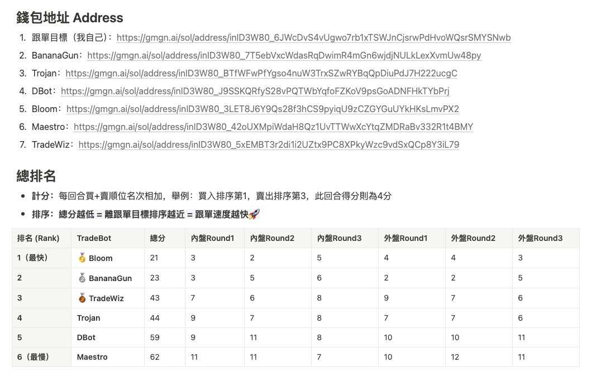
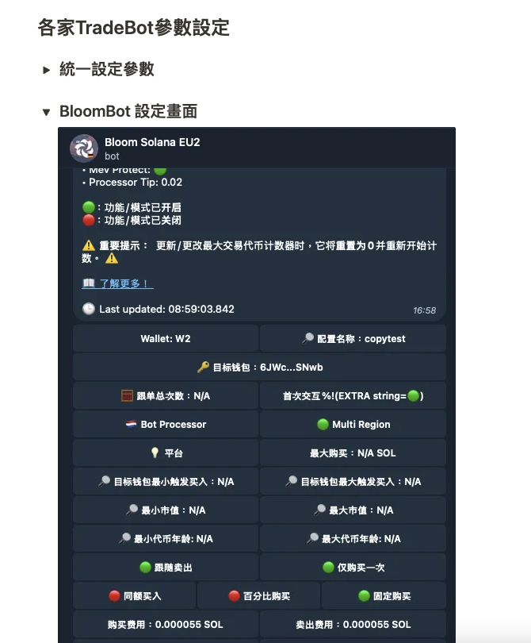

# Solana 跟單機器人速度實測對比

> **來源**: [@0x542121](https://x.com/0x542121/status/1896534568733458523) | [原文連結](https://evergreen-texture-7d9.notion.site/Bot-Creator-21-0x5421-X-0x542121-1abdc654fae780f99f24dca50e48fe0a)
>
> **日期**: Mon Mar 03 12:14:11 +0000 2025
>
> **標籤**: `跟單機器人` `Solana` `交易速度`

---

> **來源**: [@0x542121 (𝟮𝟭⚡️0x5421)](https://twitter.com/0x542121)
> **日期**: 2026-02-18
> **標籤**: `Solana` `跟單機器人` `速度測試` `交易工具`

---

## 測試概述

本次測試燒 1200U 手續費，進行全網最完整的跟單 BOT 速度實測。所有詳細紀錄包含每筆 tx 與各家 Bot 設定截圖都在 [Notion Page](https://t.co/SRUfaMRqh6) 中。

## 速度排名

### 1. @BloomTradingBot
- **表現**：依舊是免費最快跟單 BOT，穩定 0-2 Slot 跟進
- **缺點**：偶爾會漏單

### 2. @bananagun
- **表現**：速度與 Bloom 不相上下，同區塊跟進的情況較少
- **缺點**：失敗率較 Bloom 稍高

### 3. @TradeWiz_Bot
- **表現**：大多老外使用，聽說速度不錯，測完表現中規中矩

### 4. @TrojanOnSolana
- **表現**：速度與巫師相近，穩定性佳

### 5. @DBot_CN
- **優點**：過濾條件最豐富，交易手續費最低，穩定性極高
- **缺點**：速度略遜一籌

### 6. @MaestroBots
- **表現**：速度明顯不足
- **建議**：跟單玩家建議直接 Pass

## 測試參數設定

為貼近真實跟單場景，根據自己經驗統一使用以下參數設置：
- **手續費 (Fee)**: 0.000055 SOL
- **賄賂費 (Tip)**: 0.02 SOL
- **滑點**: 50%

> 註：少了幾家 Bot 是因為今年 1 月時也有實測一次跟單速度，結果有幾家被完虐，所以不再加入這輪測試。

## 結論與建議

### 整體評價
六款 Bot 表現都不錯，基本穩定在 0-2 Slot 內跟進。

### 使用建議
- **手操玩家**：挑介面順手的即可
- **跟單玩家**：建議挑前 2 名使用，才有競爭力

## 對 @MrRyanChi 的評論

實在不懂 @MrRyanChi 老哥從哪找來的「主流機器人」，測試時都需要 2 個 slot 以上才能跟進。

若照他說「交易速度在 1-2 個 slot 以內（800ms），完全就是市場上最快的跟單機器人」，建議回去重練。

### 跟單速度的重要性

- **手操玩家**：交易速度影響較小
- **跟單玩家**：慢一個 slot 就是 10~20% 價差

### 新手常見問題

剛接觸的小白不懂概念，不曉得為何跟單目標都賺錢，自己卻都在虧錢，不知不覺就把辛苦累積的本金虧光。

而推廣者只吹著「市場最快跟單機器人」的大牛逼，結果呢？返佣/收費高得離譜，速度慢到掉渣，純粹跟單賽道毒瘤。

### 作者親身經歷

為何這麼上火？因為當初自己就是那個被騙的小白，用了自稱「全網最速」的跟單 BOT 把梭子全虧沒了。後來第二次接觸跟單（也就是這幾個月），才知道原來當初那東西根本是個垃圾。

### 對推廣者的期許

大家賺錢都不容易，要賣產品或賺返佣也相當合理，但三流 Bot 還用這種方式吹牛逼我就真看不下去。

希望老哥到時端出來的東西，是真如你所說「完全就是市場上最快的跟單機器人」以及擁有「完全免疫割跟單」的黑科技。

---

**@MrRyanChi 的回應**：

> 🫡 感謝批評指正
> 
> 目前看下來，我們選了幾個割跟單的地址進行測試，都是可以免疫這個情況的。我和 @hyfidaksh 正在進行最終階段的測試。
> 
> 關於速度方面，我們測試的大部分主流機器人，都需要 2 個 slot 以上，這些都可以在 solscan 看到。
