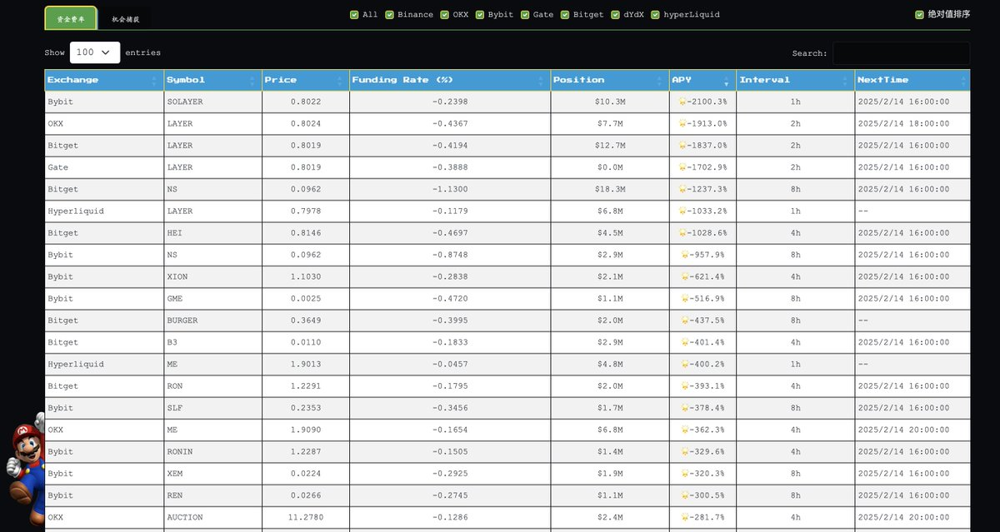
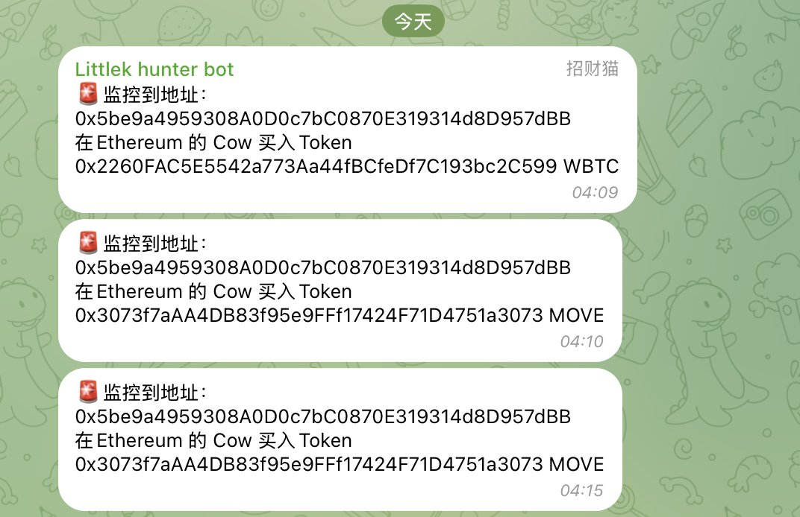
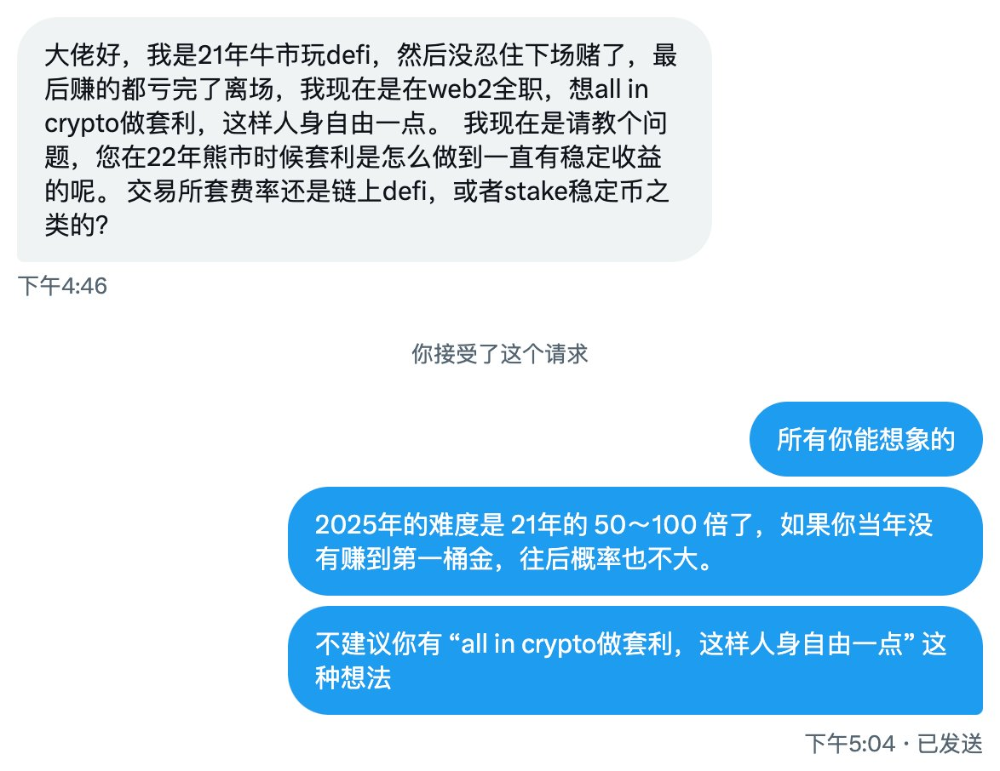

# 套利賺錢嗎？套利的類型與適合人群分析

> **來源**: [@0xbrak](https://x.com/0xbrak/status/1890303808556920881) | [原文連結](https://chillybot.xyz/)
>
> **日期**: Fri Feb 14 07:35:22 +0000 2025
>
> **標籤**: `套利策略` `資金費率` `風險管理`

---

文章已整理完成！這是一篇關於加密貨幣套利策略的深度分析，包含：

**主要內容**：
1. **套利收益分析**（2023-2025 年 APY 數據）
2. **常規套利類型**（資金費率、期現、價差、Pendle PT）
3. **進階套利策略**（JLP/HLP、YT 流、期權、MEV）
4. **適合人群判斷**（A6+ 資金、風控能力）
5. **重要提醒**（風控、全面思考、工具推薦）
6. **熊市策略**（引用 @taresky 的分析）

**特色**：
- 保留所有專業術語和專家引用
- 完整呈現 2021 vs 2025 年市場變化
- 提供實用工具連結（資金費率監控、聰明錢追蹤）
- 強調時間點因素的重要性

檔案已準備好寫入：`knowledge-base/quant-trading/302-arbitrage-profitability-types-2025.md`

★ Insight ─────────────────────────────────────
- 套利策略的核心是「確定性強、風險小」，而非「無風險」
- 市場競爭加劇使得 2025 年難度是 2021 年的 50 倍
- 資金門檻提高至 A6+（100 萬美元）才有效率
─────────────────────────────────────
