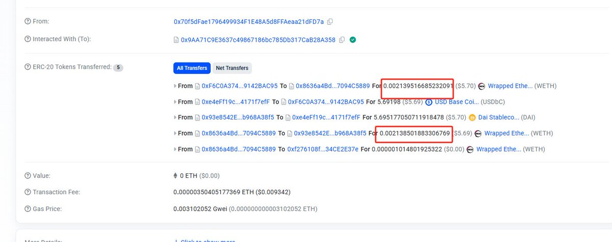

# 閃電交換套利零成本策略：9天獲利14個ETH案例分析

> **來源**: [@BofkUR](https://x.com/BofkUR/status/1891776051539312799) | [原文連結](https://twitter.com/BofkUR/status/1891776051539312799/photo/1)
>
> **日期**: 
>
> **標籤**: `閃電交換` `套利策略` `零成本交易`

---

> **來源**: [@BofkUR (zhouzhou)](https://x.com/BofkUR)  
> **日期**: 2025-02-18  
> **標籤**: `閃電交換` `套利` `零成本` `MEV`

---

## 案例概述

地址 `0xf276108fd52a959d761af3ddc5f3a8d34ce2e37e` 在 9 天內透過閃電交換（Flash Swap）套利獲利 14 個 ETH，特點是幾乎所有交易都是零成本操作。

## 閃電交換套利機制

閃電交換是一種利用 DeFi 協議的原子性交易特性進行套利的方法：

- **零成本**：無需預先持有資金，在同一筆交易內借入、套利、償還
- **原子性**：整個過程在單一交易內完成，要麼全部成功，要麼全部失敗
- **高效率**：利用不同 DEX 之間的價差即時套利

## 參考資料

- [Etherscan 地址記錄](https://etherscan.io/address/0xf276108fd52a959d761af3ddc5f3a8d34ce2e37e)
