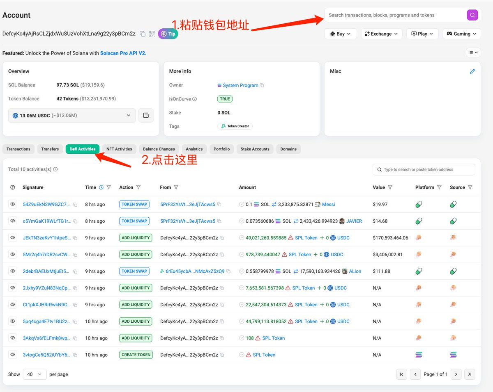
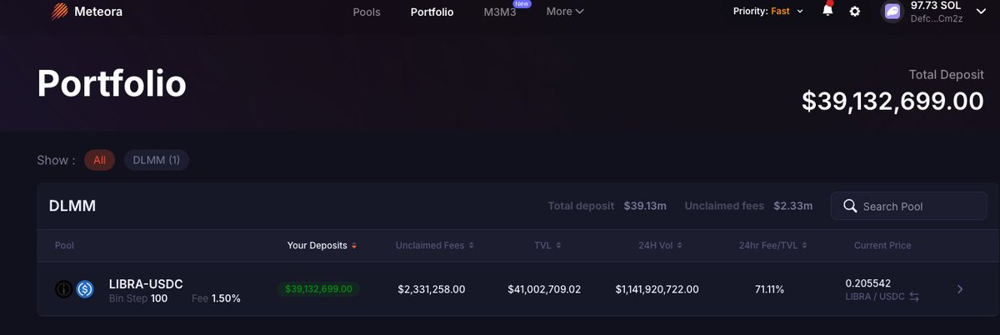
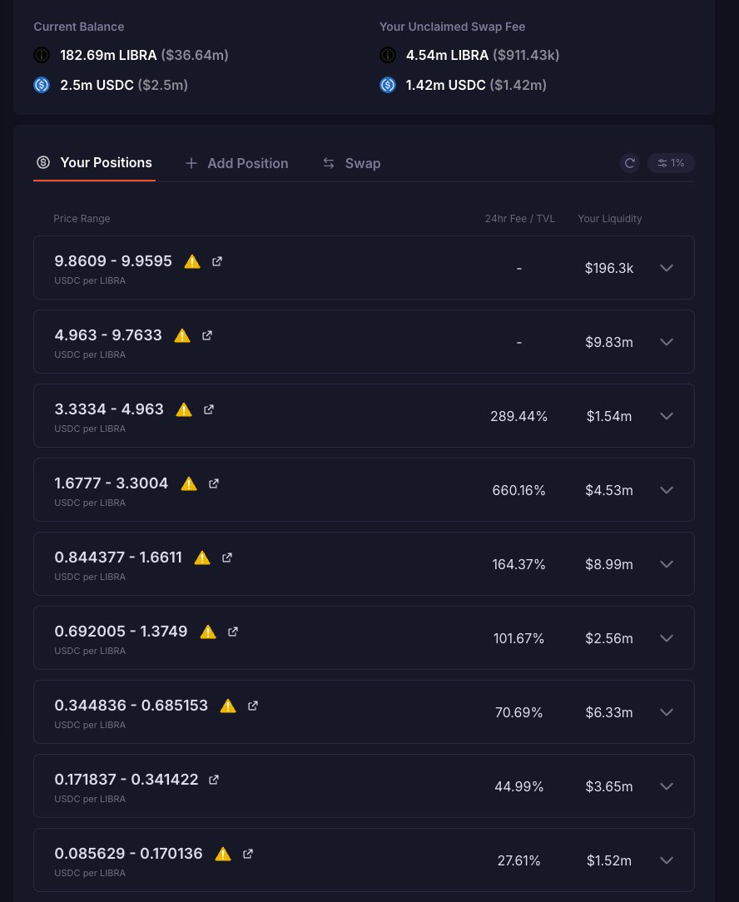

# Solana DEX 流動性池區間識別教學

> **來源**: [@0xchangan](https://x.com/0xchangan/status/1890667575568482720) | [原文連結](https://solscan.io/)
>
> **日期**: Sat Feb 15 07:40:51 +0000 2025
>
> **標籤**: `流動性池` `單邊流動性` `代幣分析`

---

> **來源**: [@0xchangan (0x长安)](https://twitter.com/0xchangan)  
> **日期**: 2026-02-18  
> **標籤**: `Solana` `DEX` `流動性池` `LP` `Meteora` `DLMM` `鏈上分析`

---

## 前言

這篇文章分享如何找到 Dex 組 LP 的範圍。

今天阿根廷總統發幣 $LIBRA，Dev 利用投資者對於 LP 不敏感，組單邊流動性進行出貨。前段時間也有 ZachXBT 將手中的代幣組 LP，利用 LP 在上漲的過程中進行出貨。在捕捉金狗的過程中，知道 Dev 的 LP 範圍也是一個不可或缺的知識點。

---

## 實戰教學

### 步驟 1：在 GMGN 上找到 Dev 的地址

在 GMGN 上找到 Dev 的地址，並將地址複製。

### 步驟 2：打開 Solana 區塊鏈瀏覽器

- 連結：https://solscan.io
- 在區塊鏈瀏覽器可以看到地址的一些操作，例如：
  - 10h 前創建了代幣
  - 11h 前開始在 Meteora 添加流動性，全部都添加的單邊流動性

### 步驟 3：將 Dev 地址添加進觀察錢包

前面的區塊鏈瀏覽器只能看到一些鏈上的操作，看不到具體的 LP 範圍。如果想要看到 LP 的區間，需要將地址添加進觀察錢包。

以 Phantom 為例：
1. 添加地址
2. 選擇「監控錢包」
3. 輸入地址

### 步驟 4：打開 Meteora

- 連結：https://meteora.ag
- 連接剛才的觀察錢包
- 點擊頂部的 Portfolio
- 下面顯示的 LIBRA-USDC 就是 Dev 創建的流動性池子

### LP 範圍分析

從 Portfolio 可以看到：
- Dev 創建了多個流動性池子
- 範圍從 0.344~9.95 不等
- 右邊顯示的是每個區間內的流動性

---

## 重點整理

| 步驟 | 工具 | 用途 |
|------|------|------|
| 1 | GMGN | 找到 Dev 地址 |
| 2 | Solscan | 查看鏈上操作記錄 |
| 3 | Phantom 錢包 | 添加觀察錢包 |
| 4 | Meteora | 查看 LP 區間範圍 |

透過這套流程，可以清楚看到 Dev 的流動性分佈區間，判斷其出貨策略。這對於捕捉 meme 幣和避免成為接盤俠至關重要。
