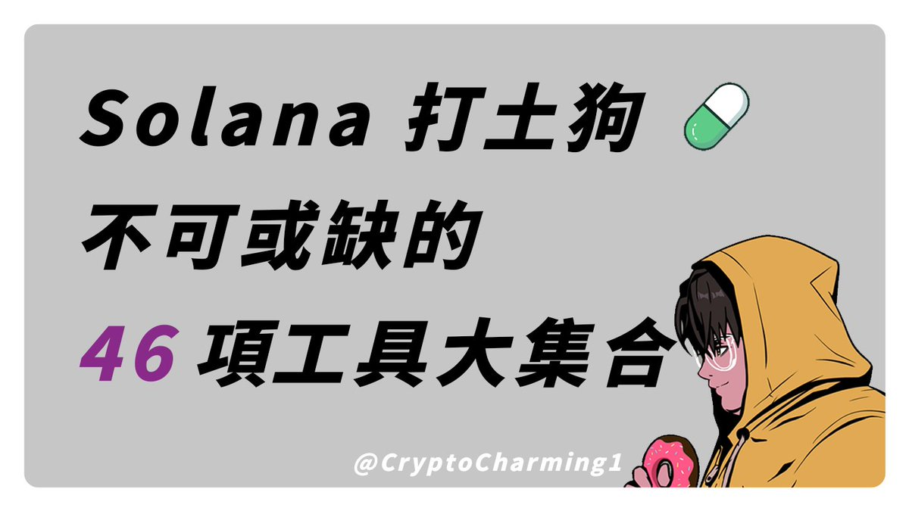

# Solana Memecoin 交易工具完整指南

> **來源**: [@CryptoCharming](https://x.com/CryptoCharming/status/1887081483460120844) | [原文連結](https://pro.xxyy.io/?ref=Charming1)
>
> **日期**: Wed Feb 05 10:11:00 +0000 2025
>
> **標籤**: `交易工具` `Memecoin` `Solana`

---

> **來源**: [@CryptoCharming (CryptoCharming 🐟)](https://twitter.com/CryptoCharming)  
> **標籤**: `Solana` `Memecoin` `交易工具` `鏈上分析` `工具集合`

---

## 概述

本文整理了 Solana memecoin 交易的完整工具清單，涵蓋交易、掃鏈、程式檢查、熱度分析、錢包追蹤等各個面向。❤️ 標記代表作者最常用的工具。

## 💎 交易工具

| 工具 | 推薦度 | 連結 |
|------|--------|------|
| XXYY | ❤️ | [@useXXYYio](https://twitter.com/useXXYYio) |
| GMGN | ❤️ | [@gmgnai](https://twitter.com/gmgnai) |
| Bloom | ❤️ | [@BloomTradingBot](https://twitter.com/BloomTradingBot) |
| Jupiter | 🎯 | [@JupiterExchange](https://twitter.com/JupiterExchange) |
| OKX | 🎯 | [@okx](https://twitter.com/okx) |
| Debot | 🎯 | [@DitingData](https://twitter.com/DitingData) |
| DexScreener | 🎯 | [@dexscreener](https://twitter.com/dexscreener) |
| Photon | 🎯 | [@tradewithPhoton](https://twitter.com/tradewithPhoton) |
| Pepeboost | 🎯 | [@PepeBoost888](https://twitter.com/PepeBoost888) |

## 💎 掃鏈工具

| 工具 | 推薦度 | 連結 |
|------|--------|------|
| XXYY | ❤️ | [@useXXYYio](https://twitter.com/useXXYYio) |
| Bullx | ❤️ | [@bullx_io](https://twitter.com/bullx_io) |
| Pumptweets | ❤️ | #pumptweet |
| GMGN | 🎯 | [@gmgnai](https://twitter.com/gmgnai) |
| Vbot | 🎯 | [@VBOT_BY_VTOPIA](https://twitter.com/VBOT_BY_VTOPIA) |

## 💎 程式檢查

| 工具 | 推薦度 | 連結 |
|------|--------|------|
| ai0x | ❤️ | [@ai0xdotfun](https://twitter.com/ai0xdotfun) |

## 💎 網站檢測

| 工具 | 推薦度 | 連結 |
|------|--------|------|
| SOL_inqbot | ❤️ | #SOL_INQBOT |
| Siteliner | 🎯 | #siteliner |
| Builtwith | 🎯 | [@builtwith](https://twitter.com/builtwith) |

## 💎 Mindshare & 熱度排行

| 工具 | 推薦度 | 連結 |
|------|--------|------|
| Kaito | ❤️ | [@_kaitoai](https://twitter.com/_kaitoai) |
| Alphagate | ❤️ | [@alphagate_io](https://twitter.com/alphagate_io) |
| GetMoni | ❤️ | [@getmoni_io](https://twitter.com/getmoni_io) |
| GoatIndex | 🎯 | [@GoatIndexAI](https://twitter.com/GoatIndexAI) |
| Cookie | 🎯 | [@cookiedotfun](https://twitter.com/cookiedotfun) |

## 💎 錢包監控

| 工具 | 推薦度 | 連結 |
|------|--------|------|
| ChainFM | ❤️ | [@chain_fm](https://twitter.com/chain_fm) |
| Cielo | ❤️ | [@CieloFinance](https://twitter.com/CieloFinance) |

## 💎 錢包追蹤溯源

| 工具 | 推薦度 | 連結 |
|------|--------|------|
| Arkham | ❤️ | [@arkham](https://twitter.com/arkham) |
| 0xPPL | ❤️ | [@0xppl_](https://twitter.com/0xppl_) |
| Opensea | 🎯 | [@opensea](https://twitter.com/opensea) |
| DeBank | 🎯 | [@DeBankDeFi](https://twitter.com/DeBankDeFi) |
| Wrapcast | 🎯 | [@warpcast_](https://twitter.com/warpcast_) |
| XO2 | 🎯 | [@xo2corporation](https://twitter.com/xo2corporation) |

## 💎 推特監控

| 工具 | 推薦度 | 連結 |
|------|--------|------|
| Alphapro | ❤️ | #alphapro |
| TWBot | 🎯 | [@yingheTWbot](https://twitter.com/yingheTWbot) |

## 💎 KOL 喊單

| 工具 | 推薦度 | 連結 |
|------|--------|------|
| XFinder | ❤️ | [@0xgangWhat](https://twitter.com/0xgangWhat) |
| CryptoGDOG | ❤️ | [@crypto_gdog](https://twitter.com/crypto_gdog) |
| AlphaScan | 🎯 | [@alphascan_xyz](https://twitter.com/alphascan_xyz) |

## 💎 敘事判斷

| 工具 | 推薦度 | 連結 |
|------|--------|------|
| PumpdotNews | ❤️ | [@pumpdotnews](https://twitter.com/pumpdotnews) |
| CryptoHunt | 🎯 | [@cryptohunt_ai](https://twitter.com/cryptohunt_ai) |

## 💎 其他工具

| 工具 | 推薦度 | 連結 |
|------|--------|------|
| Step | ❤️ | [@StepFinance_](https://twitter.com/StepFinance_) |
| PumpScam 插件 | ❤️ | [@abcdsxg](https://twitter.com/abcdsxg) |
| PumpScam | 🎯 | [@abcdsxg](https://twitter.com/abcdsxg) |
| Phanes | 🎯 | [@phanesbot](https://twitter.com/phanesbot) |
| CashCashBot | 🎯 | [@CashCashBot](https://twitter.com/CashCashBot) |
| ChainInsight | 🎯 | [@chaininsight](https://twitter.com/chaininsight) |
| PaperHands | 🎯 | [@paperhands](https://twitter.com/paperhands) |
| PurityFinance | 🎯 | [@purityfinance](https://twitter.com/purityfinance) |

## 作者說明

以上是作者平常使用的所有工具清單。工具只是輔助，最重要的還是交易判斷能力，但在打土狗時這些工具能幫助節省大量時間。
