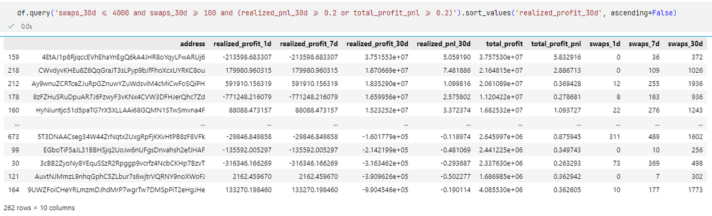

# 聰明錢包篩選方法：交易勝率與利潤分析

> **來源**: [@cryptoxfeng](https://x.com/cryptoxfeng/status/1886418415373754595)
>
> **日期**: Mon Feb 03 14:16:12 +0000 2025
>
> **標籤**: `錢包分析` `交易篩選` `利潤評估`

---

## 篩選錢包的基礎方法

### 簡單粗暴的篩選標準

- **交易數量**：30 日交易數在 100~4000 之間，確保近一個月活躍但不能太活躍
- **利潤率**：總利潤率（總盈利/總交易量）> 0.2 或 30 日利潤率 > 0.2
- **排序方式**：按照總利潤排行

## 進階篩選方法

### 核心篩選指標

1. **代幣勝率和交易勝率**
   - 篩選具有穩定勝率的錢包

2. **對數收益率分析**
   - 取每個代幣的對數收益率
   - 求均值或中位數
   - 過濾極端值

3. **市值分布分析**
   - 分析交易代幣的市值分布
   - 評估交易策略的風險偏好

4. **持倉與跟單指標**
   - 持倉時間分析
   - 割跟單系數評估

## 篩選目標

最終目的是判斷一個錢包是否顯著、可持續的「聰明」錢包，而非短期僥倖獲利。
