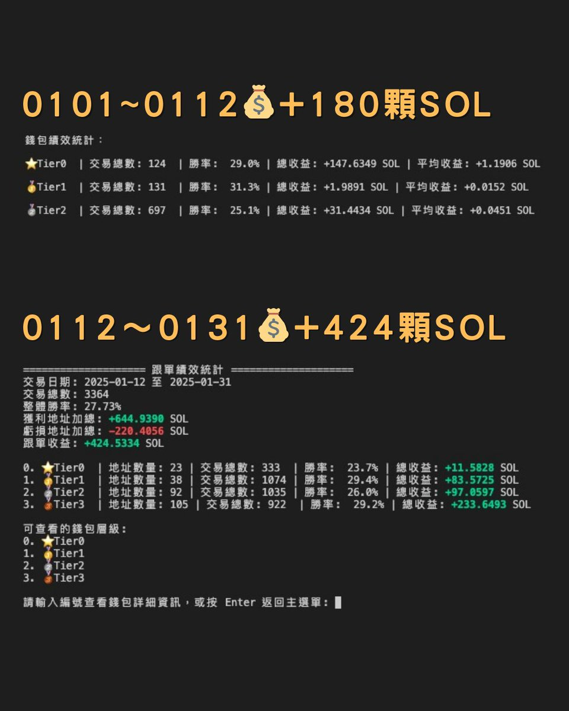

# Solana 跟單入門指南：BloomBot 設定與實戰心得

> **來源**: [@0x542121](https://x.com/0x542121/status/1885310277220262207) | [原文連結](https://t.me/BloomSolana_bot?start=ref_AFXLWYTQO5)
>
> **日期**: Fri Jan 31 12:52:52 +0000 2025
>
> **標籤**: `跟單交易` `Solana` `交易機器人`

---

> **來源**: [@0x542121 (𝟮𝟭⚡️0x5421)](https://twitter.com/0x542121)  
> **日期**: 2025-01-XX  
> **標籤**: `Solana` `跟單交易` `BloomBot` `DBot` `跟單策略`

---

## 一月份跟單收益統計

- **收益**: +604 顆 $SOL
- **跟單流成長**: 30 ➡︎ 1000 $SOL ✅

這個月運氣真的有點好，看來拜財神有用🤣 也順利將總收益打上一千顆了！這篇會分享些跟單一路走來的心得。

**BloomBot 推薦**：  
SOL最速交易機器人BloomBot，日常打狗 / 跟單 / 狙擊 / 刮刀皆可用，走邀請手續費 -10%  
連結：https://t.me/BloomSolana_bot

---

## 跟單常見問題 Q&A

### 🔸想嘗試跟單本金要多少？

建議是 **7~10 顆**再開始，我自己新錢包都固定放 10 顆。

### 🔸每單固定下多少？

固定下 **0.6~1.2 SOL**，依地址穩定度而定。

早期是對方買多少我就買多少，也滿暴力的。但遇到逆風期回撤非常快，後來才改成每注固定，主要還是依個人風險承受度決定。

如果本金較少，依舊建議**每注不要低於 0.5 SOL**。原因是交易時，Pump 會抽稅、交易 Bot 收手續費、Jito 收 Tip、以及上鏈 Fee 這些固定開銷。若每單下得太少，固定開銷佔比大，就會壓縮到淨利潤。

### 🔸跟單機器人選擇？

主流跟單我還是用 **Bloom**，原因無他就是速度最快。

但若是跟隨高頻交易地址，會建議改 **DBot**，花 $39 刀買 Pro 會員，手續費可以省更多。  
（高頻是指 `DyR2EdHMsLVYyahLqH6HgkHH9zm9WxoQvBDvegFEdHiF` 這種地址）

### 🔸跟單常常失敗？

請將**滑點拉到 50% 以上**。

不管是用哪家 Bot，跟單失敗的主因都是：
- **滑點不夠**
- **賄賂費不夠**

賄賂費能加快跟單速度，滑點則是你可接受的價差。

當跟單速度不夠快，中間會夾雜其他人買入，你與跟隨對象的價差自然就高，最後超過滑點，你跟單就失敗了。

---

## 跟單基礎設定（Bloom 為例）

| 設定項目 | 建議值 |
|---------|--------|
| Multi Region | 開啟（併發交易，能加快上鏈速度） |
| MEV Protect | 開啟（防夾模式打開） |
| 滑點 | 50% |
| 購買/賣出費用 (Fee) | 0.0005 - 0.001 |
| 綑綁小費 (Tip) | 0.005 - 0.015，或開自動 |
| 限價訂單 | 建議掛止損 -40% 到 -60% 之間 |

以上是「最基礎」跟單能正常跑的設定，至少不會一直失敗，其餘可依自身策略去調整。

---

## 跟單技術問題

### 🔸漏單 / 沒觸發跟單 / 卡 Pending

- 以 Bloom 來說，若你跟到的是**狙擊交易**，那不會觸發
- 有特別在跟狙擊手的地址，能使用 **DBot**，已確認有支援

另外跟單 Bot 皆可能**漏單**，和鏈上情況、Bot 設定、代幣熱度都有關係。只能說設定正確，9成以上單子都能跟到，其餘就看運氣。

**卡 Pending** 則可能是剛好跟到大熱盤，Fee、Tip、滑點不夠所以沒跟進去。

---

## 玩跟單的好習慣

平時錢包**別放太多錢**，有賺就把多的索子打回交易所！

睡覺時我甚至會把餘額降到 **5~7 顆**左右，避免睡覺時遇到割跟單，榨乾錢包最差就虧 7 顆。

---

## 要去哪裡找跟單地址

像 **Aveai、GMGN、Debot、chain、GDog** 等，這些網站都有整理聰明錢。以及早期入場的地址也值得留意，篩選過濾的部分能爬我先前的推文就不贅述。

### ⚠️ 注意事項

- **大 KOL / 熱門地址不建議跟**：胃納量有限，太多人跟甚至會引來割跟單的腳本 BOT，磨損會很重
- **找低調又有實力的 P 小將**：偷偷吃口肉，我一開始就是這樣玩起來的，找到一個好地址就能帶你上天堂

另外也請各位別再跟我要地址了，也不建議跟單我，跟單在玩跟單的人磨損會非常嚴重🤣

雖沒辦法分享賺錢地址，但未來我打算挑些自己跟過有問題的地址當範例講解，應該也能幫大家避避雷吧！

---

## 感謝

還要感謝 **@DBot_CN 團隊的 Victor 老哥**，剛接觸跟單時什麼都不懂，有幸遇到老哥一步步帶我調設定、解釋原理，以及傳授許多跟單的細節，十分感激老哥現在依舊不厭其煩的解答我各種問題🙏🏻

---

## 結語

當初比特幣生態全面熄火，在 Solana 競爭激烈的 PVP 又賺不到錢，走投無路才選擇嘗試跟單，有幸玩出一些心得，分享給有需要的人。

如果你也想嘗試跟單，請務必在 **Bot 設定正確 + 篩選好地址**後再去跑，才不會又把錢磨光。

祝各位新年快樂，2025 繼續賺大錢❤️

---

## BloomBot 相關資訊

- **Telegram Bot**: https://t.me/BloomSolana_bot
- **Portal**: https://t.me/bloomportal
- **Docs**: https://docs.bloombot.app/
- **US 版本**: @BloomSolanaUS1_bot
