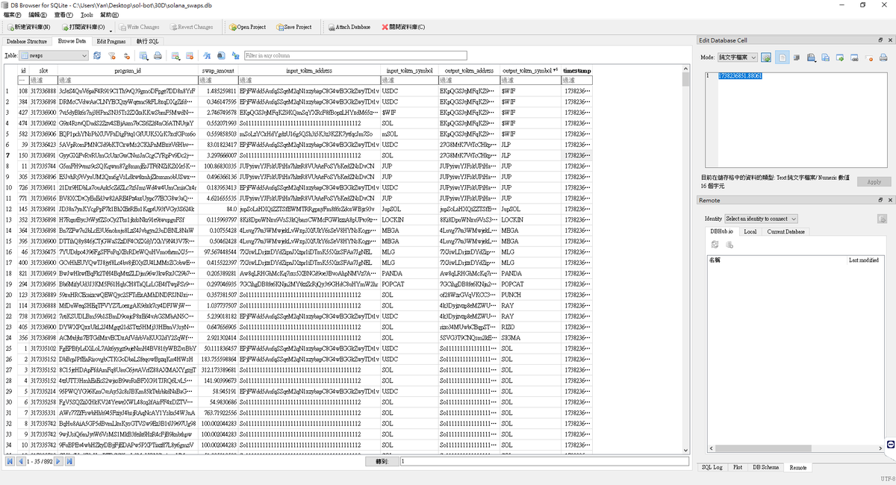
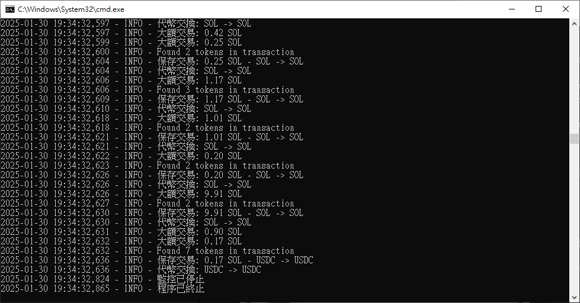

# 【Day 1】Solana Meme 幣鏈上數據即時監控：用 Python 抓取 Raydium/Jupiter 交易流

> **來源**: [@practice_y11](https://x.com/practice_y11/status/1884952151879045123) | [原文連結](https://www.python.org/downloads/)
>
> **日期**: 
>
> **標籤**: `鏈上數據擷取` `Solana DEX 監控` `Python 交易機器人`

---




> **來源**: [@practice_y11 (Yan Practice ⭕散修🎒)](https://twitter.com/practice_y11)
> **日期**: 2026-02-18
> **標籤**: `Solana` `Meme幣` `Python` `鏈上數據` `DEX監控` `Raydium` `Jupiter`

---

## 前言

要捕捉 Solana 上的 Meme 幣機會,第一步是即時監控鏈上數據。這份 Solana 交易監控代碼主要用於監測 **Jupiter DEX** 和 **Raydium AMM** 上的大額交易（超過 50 SOL）,並記錄**代幣交換（Swap）資訊**到本地 SQLite 資料庫。

## 工具準備

- **安裝 Python**: [https://www.python.org/downloads/](https://www.python.org/downloads/)
- **安裝 Solana SDK**: 在命令列執行 `pip install solana`
- **取得免費 RPC 節點**: [QuickNode](https://www.quicknode.com/)
- **安裝資料庫瀏覽器**: [DB Browser for SQLite](https://sqlitebrowser.org/)
- **新增執行程式**: 建立 `sol_swap_scan.py` 檔案（可自訂名稱）

## 功能說明

### 1. Solana RPC 連接

程式透過 Solana RPC API 連接區塊鏈,獲取最新的區塊、交易資訊,確保能即時監測到 DEX 上的交易。

```python
self.client = Client(Config.RPC_ENDPOINT)
```

- `RPC_ENDPOINT` 指定 Solana 節點的 API 地址
- 這使程式能夠查詢區塊資訊、獲取交易數據、解析交易記錄

### 2. 監測 DEX 交易

程式會監測 **Jupiter**（Solana DEX 聚合器）和 **Raydium**（流動性池 AMM）相關的交易,並根據智能合約 ID 過濾出這些交易。

```python
JUPITER_PROGRAM_IDS = [
    "JUP2jxvXaqu7NQY1GmNF4m1vodw12LVXYxbFL2uJvfo",  # Jupiter v4
    "JUP6LkbZbjS1jKKwapdHNy74zcZ3tLUZoi5QNyVTaV4"   # Jupiter v6
]
RAYDIUM_PROGRAM_ID = "675kPX9MHTjS2zt1qfr1NYHuzeLXfQM9H24wFSUt1Mp8"
```

- 透過**智能合約地址**過濾出 Jupiter 和 Raydium 相關的交易,確保只監測 DEX 交易

### 3. 解析交易中的代幣資訊

當發現 DEX 交易時,程式會提取該筆交易涉及的代幣,包括:
- **輸入代幣**（input token）
- **輸出代幣**（output token）

```python
def find_token_transfers(self, tx, account_keys) -> List[dict]:
    tokens = []
    for balance in post_token_balances:
        mint = str(mint)
        token_info = self.get_token_info(mint)
        if token_info["name"] != "Unknown":
            tokens.append(token_info)
    return tokens
```

- 透過**交易後的 Token 餘額變化**來識別代幣轉換
- 例如,USDC 交換成 SOL,程式會記錄 USDC（input）→ SOL（output）

### 4. 記錄大額交易（超過 50 SOL）

程式只記錄**超過 50 SOL 的大額交易**,避免小額交易干擾數據。

```python
if sol_change > Config.MIN_SWAP_AMOUNT:
    tokens = self.find_token_transfers(tx, tx.transaction.message.account_keys)
    if len(tokens) >= 2:
        swap_data = {
            "slot": slot,
            "program_id": str(tx.transaction.message.account_keys[0]),
            "swap_amount": sol_change,
            "input_token_address": tokens[0]["address"],
            "input_token_symbol": tokens[0]["symbol"],
            "output_token_address": tokens[-1]["address"],
            "output_token_symbol": tokens[-1]["symbol"],
            "timestamp": time.time()
        }
        save_swap(swap_data)
```

- `sol_change > 50 SOL` 代表這筆交易的 SOL 變化超過 50,才會被記錄
- 解析出**輸入代幣**和**輸出代幣**,儲存到資料庫

### 5. 儲存交易資訊到 SQLite

當監測到符合條件的交易時,程式會將數據存入 SQLite 資料庫。

```python
def save_swap(self, swap_data: dict):
    df = pd.DataFrame([swap_data])
    df.to_sql('swaps', self.engine, if_exists='append', index=False)
    logging.info(
        f"保存交易: {swap_data['swap_amount']:.2f} SOL - "
        f"{swap_data['input_token_symbol']} -> {swap_data['output_token_symbol']}"
    )
```

- 透過 **Pandas** 寫入 SQLite 資料庫,方便日後分析
- 記錄的交易數據包含:
  - 交易時的**區塊高度**（slot）
  - 交易的 **SOL 數量**
  - **輸入代幣** & **輸出代幣**
  - **交易時間戳**

### 6. 定期刷新代幣快取

Solana 代幣的名稱和符號可能會更新,因此程式會定期刷新代幣快取,確保數據最新。

```python
def refresh_token_cache(self):
    response = requests.get(Config.JUPITER_TOKEN_API, timeout=10)
    if response.status_code == 200:
        self.token_cache = {token["address"]: token for token in response.json()}
        self.last_cache_refresh = time.time()
```

- 透過 **Jupiter API** 取得最新的代幣資訊,並快取到 `self.token_cache`
- 這樣可以**加速代幣查詢**,減少不必要的 API 請求

### 7. 監測 Solana 最新交易

程式會每秒檢查最新的 Solana 區塊,並過濾出符合條件的交易。

```python
async def monitor_transactions(self):
    while True:
        current_slot = self.client.get_slot().value
        for slot in range(current_slot - 5, current_slot + 1):
            block = self.client.get_block(slot, max_supported_transaction_version=0).value
            for tx in block.transactions:
                sol_change = max(abs((post - pre) / 1e9) for pre, post in zip(tx.meta.pre_balances, post_balances))
                if sol_change > Config.MIN_SWAP_AMOUNT:
                    tokens = self.find_token_transfers(tx, tx.transaction.message.account_keys)
                    if len(tokens) >= 2:
                        swap_data = {
                            "slot": slot,
                            "program_id": str(tx.transaction.message.account_keys[0]),
                            "swap_amount": sol_change,
                            "input_token_address": tokens[0]["address"],
                            "input_token_symbol": tokens[0]["symbol"],
                            "output_token_address": tokens[-1]["address"],
                            "output_token_symbol": tokens[-1]["symbol"],
                            "timestamp": time.time()
                        }
                        save_swap(swap_data)
        await asyncio.sleep(1)
```

執行流程:
- 每秒查詢最新區塊
- 識別 DEX 交易
- 篩選出大額交易
- 解析代幣
- 存入資料庫

### 8. 程式啟動

主程式負責初始化資料庫、啟動監控,並定時刷新代幣快取。

```python
async def main():
    monitor = SwapMonitor()
    await monitor_transactions()

if __name__ == "__main__":
    try:
        asyncio.run(main())
    except KeyboardInterrupt:
        logging.info("程序已終止")
```

- 初始化監控器
- 執行監測
- 捕捉錯誤並確保程式穩定運行

## 核心功能總結

這份代碼的核心功能包括:

1. 監測 Solana 上的 **Jupiter** 和 **Raydium** 交易
2. 只記錄 **50 SOL 以上的大額交易**
3. 解析**輸入代幣** & **輸出代幣**
4. 將交易存入 **SQLite 資料庫**
5. 定期刷新代幣快取,確保數據最新
6. 過濾日誌輸出,避免干擾

## 應用場景

這個腳本可以用來:

- **監控熱門代幣交易**
- **分析流動性變化**
- **跟蹤 DEX 上的巨鯨活動**

## 作者說明

這篇有點晚發,主要是原本我想用基本概念來說明,搭配使用 AI 讓大家一行代碼都不用寫,後來發現沒實際跑起來一點都不好玩。

所以這份代碼是真實可執行的,並且保存數據到資料庫,未來用於數據分析或 AI 分析都非常方便。

另外就是,我沒辦法**連續**發教學🤣尤其是今天初二帶老婆回娘家,現在邊打字他在旁邊盯著我（抖,之後我還有正職工作,所以這 30 篇文章,我會盡快完成,說不定一次發兩篇也有可能哈!

## 系列文章背景

這是「30 天 AI x Solana 實戰」挑戰的第一篇文章。完整系列將涵蓋:

- 用 Python 即時掃描 Raydium/Jupiter 的早期金狗池
- 訓練 AI 模型預測 BOME/WIF/TRUMP 等 Meme 幣暴漲信號
- 部署抗 MEV 的自動化交易機器人
- 逆向分析 Smart Money 錢包的狙擊模式
- 生成式 AI 批量製造病毒式 Meme 營銷素材

**技術棧**:
- 鏈上數據抓取
- LSTM 價格預測
- BERT 情緒分析
- Jupiter API 整合
- 零知識證明隱私交易
- 強化學習資金管理

**目標**:
- 7 天後,你將親手寫出第一個 AI 自動交易腳本
- 30 天後,你的機器人可能在狙擊下一個百倍幣
