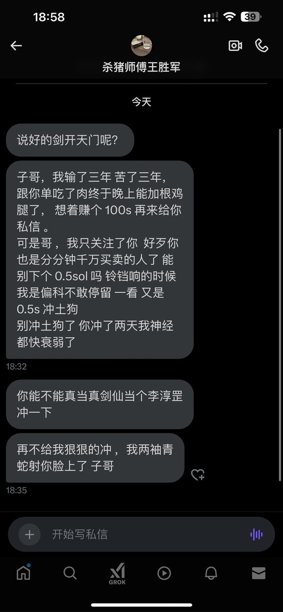
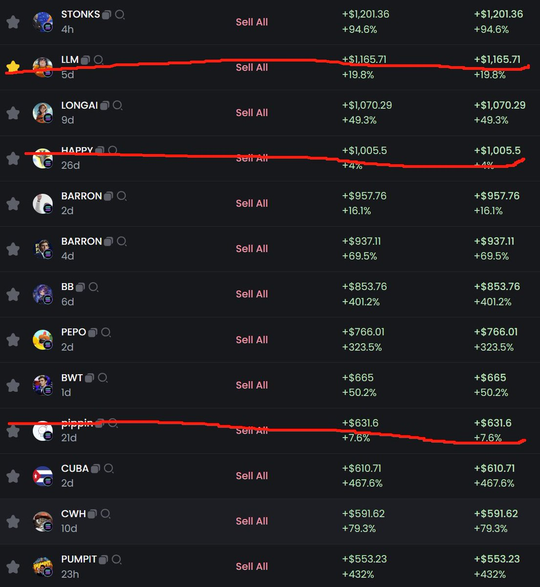
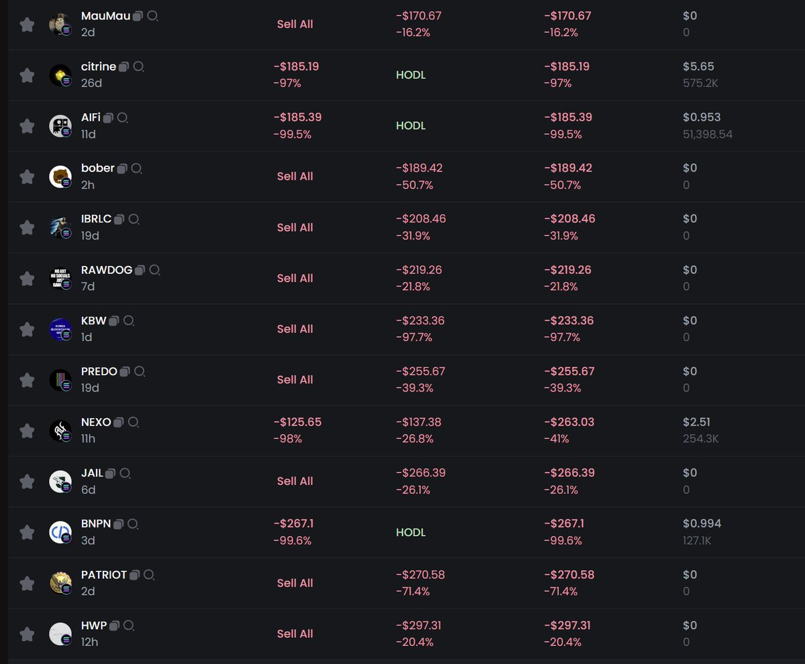

# 跟單策略：基於投研能力和運氣的信號源選擇

> **來源**: [@silverfang88](https://x.com/silverfang88/status/1882388829350547770)
>
> **日期**: 
>
> **標籤**: `跟單交易` `信號源選擇` `風險管理`

---

> **來源**: [@silverfang88 (子时)](https://twitter.com/silverfang88)
> **日期**: 2026-02-18
> **標籤**: `跟單交易` `信號源選擇` `風險管理` `投研能力`

---

## 跟單策略設計

目前採用的跟單策略配置為：

- **單筆跟單金額**: 0.5 SOL
- **最大虧損**: 0.3-0.4 SOL
- **暴擊收益**: 3-4 SOL 或以上
- **近期成績**: 最近摸到了一個 3000u 彩票

## 信號源選擇邏輯

跟單對象選擇基於「FOF（母基金）」邏輯，篩選標準包含：

1. **投研能力頂級** - 具備專業分析能力
2. **勤奮** - 持續活躍於市場
3. **拿到過結果** - 有成功交易記錄
4. **有氣運** - 在彩票版本中特別重要
5. **熟悉且不坑** - 信任關係建立

### 跟單名單

- [@Ed_x0101](https://twitter.com/Ed_x0101) (ed哥)
- [@SatoshiNobility](https://twitter.com/SatoshiNobility) (高尚)
- [@0x_Glaucus](https://twitter.com/0x_Glaucus) (glaucus)
- [@yuyue_chris](https://twitter.com/yuyue_chris) (yuyue)
- [@Tintinx2021](https://twitter.com/Tintinx2021) (tintin)
- [@haventseenyou_](https://twitter.com/haventseenyou_) (安然)
- [@Nyenchenpepe](https://twitter.com/Nyenchenpepe) (chenpepe)
- [@Mirro7777](https://twitter.com/Mirro7777) (mirro)
- [@0xRay518](https://twitter.com/0xRay518) (0xRay)
- [@Ga__ke](https://twitter.com/Ga__ke) (gake)

## 策略核心理念

在當前的「彩票版本」市場中，與其自己抽彩票，不如：

> 相信這些有氣運的人，讓他們幫我抽彩票

透過分散跟單這些優質信號源，利用期望值（EV）為正的策略設計，實現整體盈利。最近的跟單成績證明這個策略是賺錢的。
