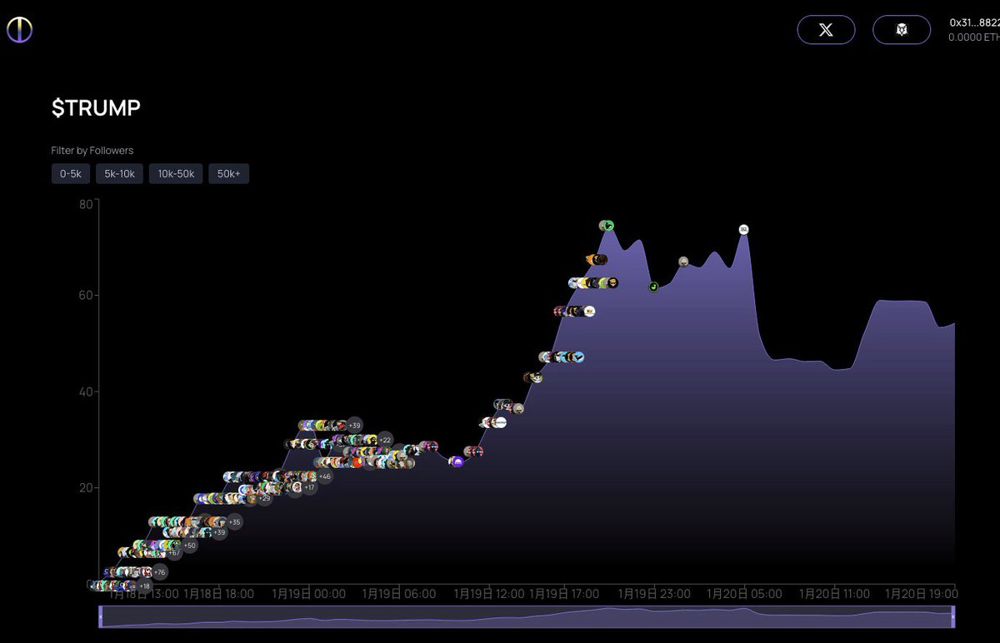
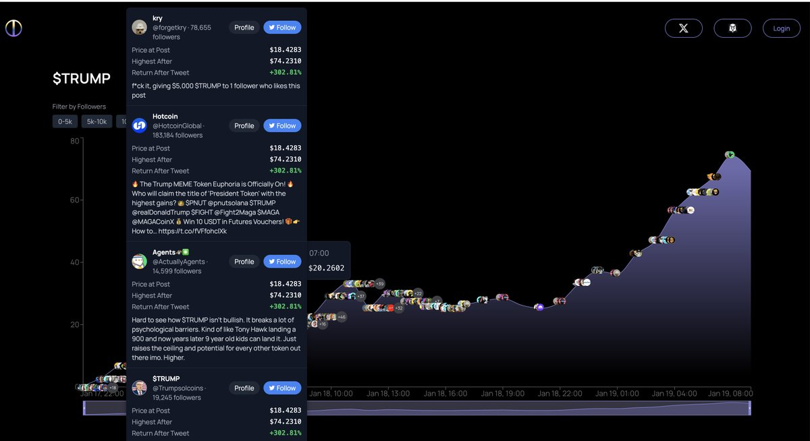

# Trump 幣 KOL Call 追蹤工具：幣傳播鏈與價格分析

> **來源**: [@0xcryptowizard](https://x.com/0xcryptowizard/status/1881317861811171814) | [原文連結](https://twitter.com/0xcryptowizard/status/1881317861811171814/photo/1)
>
> **日期**: Mon Jan 20 12:28:26 +0000 2025
>
> **標籤**: `量化工具` `KOL分析` `鏈上數據`

---

> **來源**: [@0xcryptowizard (0xWizard)](https://x.com/0xcryptowizard)
> **日期**: 2026-02-18
> **標籤**: `工具` `Meme幣` `KOL追蹤` `價格分析`

---

## 產品介紹

這是一個加強版的 Cookie 追蹤工具，可以看到每個幣的完整傳播鏈。

## 功能特點

透過這個工具可以：

- 查看某個幣種的所有 KOL Call 單時間點
- 對照每個時間點對應的價格
- 回溯所有 KOL 在各個價格點發表的內容

## 實際案例

以 Trump 幣為例，可以清楚看到整個傳播鏈條，包括：
- 所有 KOL 喊單的時間節點
- 對應時間點的幣價
- KOL 在不同價格位置發表的具體內容
