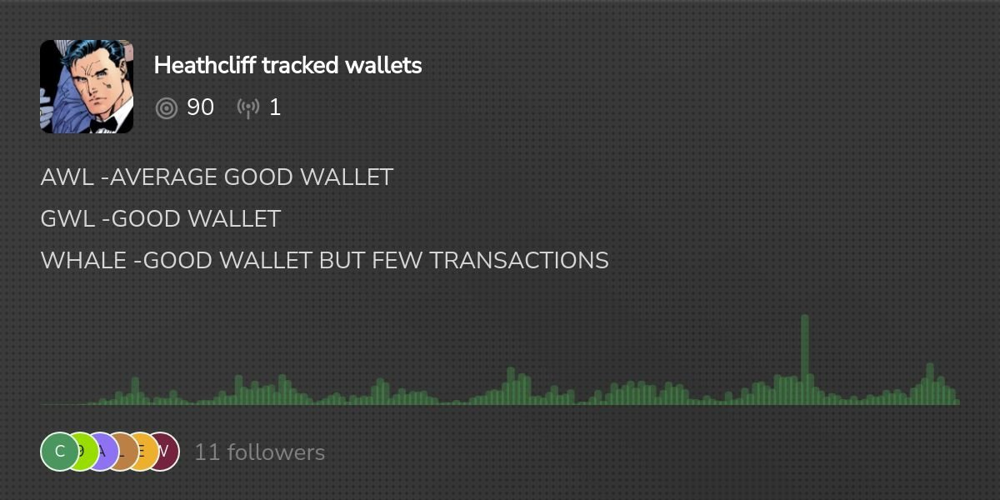

# Chain.fm 鏈上信號過濾工具 — 追蹤 KOL 錢包

> **來源**: [@supezen](https://x.com/supezen/status/1880859693830254838) | [原文連結](https://chain.fm/channel/1327987334263607299)
>
> **日期**: Sun Jan 19 06:07:50 +0000 2025
>
> **標籤**: `鏈上分析` `信號追蹤` `Solana`

---

> **來源**: [@supezen](https://twitter.com/supezen)
> **日期**: 2026-02-18
> **標籤**: `鏈上工具` `KOL追蹤` `Solana` `錢包監控`

---

## 工具介紹

Chain.fm 是一個鏈上信號追蹤平台，提供 KOL 錢包監控功能。

## Heathcliff 頻道

推薦一個由外國創建者建立的追蹤頻道，主要追蹤的是外國 KOL 的錢包活動。

- **頻道名稱**: Heathcliff tracked wallets
- **鏈**: Solana
- **平台**: Chain.fm
- **頻道連結**: https://chain.fm/heathcliff/solana

如果覺得有用可以關注該頻道，獲取外國 KOL 在 Solana 鏈上的交易信號。
