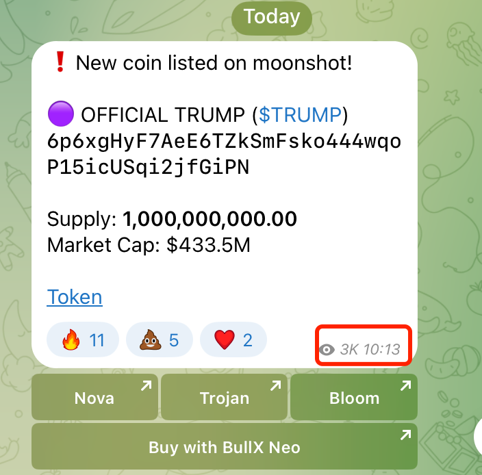
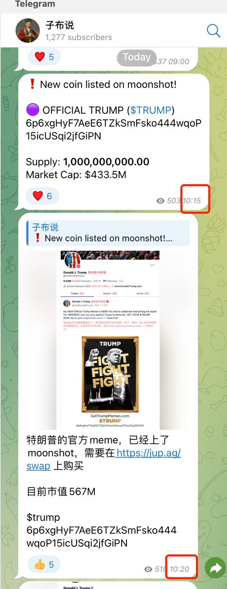

# Moonshot 代幣監控工具完全指南

> **來源**: [@0x_zibu](https://x.com/0x_zibu/status/1880500868816294220) | [原文連結](https://t.me/moonshotlistings)
>
> **日期**: Sat Jan 18 06:21:59 +0000 2025
>
> **標籤**: `監控工具` `Moonshot` `早期發現`

---

> **來源**: [@0x_zibu (子布)](https://twitter.com/0x_zibu)  
> **標籤**: `Moonshot` `代幣監控` `Solana` `Meme交易` `交易工具`

---

## 監控工具推薦

今天的 $trump 我是在群裡先看到，10:13 上線 Moonshot，我 10:15 才注意到監控，然後就轉發到了電報頻道，編輯好文字、圖片後就 10:20 了。要不是看到 Moonshot 的監控，估計我也會錯過。

以下幾款監控工具是我在用的，可以都關注起來，互相備份，畢竟有時候個別的會出問題。

### 1. Moonshot Listings | beeptools

- **電報頻道**: https://t.me/moonshotlistings
- **特點**: 會把敘事一起帶上，是最常用的監控
- **推特**: 官方推特帳號待查

### 2. AngryBot

- **電報頻道**: https://t.me/angrybot_moonshot  
- **官方推特**: @angrybotX
- **特點**: 會列出幣的基本指標，但服務可能不穩定或偶爾會有延時，作為備份使用
- **其他工具**: 
  - AI 敘事總結工具: https://t.me/angryai_bot
  - 可以去官推翻一翻，有不少好東西

### 3. MoonshotListing

- **電報頻道**: https://t.me/MoonshotListing
- **官方推特**: @MoonshotListing  
- **特點**: 推特也會發上 Moonshot 的消息，時間和電報同步，看你喜歡哪種

### 4. 第三方數據網站

- **Moonshot 幣種列表**: https://moonshot.money/coins
  - 一個第三方網站，列出了上 Moonshot 的幣
  
- **Dune 數據面板**: https://dune.com/queries/4504186/7580267
  - Dune 上關於 Moonshot 上面幣的一些數據

## 交易工具推薦

### 綜合交易平台

- **GMGN**: https://gmgn.ai/?chain=sol
  - 交易分析什麼都有

### 交易機器人

- **xxyy**: https://t.me/xxyybot  
  - 可替代 Abot 的交易工具

- **DeBot**: https://t.me/dextoolsbot
  - 監控最好、便宜優惠的交易、監控和數據分析工具

## 作者資訊

- **Telegram 頻道**: https://t.me/zibu_share (信息更及時)
- **推特**: @0x_zibu

上面有推特的大家可以關注，純友情推薦，人家免費做工具也不容易，隨手關注、點贊，給人家些動力。
