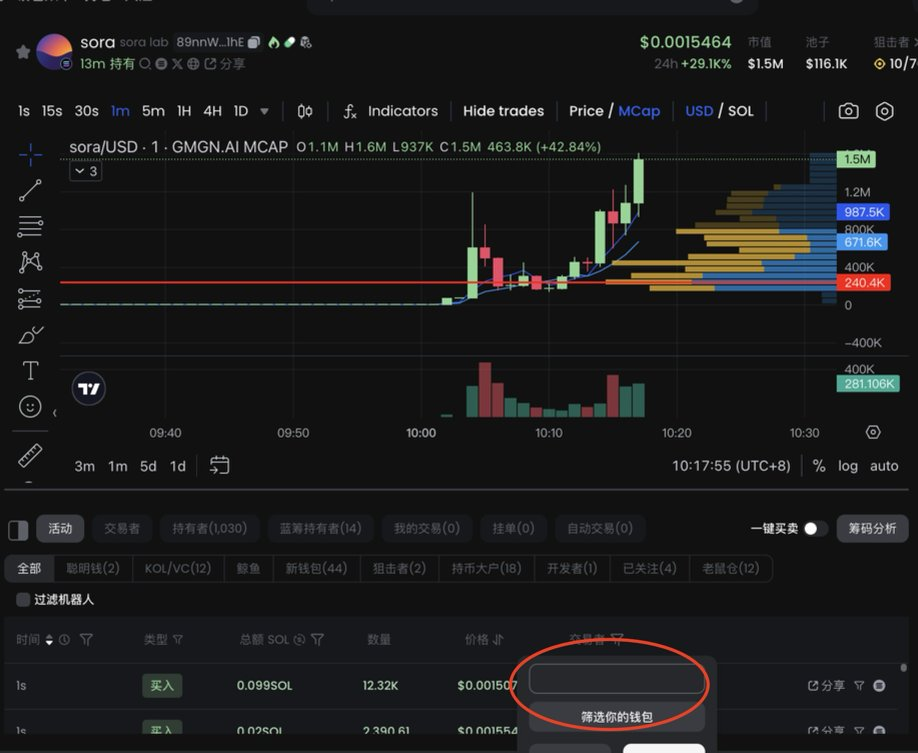

# 聰明錢庫構建策略 — 交易風格定位與監控方法

> **來源**: [@chat022511](https://x.com/chat022511/status/1879398171421667554) | [原文連結](https://chain.fm/)
>
> **日期**: Wed Jan 15 05:20:16 +0000 2025
>
> **標籤**: `聰明錢跟單` `交易風格分類` `投資組合構建`

---

> **來源**: [@chat022511 (11123w)](https://x.com/chat022511)
> **日期**: 2026-02-18
> **標籤**: `聰明錢` `錢包監控` `交易策略` `Solana` `gmgn`

---

## 聰明錢庫構建原則

構建聰明錢包庫的核心原則：**交易筆數/單筆盈利/勝率 屬於不可能三角**（不太可能三種同時兼顧）。所以需要先明確自己是哪種風格的,然後找相應的聰明錢去使用。

**範例**：
- 專注內盤的 p 小將：每天能 p 個幾十上百筆,可能勝率也很高,但是很難吃到大的,因為內盤標的的容量非常小
- 專注早期外盤（幾百k）的選手：可能單筆盈利很嚇人,出手頻率也不低,但是胜率不會太高

## 聰明錢分類

在挑選聰明錢之前,應該先確定自己想找的是哪一種類型的聰明錢,是喜歡在內盤快進快出的聰明錢,還是埋伏早期外盤的,抑或是拿大結果的鑽石手,定好目標再找,篩選速度就會很快。

### 1. 認知型

- **特徵**：出手頻率低,一出手就是重倉,單筆盈利高,偏鑽石手,出手確定性很高
- **價值**：具有極高參考價值

### 2. 正 EV 型

- **特徵**：有角度就上,單筆塞的不多,在內盤/100k 以下就是所謂的彩票打法,外盤的話每天大概會塞 20 個標的,基本上金狗都有他們的身影
- **價值**：具有較高的參考價值,這類聰明錢買的標的看到就會研究

### 3. PVP 型

- **特徵**：喜歡 jeet,交易頻率高的嚇人
- **使用方法**：最好不要跟單這種聰明錢,標註出來關掉提醒,有想上的標的會觀察一下這類聰明錢多不多,如果都是熟人會小心一點,有些聰明錢喜歡把幣砸死

## 聰明錢庫構建方法

### 認知型聰明錢

在大幣的 top holder 裡面去找,看他平時都買什麼,出手頻率如何,如果喜歡的話就加聰明錢庫了。

### 正 EV 型聰明錢

主要是在速通盤裡去找,top100 交易者/持有者裡面早期上車的,看看歷史記錄,如果判斷不是運氣,那就加到聰明錢庫。

## 工具推薦

### gmgn.ai

筛選和監控聰明錢,主要使用 [@gmgnai](https://gmgn.ai),gmgn 無論是找莊還是監控、複盤都是非常好用的。

**小竅門**：gmgn 的篩選功能非常好用,能在 k 線上顯示出某個人的買入賣出點位。

### 其他工具

- **Chain.fm**：可以看到別人公開的聰明錢庫
- **Solscan**：可以找一些幣的 DCA（定時定量購買某種代幣）,也可以複盤一些熱門項目的狙擊者燒的 gas

**範例**：在 solscan 上,你可以發現 $gnz 的榜一,使用了 66 sol 狙開盤。

## 實戰案例：$sora 複盤

### 第一次警報（200k 市值）

叙事聰明錢 `22hQSTCXbgQdVVEUWBaHqZGwXuu18mnSp5jbrLvQzcxK` 買入了 10 sol,再一看 pvp 聰明錢/內盤彩票聰明錢 基本沒上（不過這種我關注的也比較少）,說明這個盤子應該不是 p 發射的。

**判斷**：不屬於 pvp 盤子,認知高的聰明錢上車了,這時候就應該打起警惕,先研究。

### 研究流程

$sora 屬於 AI 幣,主要看官網/GitHub：
- **官網**：挺好看,做的東西概念比較新
- **GitHub**：代碼屬於不錯的水準,使用了 go 語言編程（這也比較罕見）,commit 最早提交是在 3 週之前,是流水盤子的可能性降低了（垃圾盤子 GitHub 我覺得準備三天都多了）
- **初步判斷**：是個還不錯的項目

### 上車決策

研究完,就是決定要不要上車了,如果沒在寫文章會選擇上個彩票倉。

回頭看,這個幣上車機會還是挺多的,800k 的時候 dnf 小號也進場了,她選的標的確定性蠻大的,如果前面沒有進場,這時候也算是一個上車點。

## 總結

積累,用好聰明錢庫,可以幫助我們發現一些早期機會,也可以輔助判斷進場點、確定性。
